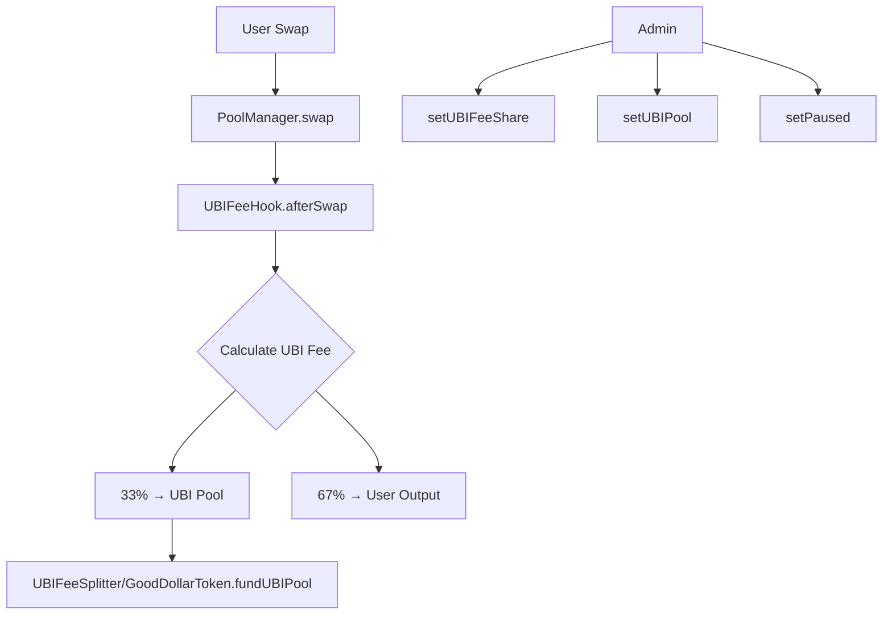

## Overview

Fork Uniswap V4 core contracts and implement a custom hook that routes 33% of swap fees to the GoodDollar UBI pool. This is the first dApp on the GoodDollar L2 — GoodSwap — where every trade automatically funds universal basic income.

The hook intercepts swap fees via Uniswap V4's `afterSwap` callback, calculates the UBI share, and transfers it to the UBI fee splitter contract.

## Acceptance Criteria

- [ ] UBIFeeHook.sol implements Uniswap V4 `afterSwap` hook
- [ ] 33% of swap fees are routed to UBI pool via UBIFeeSplitter
- [ ] Hook is configurable: fee percentage can be adjusted by admin
- [ ] Comprehensive test suite covering:
  - Fee calculation accuracy
  - Fee routing to correct destinations
  - Edge cases (zero swaps, very small/large amounts)
  - Admin controls (fee adjustment, pause)
- [ ] All tests pass with `forge test`
- [ ] Deployed and verified on local anvil devnet
- [ ] Gas benchmarks: hook adds < 50k gas overhead per swap

## Out of Scope

- Full Uniswap V4 PoolManager deployment (use minimal interfaces)
- Frontend / UI (see 0003-goodswap-frontend)
- Liquidity provision UI
- Multi-hop routing
- Production deployment (testnet/mainnet)

## Research Notes

- Uniswap V4 uses a hook system where contracts implementing specific callbacks (beforeSwap, afterSwap, etc.) are invoked by the PoolManager during swap execution
- The hook address must encode its permissions in the address bits (V4 convention), but for dev/testing with minimal interfaces, we bypass this
- Using minimal interfaces (IPoolManager, PoolKey, SwapParams, BalanceDelta) avoids pulling in the full V4 monorepo dependency
- Fee calculation uses basis points (BPS) for precision — 3333 BPS = 33.33%
- The afterSwap hook reads the BalanceDelta to determine output token and amount, then transfers the UBI share

## Assumptions

- Using minimal V4 interfaces is acceptable for Phase 1 (no full PoolManager deployment needed)
- The hook holds tokens that it redistributes (in production, this would use V4's delta settlement)
- Gas benchmarks can be measured via Foundry's gas reporting

## Architecture

## Size Estimation

- **New pages/routes:** 0 (Solidity contracts only)
- **New UI components:** 0
- **API integrations:** 1 (Uniswap V4 PoolManager interface via minimal stubs)
- **Complex interactions:** 0
- **Estimated LOC:** ~300 (contract) + ~435 (tests) + ~50 (deploy script) = ~785
- **Status:** Core contract and tests already implemented in previous iteration

## One-Week Decision: YES

This initiative is already substantially implemented. The UBIFeeHook.sol contract exists with 300 LOC and a comprehensive 435 LOC test suite covering fee calculation, routing, admin controls, edge cases, events, and fuzz tests. Remaining work is limited to:
1. Running and verifying all tests pass
2. Adding gas benchmark tests
3. Creating an Anvil deploy script
4. Final verification

Estimated remaining effort: 1-2 days.

## Implementation Plan

- **Day 1:** Verify existing tests pass. Add gas benchmark test using Foundry's gas snapshot. Create Anvil deploy script (`script/DeployUBIFeeHook.s.sol`).
- **Day 2:** Run deployment on local Anvil. Verify gas overhead < 50k. Final review and commit.
