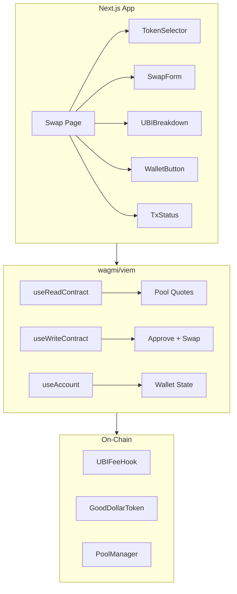

## Overview

Build a basic swap UI (React/Next.js) that connects to the GoodSwap contracts deployed on GoodDollar L2. Users can select tokens, input amounts, see price impact, and see exactly how much of their swap fee funds UBI. The UBI contribution is a first-class UI element — not hidden in fine print.

## Acceptance Criteria

- [ ] Next.js app with TypeScript, Tailwind CSS
- [ ] Token selector supporting G$, ETH, USDC (expandable)
- [ ] Swap form with input/output amounts, price display
- [ ] UBI fee breakdown shown prominently: "X G$ funds UBI from this swap"
- [ ] Wallet connection via wagmi/viem (MetaMask, WalletConnect)
- [ ] Transaction status (pending, confirmed, failed)
- [ ] Responsive design (mobile-first)
- [ ] Deployed at goodswap.clawz.org

## Out of Scope

- Liquidity provision / pool creation UI
- Advanced trading features (limit orders, charts)
- Multi-chain support
- Token list management / CoinGecko integration
- Analytics dashboard

## Research Notes

- Next.js 14+ with App Router provides the best DX for React + TypeScript
- wagmi v2 + viem provide type-safe Ethereum interaction hooks
- Tailwind CSS v3+ for utility-first styling, responsive design
- RainbowKit or ConnectKit for wallet connection UI (reduces boilerplate)
- Contract ABIs can be generated from Foundry artifacts in `out/`

## Architecture

## Size Estimation

- **New pages/routes:** 1 (swap page) + layout
- **New UI components:** 6 (TokenSelector, SwapInput, UBIBreakdown, WalletButton, TxStatusModal, Header)
- **API integrations:** 4 (wagmi contract reads, wagmi contract writes, wallet providers, token balance queries)
- **Complex interactions:** 3 (wallet connect flow, approve+swap multi-step, real-time price/fee calculation)
- **Estimated LOC:** ~2000+

## One-Week Decision: NO

**Automatic NO.** This initiative has 3 complex interactions (wallet connection, multi-step approve+swap flow, real-time price/fee updates), exceeding the 2-interaction threshold. The estimated LOC of 2000+ also triggers the automatic threshold. Split into two focused initiatives: UI scaffold with mock data, and Web3 wallet integration.

## Split Rationale

Split vertically into:
1. **0007-goodswap-scaffold** — Next.js project setup, swap page UI with mock data, all visual components, responsive layout. Can be reviewed and iterated on visually before adding Web3 complexity.
2. **0008-goodswap-web3** — wagmi/viem integration, wallet connection, contract reads/writes, approve+swap flow, transaction status. Builds on top of the scaffold.
