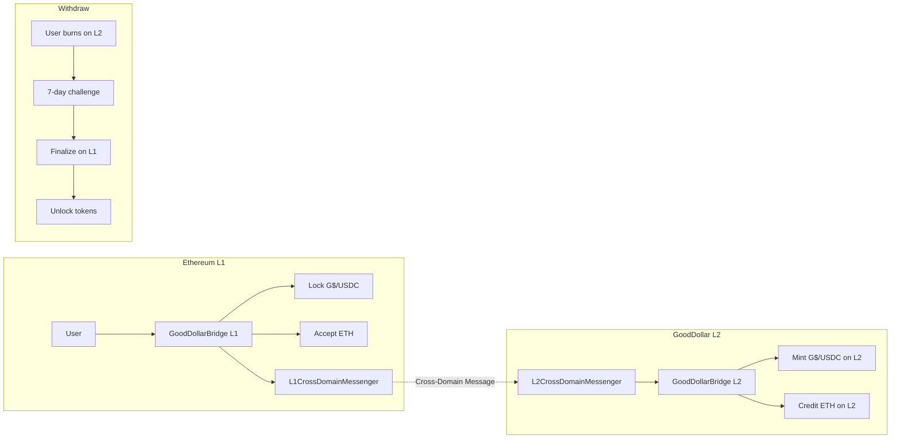

## Overview

Implement L1↔L2 bridge contracts for G$, ETH, and USDC using the OP Stack StandardBridge pattern. This enables users to move assets between Ethereum L1 and GoodDollar L2. G$ uses a custom bridge that mints/burns on L2, while ETH and USDC use the standard lock/unlock pattern.

## Acceptance Criteria

- [ ] L1StandardBridge deployed on Sepolia with G$, ETH, USDC support
- [ ] L2StandardBridge deployed on GoodDollar L2 devnet
- [ ] G$ bridge: lock on L1 → mint on L2, burn on L2 → unlock on L1
- [ ] ETH bridge: native ETH deposit/withdraw
- [ ] USDC bridge: ERC20 lock/unlock pattern
- [ ] Deposit and withdrawal tests passing
- [ ] 7-day withdrawal challenge period (OP Stack default)
- [ ] Event emission for bridge monitoring
- [ ] Gas estimates documented

## Out of Scope

- Fast bridge (< 7 day withdrawals) — future Li.Fi integration
- Bridge UI (separate initiative)
- Cross-chain messaging beyond token transfers
- Third-party bridge integrations (Across, Hop, etc.)

## Research Notes

- OP Stack StandardBridge uses a pair of contracts: L1StandardBridge (on L1) and L2StandardBridge (on L2) communicating via cross-domain messengers
- For ERC20 tokens: L1 locks tokens, L2 mints corresponding bridged tokens. Withdrawal reverses.
- For native ETH: L1 accepts ETH deposits, L2 credits native ETH. Uses OptimismPortal for finalization.
- G$ needs a custom `OptimismMintableERC20` pattern since it's the native L2 token but exists as ERC20 on L1
- 7-day challenge period is enforced by the L2OutputOracle / DisputeGame — we don't implement this, it's part of OP Stack infrastructure
- For testing: use Foundry fork tests simulating L1↔L2 message passing

## Assumptions

- Cross-domain message passing is abstracted via interfaces (actual messenger deployed with OP Stack)
- The 7-day challenge period is an OP Stack infrastructure concern, not contract logic we implement
- Testing uses Foundry's mock/prank capabilities to simulate cross-domain calls
- G$ on L1 is an existing ERC20 (we create a mock for testing)

## Architecture

## Size Estimation

- **New pages/routes:** 0 (Solidity contracts only)
- **New UI components:** 0
- **API integrations:** 2 (L1 and L2 cross-domain messenger interfaces)
- **Complex interactions:** 1 (cross-domain message simulation in tests)
- **Estimated LOC:** ~600 (contracts: L1Bridge, L2Bridge, interfaces) + ~500 (tests) + ~100 (deploy script) = ~1200

## One-Week Decision: YES

The bridge contracts follow well-documented OP Stack StandardBridge patterns. We implement 2 main contracts (L1 and L2 bridges) with 3 token types, plus comprehensive tests. At ~1200 LOC and only 1 complex interaction (cross-domain messaging simulation), this fits within the one-week threshold. The patterns are straightforward lock/mint and burn/unlock.

## Implementation Plan

- **Day 1-2:** Implement L1GoodDollarBridge with deposit functions for G$, ETH, USDC. Implement interfaces for cross-domain messenger. Write deposit tests.
- **Day 3-4:** Implement L2GoodDollarBridge with finalization and withdrawal initiation. Write withdrawal tests including cross-domain message simulation.
- **Day 5:** Gas benchmarks, event emission verification, deploy script, documentation.
