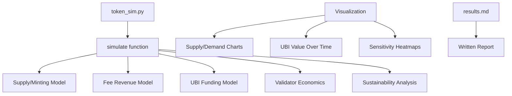

## Overview

Python simulation of GoodDollar tokenomics at different user scales (1M, 100M, 1B users). Model the interplay between supply expansion (UBI minting), demand drivers (swap fees, staking, DeFi usage), UBI value per person, and inflation rates. Answer the critical question: at what scale does UBI become meaningful, and what fee volume is needed to sustain it?

## Acceptance Criteria

- [ ] Python simulation with configurable parameters
- [ ] Models: daily UBI minting, fee-based UBI pool, staking lockup
- [ ] Scenarios: 1M, 10M, 100M, 1B verified users
- [ ] Fee volume models: conservative, moderate, aggressive
- [ ] Output metrics: G$ price stability, UBI value (USD equiv), inflation rate, pool sustainability
- [ ] Visualizations: charts showing supply/demand curves, UBI value over time
- [ ] Sensitivity analysis: which parameters matter most?
- [ ] Written report with recommendations for fee split ratios
- [ ] Jupyter notebook or standalone Python scripts

## Out of Scope

- Agent-based modeling (individual user behavior)
- MEV simulation
- Cross-chain arbitrage modeling
- Real market data backtesting
- Formal economic paper / peer review

## Research Notes

- Core simulation already implemented in `simulations/token_sim.py` (~350 LOC)
- Results report exists at `simulations/results.md`
- The simulation models: daily UBI minting, DEX fees, lending fees, gas fees, validator staking, token burns
- Scales tested: 1M, 10M, 100M, 1B users with configurable parameters
- Sensitivity analysis covers 7 key parameters
- Key finding: sustainability depends on per-user economic activity, not total user count
- Missing: matplotlib visualizations and Jupyter notebook

## Assumptions

- matplotlib is available for chart generation (add to requirements)
- The existing simulation is correct and comprehensive enough for Phase 1
- Charts can be generated as static PNGs saved to `simulations/charts/`

## Architecture

## Size Estimation

- **New pages/routes:** 0
- **New UI components:** 0
- **API integrations:** 0
- **Complex interactions:** 0 (pure computation)
- **Estimated LOC:** ~350 existing + ~200 (visualization functions) + ~100 (requirements.txt, README updates) = ~650
- **Status:** Core simulation already implemented, needs visualizations and final polish

## One-Week Decision: YES

The simulation is already substantially complete (~350 LOC with full sensitivity analysis and results report). Remaining work is adding matplotlib chart generation and optionally a Jupyter notebook. Estimated 1-2 days of remaining effort.

## Implementation Plan

- **Day 1:** Add matplotlib visualizations to token_sim.py: supply/demand curves, UBI value trajectory, sensitivity heatmap. Create `simulations/requirements.txt`.
- **Day 2:** Generate charts, update results.md with chart references. Final review of simulation parameters and recommendations.
