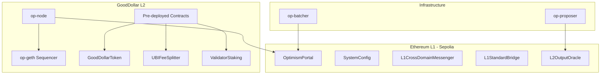

## Overview

Configure the OP Stack chain for GoodDollar L2: genesis file with pre-deployed contracts (G$ token, UBI claims, fee splitter, validator staking), rollup configuration, and a docker-compose devnet for local development. This is the infrastructure foundation — once running, all other initiatives deploy on top.

## Acceptance Criteria

- [ ] Genesis file with pre-deployed GoodDollar contracts
- [ ] G$ configured as native gas token (custom gas oracle)
- [ ] Rollup config: 1-second block time, appropriate gas limits
- [ ] Chain ID registered / chosen
- [ ] docker-compose.yml with: op-geth (sequencer), op-node (rollup node), op-batcher, op-proposer
- [ ] L1 contracts (OptimismPortal, L1CrossDomainMessenger) deploy script for Sepolia
- [ ] Devnet boots and produces blocks within 60 seconds
- [ ] Basic smoke test: deploy contract, send transaction, verify on L2
- [ ] Documentation: README with setup instructions

## Out of Scope

- Production deployment (mainnet)
- Decentralized sequencer
- Celestia DA integration (Phase 4)
- Blockscout explorer setup (separate task)
- Monitoring / alerting infrastructure

## Research Notes

- OP Stack uses op-geth (execution engine) + op-node (consensus/derivation) + op-batcher (L1 transaction batching) + op-proposer (output root proposals)
- Genesis generation requires: chain config, alloc (pre-deployed contract bytecodes + storage), gas config
- Custom gas token support is available in OP Stack via the `CustomGasToken` feature flag
- Chain ID should be unique; will use 42069 for devnet (common test chain ID pattern)
- Docker images: `us-docker.pkg.dev/oplabs-tools-artifacts/images/op-geth`, `op-node`, `op-batcher`, `op-proposer`
- L1 contracts include: OptimismPortal, SystemConfig, L1CrossDomainMessenger, L1StandardBridge, L2OutputOracle
- 1-second block time requires appropriate gas target/limit configuration

## Architecture

## Size Estimation

- **New pages/routes:** 0
- **New UI components:** 0
- **API integrations:** 4 (op-geth, op-node, op-batcher, op-proposer configuration)
- **Complex interactions:** 3 (genesis generation with embedded bytecodes, Docker orchestration of 4+ services, L1 contract deployment scripts)
- **Estimated LOC:** ~1500 (genesis JSON + rollup config + docker-compose + deploy scripts + smoke test + README)

## One-Week Decision: NO

**Automatic NO.** 3 complex interactions (genesis generation, Docker orchestration, L1 deployment) exceeds the 2-interaction threshold. The ~1500 LOC across multiple configuration formats (JSON, YAML, TOML, Solidity, Shell) adds complexity. Split into genesis/config and devnet/deployment.

## Split Rationale

Split into:
1. **0009-chain-genesis** — Genesis file with pre-deployed contracts, rollup configuration, chain ID selection, gas token config. Pure configuration work.
2. **0010-devnet-compose** — Docker-compose setup, L1 deploy scripts, smoke test, README. Infrastructure orchestration.
