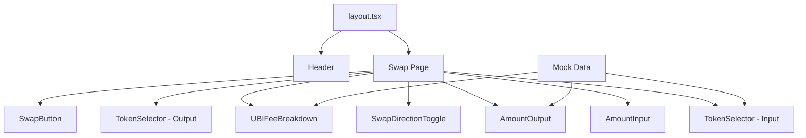

## Overview

Create the Next.js project scaffold for GoodSwap and build all visual UI components with mock data. This delivers a fully styled, responsive swap interface that can be reviewed visually before adding Web3 complexity. The UBI fee breakdown is a first-class UI element.

## Acceptance Criteria

- [ ] Next.js 14+ app with TypeScript, Tailwind CSS, App Router
- [ ] Project at `frontend/` directory in repo root
- [ ] Layout with header (logo, nav placeholder, connect wallet placeholder)
- [ ] Swap page at `/` with:
  - Token selector dropdown (G$, ETH, USDC) with token icons
  - Input amount field with "Max" button
  - Output amount field (calculated from mock rate)
  - Swap direction toggle button
  - UBI fee breakdown: "X G$ funds UBI from this swap" prominently displayed
  - Swap button (disabled state without wallet)
- [ ] Responsive design: works on mobile (360px+) and desktop
- [ ] Dark theme with GoodDollar green accent (#00B0A0)
- [ ] All components use mock data (no Web3 calls)
- [ ] `npm run build` succeeds with no errors

## Out of Scope

- Wallet connection (see 0008-goodswap-web3)
- Contract interaction (see 0008-goodswap-web3)
- Transaction execution
- Deployment
- Token list from external APIs

## Research Notes

- Next.js 14 App Router for file-based routing and server components
- Tailwind CSS for responsive utility-first styling
- Use shadcn/ui or Radix primitives for accessible dropdowns and dialogs
- Mock exchange rates: 1 ETH = 100,000 G$, 1 USDC = 100 G$
- UBI fee = 33.33% of swap fee (0.3% of trade), so UBI contribution per swap = amount × 0.003 × 0.3333

## Architecture

## Size Estimation

- **New pages/routes:** 1 (swap page + layout)
- **New UI components:** 5 (TokenSelector, AmountInput, SwapDirectionToggle, UBIFeeBreakdown, SwapButton/Header combined)
- **API integrations:** 0 (mock data only)
- **Complex interactions:** 0 (static UI with local state)
- **Estimated LOC:** ~800 (components + page + layout + config + styles)

## One-Week Decision: YES

1 page with 5 components, no API integrations, no complex interactions, ~800 LOC. This is a straightforward frontend scaffold that uses mock data. Estimated 2-3 days.

## Implementation Plan

- **Day 1:** `npx create-next-app` with TypeScript + Tailwind. Set up project structure, layout with header, dark theme, GoodDollar branding.
- **Day 2:** Build swap page: TokenSelector, AmountInput, SwapDirectionToggle, output display, UBI fee breakdown calculation and display.
- **Day 3:** Polish responsive design, add token icons (SVG), loading/empty states, ensure build passes.
