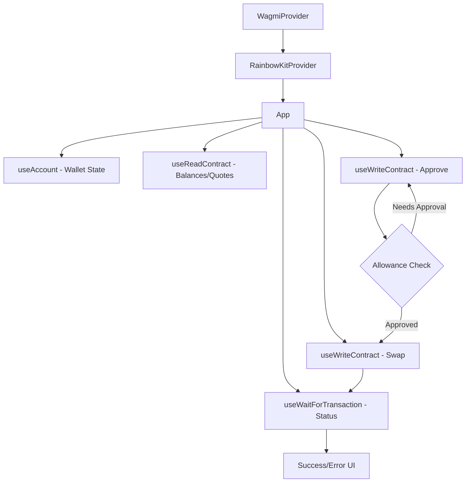

## Overview

Add Web3 capabilities to the GoodSwap frontend: wallet connection (MetaMask, WalletConnect), on-chain contract reads for real-time quotes and UBI fee calculations, and swap execution (approve + swap transaction flow with status tracking).

## Acceptance Criteria

- [ ] wagmi v2 + viem configured with GoodDollar L2 chain
- [ ] RainbowKit or ConnectKit wallet connection UI
- [ ] Wallet button in header shows address/ENS when connected
- [ ] Token balances fetched from chain and displayed
- [ ] Swap quotes from on-chain pool data (or mock pool for devnet)
- [ ] UBI fee breakdown uses on-chain `calculateUBIFee()` read
- [ ] Approve → Swap transaction flow with status tracking
- [ ] Transaction status: pending spinner, success with tx hash link, error with retry
- [ ] Network switching prompt if user is on wrong chain

## Out of Scope

- Liquidity provision
- Advanced routing / multi-hop
- Price charts
- Deployment (handled separately)

## Research Notes

- wagmi v2 provides React hooks: useAccount, useReadContract, useWriteContract, useWaitForTransactionReceipt
- viem for ABI encoding/decoding and chain definitions
- RainbowKit provides drop-in wallet connection modal with MetaMask, WalletConnect, Coinbase Wallet
- Contract ABIs from Foundry `out/` directory (JSON artifacts)
- The approve+swap pattern: first `token.approve(router, amount)`, then `router.swap(params)`
- For devnet: use hardcoded contract addresses from deploy script

## Architecture

## Size Estimation

- **New pages/routes:** 0 (enhances existing swap page)
- **New UI components:** 2 (WalletButton with dropdown, TxStatusModal)
- **API integrations:** 3 (wagmi reads, wagmi writes, wallet providers)
- **Complex interactions:** 2 (wallet connect flow, approve+swap multi-step)
- **Estimated LOC:** ~800 (wagmi config + hooks + components + ABI imports)

## One-Week Decision: YES

With 0 new pages, 2 new components, 3 API integrations, 2 complex interactions, and ~800 LOC, this fits within all thresholds. The wagmi/RainbowKit ecosystem handles most of the complexity. Estimated 3-4 days.

## Implementation Plan

- **Day 1:** Install wagmi, viem, RainbowKit. Configure providers, chain definition for GoodDollar L2. Import contract ABIs.
- **Day 2:** Build WalletButton component. Wire up token balance reads. Replace mock data with on-chain reads where available.
- **Day 3:** Implement approve + swap flow. Build TxStatusModal with pending/success/error states. Add network switching.
- **Day 4:** Integration testing, error handling edge cases, final polish.
