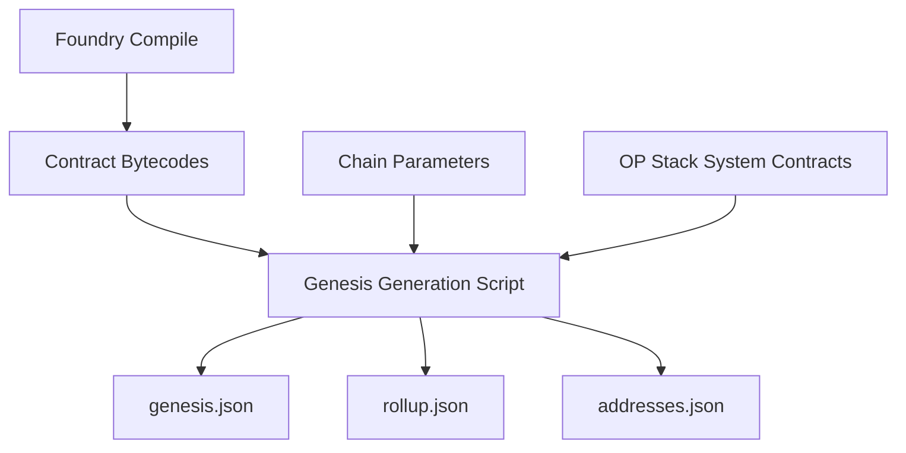

## Overview

Create the OP Stack genesis file for GoodDollar L2 with pre-deployed core contracts (G$ token, UBI claims, fee splitter, validator staking), rollup configuration with 1-second block time, and chain parameter selection. This is the data layer that defines the chain's initial state.

## Acceptance Criteria

- [ ] Genesis JSON file at `op-stack/genesis.json` with:
  - Pre-deployed GoodDollarToken at a deterministic address
  - Pre-deployed UBIFeeSplitter at a deterministic address
  - Pre-deployed ValidatorStaking at a deterministic address
  - OP Stack system contracts at standard addresses
- [ ] Rollup config at `op-stack/rollup.json` with:
  - 1-second block time
  - Chain ID: 42069 (devnet)
  - Appropriate gas limits and base fee
- [ ] Chain definition file for viem/wagmi consumption
- [ ] Foundry script that compiles contracts and generates genesis alloc entries
- [ ] Documentation of all pre-deployed addresses

## Out of Scope

- Docker infrastructure (see 0010-devnet-compose)
- L1 contract deployment (see 0010-devnet-compose)
- Custom gas token implementation (use standard ETH gas for Phase 1 devnet)
- Production chain parameters

## Research Notes

- OP Stack genesis uses standard go-ethereum genesis format with alloc section for pre-deployed contracts
- Pre-deployed contracts need: bytecode (from Foundry compilation), storage layout (constructor args encoded into storage), balance
- OP Stack system contracts (L2CrossDomainMessenger, L2StandardBridge, etc.) go at predefined addresses: 0x4200000000000000000000000000000000000000+
- Custom contracts can go at any address; convention is 0x4200...0100+ range
- Rollup config defines: genesis hashes, block time, sequencer address, batch submitter, gas config

## Architecture

## Size Estimation

- **New pages/routes:** 0
- **New UI components:** 0
- **API integrations:** 0
- **Complex interactions:** 1 (genesis generation with bytecodes and storage layouts)
- **Estimated LOC:** ~200 (genesis script) + ~300 (genesis.json) + ~100 (rollup.json) + ~50 (chain def) = ~650

## One-Week Decision: YES

1 complex interaction, 0 API integrations, ~650 LOC of configuration and scripts. This is focused config generation work. Estimated 2-3 days.

## Implementation Plan

- **Day 1:** Create `op-stack/` directory structure. Write genesis generation script using Foundry artifacts. Define chain parameters (ID, gas config, block time).
- **Day 2:** Generate genesis.json with pre-deployed contracts and OP Stack system contract stubs. Create rollup.json. Create chain definition for frontend consumption.
- **Day 3:** Document all addresses. Verify genesis file is valid JSON and contains correct bytecodes.
