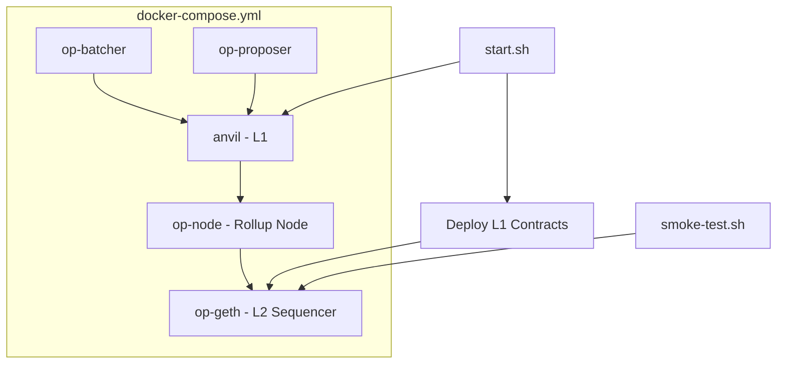

## Overview

Create a docker-compose devnet for GoodDollar L2 local development. Orchestrates op-geth (sequencer), op-node, op-batcher, and op-proposer services. Includes L1 contract deploy scripts for local Anvil L1, a smoke test, and comprehensive README documentation.

## Acceptance Criteria

- [ ] `docker-compose.yml` at `op-stack/docker-compose.yml` with:
  - op-geth: sequencer node with genesis from 0009
  - op-node: rollup derivation connected to L1
  - op-batcher: batch submission to L1
  - op-proposer: output root proposals to L1
  - anvil: local L1 for development
- [ ] L1 contract deploy script: deploys OptimismPortal, SystemConfig stubs to local Anvil
- [ ] `./op-stack/start.sh` script that boots the full devnet
- [ ] Devnet produces blocks within 60 seconds of start
- [ ] Smoke test script: deploy a contract on L2, send transaction, verify receipt
- [ ] README at `op-stack/README.md` with setup instructions

## Out of Scope

- Production deployment
- Sepolia deployment (local Anvil L1 only for now)
- Monitoring/alerting
- Blockscout explorer

## Research Notes

- OP Stack official devnet uses docker-compose with similar service configuration
- op-geth image: `us-docker.pkg.dev/oplabs-tools-artifacts/images/op-geth`
- op-node, op-batcher, op-proposer from same registry
- For local development, an Anvil instance serves as L1
- Services need proper JWT secret for engine API authentication
- Boot sequence: L1 (Anvil) → Deploy L1 contracts → op-geth (init genesis) → op-node → op-batcher → op-proposer

## Architecture

## Size Estimation

- **New pages/routes:** 0
- **New UI components:** 0
- **API integrations:** 1 (Docker service orchestration)
- **Complex interactions:** 2 (Docker multi-service orchestration, L1 deploy + smoke test scripting)
- **Estimated LOC:** ~200 (docker-compose) + ~150 (start.sh) + ~100 (smoke-test.sh) + ~200 (L1 deploy script) + ~200 (README) = ~850

## One-Week Decision: YES

2 complex interactions, 1 API integration, ~850 LOC. This is infrastructure configuration following well-documented OP Stack patterns. Estimated 3-4 days.

## Implementation Plan

- **Day 1:** Create docker-compose.yml with all 5 services. Generate JWT secret. Configure inter-service networking.
- **Day 2:** Write L1 deploy script (Foundry script or shell) for Anvil. Write start.sh with proper boot sequence and health checks.
- **Day 3:** Write smoke test (cast commands to deploy, transact, verify). Write README with prerequisites, setup, and usage.
- **Day 4:** Test full boot cycle. Debug service connectivity. Ensure blocks produced within 60 seconds.
