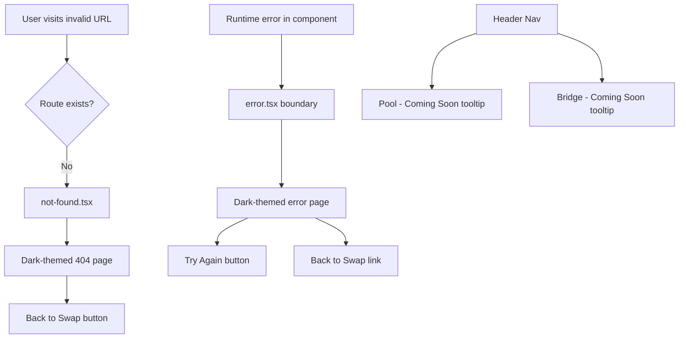

## Problem Statement

When navigating to any invalid URL (e.g. `/pool`, `/bridge`, `/nonexistent-page`), the app shows the **default Next.js 404 page** — a white background with generic "404 | This page could not be found." text. This is a jarring visual break from the app's dark theme (`#0f1729` background) and provides no navigation path back to the working app.

Additionally, there is **no `error.tsx` error boundary**, so any unhandled runtime exception in a component will crash to the default Next.js error page (also white, also unstyled).

The Header nav shows "Pool" and "Bridge" as disabled `` elements. Users who try these routes (by typing the URL or expecting them to work) hit the white 404 page with no context about what happened.

## User Story

As a GoodSwap user, I want to see a branded, helpful error page when I navigate to a page that doesn't exist, so that I'm not confused by a broken-looking white screen and can find my way back to the swap.

## How It Was Found

- Navigated to `http://localhost:3100/pool` — saw default white 404 page
- Navigated to `http://localhost:3100/bridge` — same white 404
- Navigated to `http://localhost:3100/nonexistent-page` — same white 404
- No `error.tsx` or `not-found.tsx` files exist in the project
- Screenshots saved in `.autobuilder/screenshots/pool.png`, `.autobuilder/screenshots/bridge.png`, `.autobuilder/screenshots/404-random.png`

## Proposed UX

1. **Custom `not-found.tsx`**: Dark-themed 404 page matching the app's design system. Shows the GoodSwap logo, a clear "Page Not Found" message, and a prominent "Back to Swap" button. Should feel like part of the app, not a break from it.

2. **Global `error.tsx`**: Dark-themed error boundary that catches runtime errors. Shows a friendly error message with a "Try Again" button (calls `reset()`) and a "Back to Swap" link. Should NOT expose raw error details to users.

3. **Nav "Coming Soon" treatment**: Pool and Bridge nav items should indicate "Coming Soon" on hover (via a tooltip or subtitle) so users understand these are planned features, not broken links.

## Acceptance Criteria

- [ ] `frontend/src/app/not-found.tsx` exists with a dark-themed 404 page
- [ ] 404 page includes GoodSwap branding and a "Back to Swap" link/button
- [ ] `frontend/src/app/error.tsx` exists as a client-side error boundary
- [ ] Error boundary has dark theme, "Try Again" button, and "Back to Swap" link
- [ ] Navigating to `/pool`, `/bridge`, or any invalid URL shows the custom 404
- [ ] Pool and Bridge nav items show "Coming Soon" context on hover
- [ ] No white-background flashes on any error state

## Verification

- Navigate to `/pool`, `/bridge`, `/anything-random` — all show custom dark 404
- Force a runtime error in a component — error boundary catches it with dark UI
- Hover over Pool/Bridge nav items — "Coming Soon" tooltip or text appears
- Run `npm run build` — no build errors

## Out of Scope

- Actually building the Pool or Bridge pages
- Server-side error logging
- Analytics for 404 hits

---

## Planning

### Research Notes

- Next.js App Router supports `not-found.tsx` (renders on unmatched routes) and `error.tsx` (client-side error boundary) at the app directory level.
- `error.tsx` must be a `'use client'` component receiving `{ error, reset }` props.
- `not-found.tsx` is a server component by default.
- The existing app uses Tailwind with custom colors defined in `tailwind.config.ts` (dark theme with `#0f1729` background).
- Tooltip can be done with pure CSS (`:hover` + `group`/`peer` Tailwind utilities) — no library needed.

### Assumptions

- The Header component can be modified (it's not in an executed initiative's locked files — it was built in `goodswap-scaffold` which is executed, but the Header itself is a shared component that needs updating).
- Actually, the Header IS part of the executed scaffold initiative. However, the initiative says we shouldn't modify INITIATIVE FILES with executed: true. The code files themselves can be modified by new initiatives. The Header needs a small tweak for tooltips.

### Architecture Diagram

### Size Estimation

- **New pages/routes**: 2 (`not-found.tsx`, `error.tsx`)
- **New UI components**: 0 (pages use existing Tailwind classes)
- **API integrations**: 0
- **Complex interactions**: 0
- **Estimated LOC**: ~100-150

### One-Week Decision: YES

Rationale: Only 2 simple static pages (no data fetching, no state management, no API calls) plus a minor tooltip addition to the Header. Well under the one-week threshold. This is approximately 2-4 hours of work.

### Implementation Plan

**Day 1 (2-4 hours):**
1. Create `frontend/src/app/not-found.tsx` — dark-themed 404 page with GoodSwap branding, "Page Not Found" message, "Back to Swap" button
2. Create `frontend/src/app/error.tsx` — client-side error boundary with dark theme, "Try Again" button, "Back to Swap" link
3. Update `Header.tsx` — add "Coming Soon" tooltip on hover for Pool and Bridge nav items
4. Verify all routes render correctly, build passes
