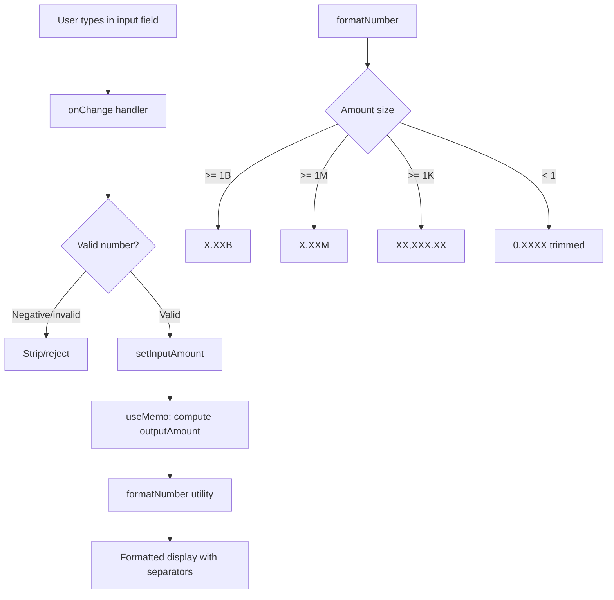

## Problem Statement

The swap form in GoodSwap accepts invalid input values and displays output numbers in an unformatted, overflowing manner:

1. **Negative values accepted**: Entering `-100` in "You pay" produces a negative "You receive" amount (`-9970000.000000`). There is no validation preventing negative input.

2. **Output number overflow**: Entering extremely large numbers (e.g., `999999999999`) causes the "You receive" value to overflow its container, truncating digits and breaking the visual layout.

3. **Excessive decimal places**: Output amounts like `99700.000000` show 6 trailing zeros. There's no smart truncation or formatting.

4. **No number formatting**: Large output numbers have no thousand separators (e.g., shows `99700` instead of `99,700`), making them hard to read.

## User Story

As a GoodSwap user, I want the swap form to reject invalid inputs and display formatted numbers, so that I can confidently understand the amounts I'm trading.

## How It Was Found

- Entered `-100` in "You pay" field — accepted, showed negative output amount
- Entered `999999999999` — output number overflowed container, digits cut off
- Entered `1` — output showed `99700.000000` with excessive decimals
- Screenshots in `.autobuilder/screenshots/swap-negative.png` and `.autobuilder/screenshots/swap-huge-amount.png`

## Proposed UX

1. **Block negative input**: The input field should reject negative values. Strip the minus sign or clamp to 0. The `onChange` handler should filter out invalid characters.

2. **Smart number display**: Output amounts should be formatted with:
   - Thousand separators for readability (e.g., `99,700`)
   - Intelligent decimal truncation: 2 decimals for stablecoin amounts, 4-6 decimals for small crypto amounts, trim trailing zeros
   - For very large numbers, use abbreviations (e.g., `1.2M`, `3.5B`)

3. **Text overflow protection**: Output field should use `text-overflow: ellipsis` or auto-size to prevent layout breaks. Show full number in a tooltip on hover.

4. **Max input guard**: Set a reasonable maximum input to prevent absurd calculations.

## Acceptance Criteria

- [ ] Negative values cannot be entered in the "You pay" field
- [ ] Output amounts display with proper thousand separators
- [ ] Trailing zeros are trimmed from decimal amounts
- [ ] Very large output numbers don't overflow the container
- [ ] Numbers above 1M use abbreviated format (e.g., "1.2M G$")
- [ ] The UBI breakdown section also uses formatted numbers
- [ ] Zero and empty states still work correctly

## Verification

- Enter `-1` → input rejects or becomes `1`
- Enter `999999999999` → output displays abbreviated number, no overflow
- Enter `1` with ETH→G$ → output shows `99,700` (not `99700.000000`)
- Enter `0.001` with ETH→G$ → output shows `99.7` (appropriate precision)
- Run `npm run build` — no build errors

## Out of Scope

- Real-time balance checking (requires wallet connection)
- Slippage tolerance settings
- Price impact warnings

---

## Planning

### Research Notes

- The current `SwapCard.tsx` uses `<input type="number">` which allows negative values by default.
- The `onChange` handler does no validation: `onChange={e => setInputAmount(e.target.value)}`
- `outputAmount` is computed via `useMemo` with `.toFixed(6)` or `.toFixed(2)` — no thousand separators, no smart truncation.
- The output field uses `min-w-0` but has no `overflow` handling for very long numbers.
- JavaScript's `Intl.NumberFormat` can handle thousand separators and smart decimal formatting natively.

### Assumptions

- The number formatting utility can be a simple helper function (no library needed).
- `Intl.NumberFormat` is available in all target browsers.
- Input validation should happen at the `onChange` level — strip invalid characters before setting state.

### Architecture Diagram

### Size Estimation

- **New pages/routes**: 0
- **New UI components**: 0 (modifying existing SwapCard.tsx)
- **API integrations**: 0
- **Complex interactions**: 0
- **New utility functions**: 1 (`formatNumber`)
- **Estimated LOC**: ~80-120 (utility function + component changes)

### One-Week Decision: YES

Rationale: Zero new pages, zero new components. This is a focused refactor of the existing SwapCard input handling plus a small utility function. Approximately 2-3 hours of work. Well under the one-week threshold.

### Implementation Plan

**Day 1 (2-3 hours):**
1. Create `frontend/src/lib/format.ts` — number formatting utility with `formatAmount()` function supporting thousand separators, smart decimals, and abbreviations (M, B)
2. Update `SwapCard.tsx`:
   - Add input validation in `onChange` to reject negative values and limit length
   - Use `formatAmount()` for the output display
   - Add `overflow-hidden text-ellipsis` to output field
3. Update `UBIBreakdown.tsx` to use the same formatting utility
4. Verify edge cases: 0, empty, small decimals, large numbers, token flips
