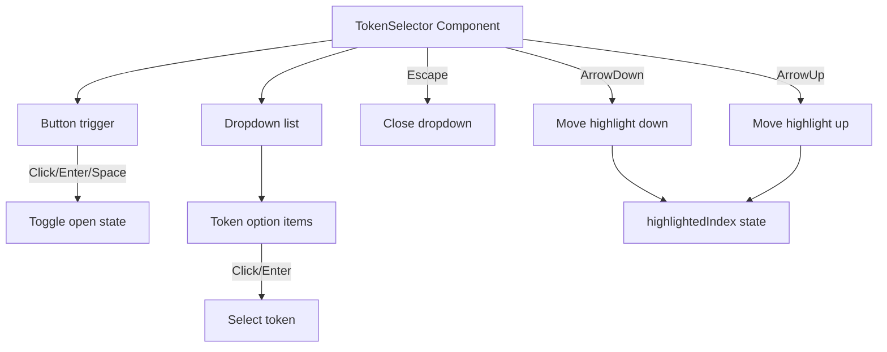

## Problem Statement

The token selector dropdown cannot be closed with the Escape key and has no keyboard navigation support. When the dropdown is open, pressing Escape does nothing — users must click outside the dropdown to close it. There is also no arrow key navigation through the token list, no focus management when the dropdown opens, and no visual focus indicator. This makes the component inaccessible to keyboard-only users and less polished than competitors like Uniswap whose token modal supports full keyboard interaction.

## User Story

As a keyboard-focused user, I want to be able to open the token selector, navigate with arrow keys, select with Enter, and dismiss with Escape, so that I can use the swap interface without a mouse.

## How It Was Found

Automated Playwright edge case testing:
- Opened the token selector dropdown
- Pressed Escape key → dropdown remained open
- No arrow key navigation through token options
- No focus trap within the dropdown
- Dropdown only closes via mousedown outside event

## Proposed UX

- **Escape** key closes the dropdown when open
- **Arrow Up/Down** navigates through available tokens with visible focus highlight
- **Enter** selects the focused token
- When the dropdown opens, focus moves to the first item
- When the dropdown closes, focus returns to the trigger button
- Match standard ARIA listbox/combobox patterns

## Acceptance Criteria

- [ ] Pressing Escape while the token selector is open closes the dropdown
- [ ] Arrow Down moves focus/highlight to the next token in the list
- [ ] Arrow Up moves focus/highlight to the previous token
- [ ] Enter selects the currently highlighted token and closes the dropdown
- [ ] Opening the dropdown highlights the first available token
- [ ] Closing the dropdown returns focus to the trigger button
- [ ] Visual highlight on the focused token item
- [ ] Existing click-based selection still works
- [ ] No regressions in mobile behavior

## Verification

- Run full test suite
- Manual Playwright test: open dropdown → press Escape → verify closed
- Manual Playwright test: open dropdown → ArrowDown → Enter → verify selection

## Out of Scope

- Token search/filter functionality
- Token list sorting
- Custom token import

---

## Planning

### Overview

Add keyboard interaction support to the existing `TokenSelector` component in `frontend/src/components/TokenSelector.tsx`. Currently the dropdown only supports mouse interaction (click to open, click outside to close, click to select). This initiative adds Escape, ArrowUp/Down, and Enter key handling.

### Research Notes

- Standard ARIA listbox pattern: trigger button has `aria-haspopup="listbox"`, dropdown has `role="listbox"`, items have `role="option"`
- React pattern: add `onKeyDown` handler to the wrapper div, track `highlightedIndex` state
- The existing `useEffect` for outside-click already handles cleanup

### Assumptions

- Only 2-3 tokens in the list, so no scroll management needed
- No search/filter functionality needed (out of scope)

### Architecture Diagram

### Size Estimation

- **New pages/routes:** 0
- **New UI components:** 0 (modifying existing TokenSelector)
- **API integrations:** 0
- **Complex interactions:** 1 (keyboard navigation in dropdown)
- **Estimated lines of new code:** ~60

### One-Week Decision: YES

Single component modification adding keyboard event handlers and a `highlightedIndex` state. No new pages, APIs, or complex integrations. Under one day of work.

### Implementation Plan

**Day 1 (< 4 hours):**
1. Add `highlightedIndex` state to TokenSelector
2. Add `onKeyDown` handler: Escape closes, ArrowDown/Up changes index, Enter selects
3. Add visual highlight class for focused item
4. Reset highlight when dropdown opens/closes
5. Return focus to trigger button on close
6. Write component tests for keyboard interactions
7. Run Playwright verification test
8. Commit
