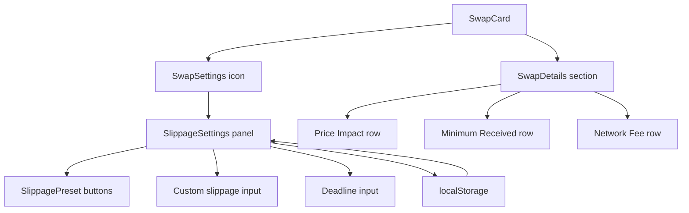

## Problem Statement

When a user enters a swap amount on GoodSwap, the only transaction information shown is the exchange rate and the UBI contribution. There is no slippage tolerance setting, no price impact indicator, no minimum received display, and no settings gear — all of which are standard on every major DEX (Uniswap, SushiSwap, PancakeSwap). A user completing the swap journey has zero control over trade parameters and no way to assess the risk of their trade.

## User Story

As a DeFi user, I want to see price impact, minimum received, and set my slippage tolerance before confirming a swap, so that I can make informed trading decisions and avoid unexpected losses.

## How It Was Found

During UX flow testing of the "user tries to make a swap" scenario:
1. Entered 1.5 ETH → 149,550 G$ — only the rate and UBI breakdown were shown
2. No settings icon anywhere on the swap card
3. No "Price Impact", "Minimum Received", or "Route" information displayed
4. Compared against Uniswap which shows all of these in an expandable details section below the swap amounts
5. Screenshot evidence saved to `.autobuilder/screenshots/swap-with-amount.png`

## Proposed UX

Following Uniswap's pattern:
1. **Settings gear icon** in the swap card header (next to "0.3% fee" badge) that opens a settings panel
2. **Settings panel** with slippage tolerance (0.1%, 0.5%, 1.0% presets + custom input) and transaction deadline
3. **Expandable swap details section** below the UBI breakdown showing:
   - Price impact percentage (color-coded: green <1%, yellow 1-5%, red >5%)
   - Minimum received (based on slippage tolerance)
   - Network fee estimate
4. Details section auto-expands when an amount is entered, collapsed by default

## Acceptance Criteria

- [ ] Settings gear icon visible in swap card header
- [ ] Clicking settings gear opens a settings panel with slippage tolerance options
- [ ] Slippage presets: 0.1%, 0.5%, 1.0% plus custom input
- [ ] Transaction deadline setting (minutes, default 30)
- [ ] Swap details section appears below UBI breakdown when amount is entered
- [ ] Details show: price impact %, minimum received, network fee
- [ ] Price impact is color-coded by severity
- [ ] Settings persist across page refreshes (localStorage)
- [ ] Details section is collapsible/expandable
- [ ] All new UI is responsive and works on 320px viewport

## Verification

- Run all existing tests (`npx vitest run`)
- Verify in browser that settings panel opens and closes correctly
- Verify swap details appear when entering amounts
- Verify on mobile viewport (320px)

## Out of Scope

- Real price impact calculation (use mock for now based on amount thresholds)
- Actual transaction deadline enforcement (backend concern)
- Multi-hop route display

## Planning

### Research Notes

- Uniswap V3/V4 interface shows an expandable "Swap Details" section beneath the swap card with price impact, minimum received, expected output, and network fee
- Slippage settings are accessed via a gear icon in the card header, opening an inline panel with preset buttons (Auto, 0.1%, 0.5%, 1.0%) and a custom input
- React state for slippage can be stored in localStorage for persistence
- Price impact calculation for mock: simulate based on order size relative to a fictional pool depth

### Architecture Diagram

### Size Estimation

- **New pages/routes:** 0
- **New UI components:** 2 (SwapSettings panel/component, SwapDetails expandable section)
- **API integrations:** 0 (all mock)
- **Complex interactions:** 1 (settings panel toggle, localStorage persistence)
- **Estimated LOC:** ~350

### One-Week Decision

**YES** — This is 2 focused UI components with no API integrations and no complex real-time interactions. The slippage panel and details section are both straightforward React components with mock calculations. ~350 LOC fits well within a week.

### Implementation Plan

**Day 1:**
- Create `SwapSettings` component with slippage presets (0.1%, 0.5%, 1.0%) and custom input
- Add transaction deadline setting
- Persist settings in localStorage via a custom hook `useSwapSettings`
- Add gear icon to SwapCard header

**Day 2:**
- Create `SwapDetails` component showing price impact, minimum received, network fee
- Integrate into SwapCard below UBI breakdown
- Add expand/collapse toggle with chevron animation
- Calculate mock price impact based on amount thresholds
- Calculate minimum received = output × (1 - slippage)

**Day 3:**
- Write tests for all new components
- Color-code price impact (green/yellow/red)
- Responsive design verification at 320px
- Integration testing
