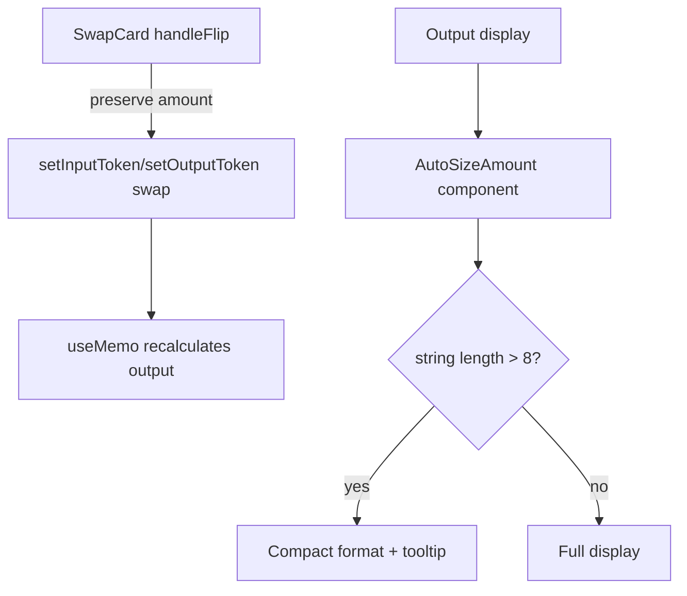

## Problem Statement

Two UX friction points found during complete user journey testing:

1. **Flip button clears input amount**: When the user clicks the flip (↕) button to reverse the token pair, the input amount is cleared. On Uniswap, flipping preserves the amount and recalculates the output, allowing users to quickly compare rates in both directions. Clearing forces users to re-type their amount, which is frustrating.

2. **Large output amounts truncated on small mobile**: On a 320px viewport (iPhone SE), entering 10 ETH shows "997,..." as the output with CSS text-overflow ellipsis. The user cannot see the full amount they will receive, which is critical financial information that must never be hidden.

## User Story

As a swap user, I want the flip button to preserve my entered amount and show me the recalculated output instantly, so that I can quickly compare rates between token pairs without retyping.

As a mobile user, I want to see the full output amount on any screen size, so that I know exactly how much I will receive.

## How It Was Found

1. **Flip clears amount**: Tested "User switches token pair" scenario. Entered 1.5 ETH, clicked flip — input cleared. Had to re-enter amount. Screenshot: `.autobuilder/screenshots/swap-after-flip.png`
2. **Mobile truncation**: Tested on 320px viewport. Entered 10 ETH (output = 997,000 G$) — displayed as "997,..." on screen. Screenshot: `.autobuilder/screenshots/mobile-small-with-amount.png`

## Proposed UX

1. **Flip preservation**: When flipping:
   - Keep the current input amount
   - Swap the input/output tokens
   - Recalculate the output amount based on new pair
   - Add a subtle rotation animation to the flip icon (180° over 200ms)

2. **Mobile number display**: 
   - Use responsive text sizing: scale down font-size on small screens when the number is long
   - For very large numbers (>6 digits), use compact notation (e.g., "997K" with full value in a tooltip)
   - Or use `text-[clamp(1.25rem,5vw,1.875rem)]` to auto-scale

## Acceptance Criteria

- [ ] Flip button preserves the input amount (does not clear)
- [ ] Output recalculates after flip with the new token pair
- [ ] Flip button has a smooth rotation animation
- [ ] Output amounts on 320px wide viewport are fully visible (not truncated)
- [ ] Full precision value available via tooltip on compact numbers
- [ ] All existing tests continue to pass

## Verification

- Run all existing tests (`npx vitest run`)
- Verify flip behavior in browser: enter amount, flip, confirm amount preserved
- Verify on 320px viewport: enter large amount, confirm output is readable
- Test with all token pairs

## Out of Scope

- Changing the overall swap card layout
- Adding new tokens
- Any backend/contract changes

## Planning

### Research Notes

- Uniswap preserves the input amount on flip and recalculates; this is the expected DeFi UX pattern
- For responsive number display, options include: (a) CSS `clamp()` font-size, (b) compact number formatting (Intl.NumberFormat with `notation: 'compact'`), (c) auto-shrink based on string length
- The current code in `handleFlip` calls `setInputAmount('')` which explicitly clears — simple fix to remove that line
- Output amount uses `text-3xl` (1.875rem/30px) and `text-ellipsis` which truncates on mobile

### Architecture Diagram

### Size Estimation

- **New pages/routes:** 0
- **New UI components:** 0 (modifying existing SwapCard + possibly a small AutoSizeAmount helper)
- **API integrations:** 0
- **Complex interactions:** 0
- **Estimated LOC:** ~100

### One-Week Decision

**YES** — This is a small, focused change: one line removal for flip behavior, and a text sizing improvement for mobile output display. ~100 LOC total, well within a single day.

### Implementation Plan

**Day 1:**
- Modify `handleFlip` in SwapCard to preserve inputAmount instead of clearing
- Update flip button with CSS transition animation (rotate 180°)
- Implement responsive output number display using auto-shrink font size or compact notation
- Add tooltip with full precision value
- Write tests for flip preservation behavior
- Test on 320px viewport
