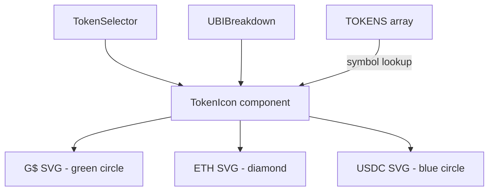

## Problem Statement

The token selector and swap card use emoji characters (💚 for G$, ⟠ for ETH, 💲 for USDC) as token icons. Every professional DEX (Uniswap, SushiSwap, 1inch) uses proper SVG or image-based token logos. The emoji icons make GoodSwap look like a prototype rather than a production-quality application.

## User Story

As a DeFi user, I want to see recognizable, professional token logos so that I trust the swap interface and can quickly identify tokens at a glance.

## How It Was Found

Visual review of the live app at http://localhost:3100. Screenshots saved to `.autobuilder/screenshots/home.png` and `.autobuilder/screenshots/token-selector-open.png` show emoji characters where token logos should be.

## Proposed UX

- Replace the `icon: string` field in the `Token` interface to support React component references
- G$: Green circle with "G$" text (matching header brand mark style)
- ETH: The official Ethereum diamond logo
- USDC: The official USDC circle logo
- Each logo should be a crisp inline SVG rendered at consistent sizes

## Acceptance Criteria

- [ ] All three tokens (G$, ETH, USDC) use inline SVG logos instead of emoji
- [ ] SVGs render consistently at correct sizes in: token selector trigger, token selector dropdown list, UBI breakdown callout
- [ ] Logos are visually crisp and recognizable at small sizes (20px)
- [ ] No layout shifts when switching between tokens
- [ ] Mobile and desktop render identically

## Overview

Create a `TokenIcon` component that renders inline SVGs for each supported token. Update the `TOKENS` array and all rendering sites to use the component instead of raw emoji strings.

## Research Notes

- Inline SVGs are the standard approach for token logos in DeFi frontends (vs. image URLs which require network requests)
- The ETH diamond and USDC circle logos are well-known and freely available as SVG paths
- The G$ logo already exists in the Header component as a green circle with text

## Assumptions

- Only 3 tokens need logos currently (G$, ETH, USDC)
- SVGs will be hardcoded inline (no external image loading)

## Architecture Diagram

## Size Estimation

- New pages/routes: 0
- New UI components: 1 (TokenIcon)
- API integrations: 0
- Complex interactions: 0
- Estimated lines of new code: ~80

## One-Week Decision: YES

This is a small, focused change: 1 new component (~50 LOC) plus updates to 2 existing files (TokenSelector, UBIBreakdown) to use the new component. Well under the one-week threshold.

## Implementation Plan

1. Create `TokenIcon` component in `frontend/src/components/TokenIcon.tsx` with inline SVGs for G$, ETH, USDC
2. Update `Token` interface — keep `icon` field as string symbol key for backward compat, add `TokenIcon` usage at render sites
3. Update `TokenSelector.tsx` — replace `{selected.icon}` and `{token.icon}` with `<TokenIcon symbol={...} />`
4. Update `UBIBreakdown.tsx` — replace the 💚 emoji with `<TokenIcon symbol="G$" />`
5. Test at desktop and mobile viewports

## Verification

- Run all tests: `npm test` in frontend/
- Visual check in browser at desktop (1280px) and mobile (375px) viewports

## Out of Scope

- Adding new tokens beyond G$, ETH, USDC
- Fetching token logos from external APIs
- Dark/light mode variants
