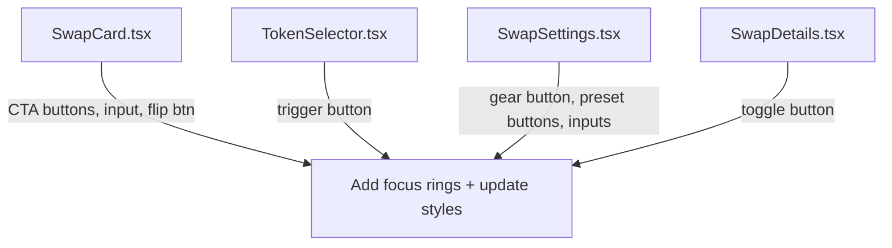

## Problem Statement

Several interaction-level visual quality issues make the swap card feel less polished than production DEXes:

1. **CTA button too muted**: The "Connect Wallet to Swap" button uses `bg-goodgreen/20 text-goodgreen/60` which looks like a disabled/ghost button rather than the primary action.
2. **No visible focus rings**: Tab-navigating through the swap form shows no focus indicators on interactive elements.
3. **Input placeholder low contrast**: The "0" placeholder uses `text-gray-600` against `bg-dark/80`, which is very faint.

## User Story

As a user navigating the swap interface, I want clearly visible interactive states (hover, focus, active) and a prominent call-to-action so that the interface feels responsive and professional.

## How It Was Found

Visual review of the live app at http://localhost:3100. Screenshots at `.autobuilder/screenshots/home.png` show the muted CTA. Code review confirmed missing `focus-visible:` ring utilities.

## Proposed UX

1. **CTA button**: Strengthen "Connect Wallet to Swap" to `bg-goodgreen/30 text-goodgreen border border-goodgreen/40`. "Enter an Amount" to `text-gray-400`.
2. **Focus rings**: Add `focus-visible:ring-2 focus-visible:ring-goodgreen/50` to all interactive elements.
3. **Placeholder contrast**: Change from `placeholder:text-gray-600` to `placeholder:text-gray-500`.

## Acceptance Criteria

- [ ] "Connect Wallet to Swap" button is visually prominent (not ghost/disabled looking)
- [ ] "Enter an Amount" button text uses gray-400 for better visibility
- [ ] All interactive elements show a visible focus ring when tab-navigated
- [ ] Input placeholder "0" is legible against the dark background
- [ ] No visual regressions in expanded state (with amount, UBI breakdown, details)

## Overview

Pure CSS/Tailwind class changes across SwapCard.tsx, TokenSelector.tsx, SwapSettings.tsx, and SwapDetails.tsx. No new components, no logic changes.

## Research Notes

- `focus-visible` is the modern standard for keyboard-only focus rings (doesn't show on mouse clicks)
- Tailwind's `focus-visible:ring-*` utilities are well supported
- WCAG AA requires 3:1 contrast for UI components

## Assumptions

- Focus ring color will use goodgreen at 50% opacity to match the brand
- Changes are CSS-only, no functional logic changes

## Architecture Diagram

## Size Estimation

- New pages/routes: 0
- New UI components: 0
- API integrations: 0
- Complex interactions: 0
- Estimated lines of new code: ~30 (Tailwind class updates only)

## One-Week Decision: YES

This is purely CSS class updates across 4 files. No new components, no logic changes. ~30 lines of Tailwind class modifications. Fits in a few hours.

## Implementation Plan

1. Update `SwapCard.tsx`:
   - CTA button classes for "Connect Wallet" and "Enter an Amount"
   - Input placeholder contrast
   - Focus ring on input, flip button
2. Update `TokenSelector.tsx` — focus ring on trigger button
3. Update `SwapSettings.tsx` — focus ring on gear button, preset buttons, custom input
4. Update `SwapDetails.tsx` — focus ring on toggle button
5. Visual verification at desktop and mobile

## Verification

- Run all tests: `npm test` in frontend/
- Tab through all elements and verify focus rings appear
- Screenshots at desktop and mobile widths

## Out of Scope

- Changing the overall color scheme
- Adding new interactive components
- Full accessibility audit
