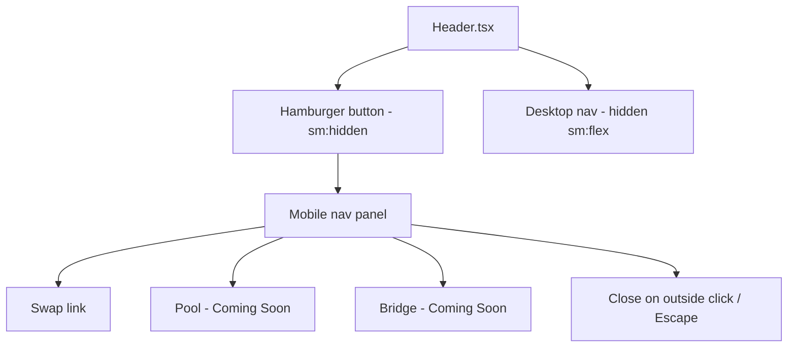

## Problem Statement

On mobile viewports (< 640px), the header navigation links (Swap, Pool, Bridge) are completely hidden via `hidden sm:flex` with no alternative navigation. Mobile users see only the logo and "Connect Wallet" button, with zero way to navigate.

## User Story

As a mobile user, I want to access navigation links on my phone so that I can navigate between sections.

## How It Was Found

Visual review at mobile viewport (375px). Screenshot at `.autobuilder/screenshots/home-mobile.png` confirms nav links invisible on mobile.

## Proposed UX

Add a hamburger menu button in the mobile header that opens a slide-down navigation panel:

- **Trigger**: Hamburger icon visible only on mobile (`sm:hidden`)
- **Panel**: Slides down showing Swap, Pool ("Coming Soon"), Bridge ("Coming Soon")
- **Close**: Tap hamburger, tap outside, or Escape
- **Animation**: `transition-all duration-200`

## Acceptance Criteria

- [ ] Hamburger icon visible on mobile (< 640px), hidden on desktop (>= 640px)
- [ ] Tapping hamburger opens navigation panel with all nav links
- [ ] "Coming Soon" badges displayed for Pool and Bridge
- [ ] Active link has distinct styling
- [ ] Panel closes on: hamburger tap, outside click, Escape key
- [ ] Smooth open/close animation
- [ ] Desktop navigation unchanged

## Overview

Add mobile menu state and markup to the existing `Header.tsx` component. No new files needed — the menu markup goes inline in the header.

## Research Notes

- Standard mobile nav pattern: hamburger trigger + slide-down panel
- Can use React state in the existing client component
- Outside-click close pattern already exists in TokenSelector and SwapSettings

## Assumptions

- Keep all menu logic in Header.tsx (no separate component needed for 3 nav items)
- Use CSS transitions for animation (no framer-motion dependency)

## Architecture Diagram

## Size Estimation

- New pages/routes: 0
- New UI components: 0 (inline in Header.tsx)
- API integrations: 0
- Complex interactions: 1 (hamburger open/close with animation)
- Estimated lines of new code: ~60

## One-Week Decision: YES

Single component modification with ~60 LOC of new markup and state. Standard mobile nav pattern. Fits in half a day.

## Implementation Plan

1. Add `useState` for menu open/close in Header.tsx
2. Add hamburger button with `sm:hidden`
3. Add mobile nav panel markup with nav links and "Coming Soon" badges
4. Add outside-click and Escape handlers (reuse existing pattern from TokenSelector)
5. Add CSS transition for smooth open/close
6. Test at 375px and 640px breakpoints

## Verification

- Run all tests: `npm test` in frontend/
- Visual check at 375px and 640px viewports
- Test open/close interactions

## Out of Scope

- Bottom navigation bar
- Navigation to actual Pool/Bridge pages
- Tablet-specific layouts
