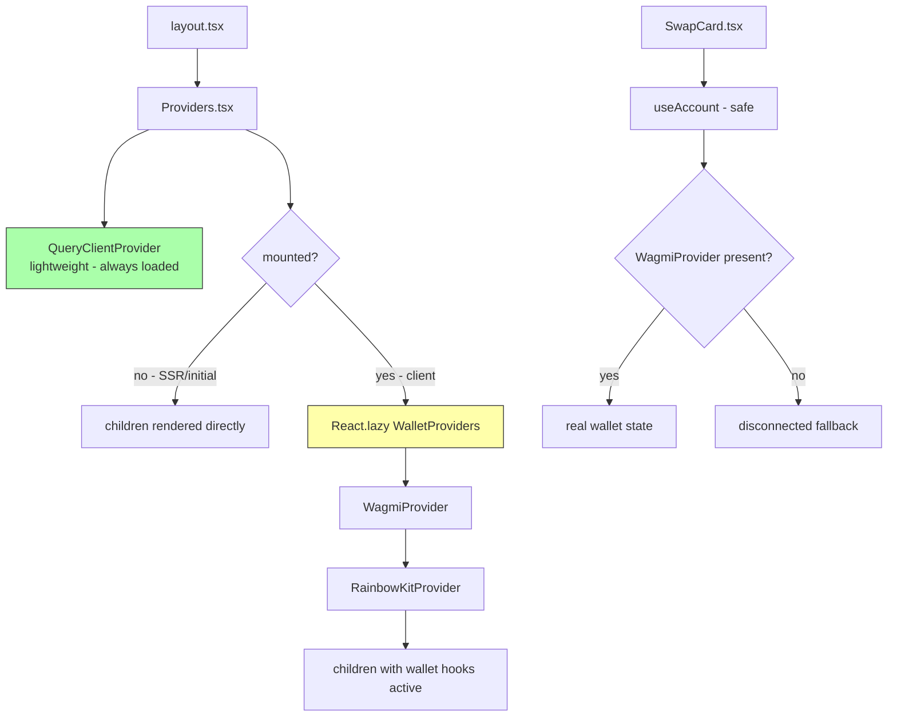

## Problem Statement

The GoodSwap page loads **6.9 MB of JavaScript** in development and **6.1 MB uncompressed** in production on initial page load. The wallet SDK ecosystem (RainbowKit, Wagmi, WalletConnect, Reown AppKit) dominates the bundle. All wallet code is eagerly loaded in the root layout via `Providers.tsx`, even though the user hasn't attempted to connect a wallet.

The wallet SDKs also initiate 6+ background network requests on page load to WalletConnect relay servers and Reown AppKit APIs, causing console errors (ERR_CONNECTION_REFUSED, 403, 400) and preventing the page from reaching `networkidle`.

The swap form is fully functional without a wallet connected — users can browse exchange rates, enter amounts, and see UBI fee breakdown without any wallet interaction.

## User Story

As a GoodSwap user, I want the swap page to load fast so I can quickly check rates and decide whether to swap, without waiting for wallet SDKs I haven't requested yet.

## How It Was Found

Performance profiling using Playwright during product review iteration #6. Measured resource transfer sizes, console errors, and page load timing in both dev and production modes.

## Proposed UX

- The swap page loads instantly with a lightweight "Connect Wallet" placeholder button
- The swap form is immediately interactive (enter amounts, select tokens, see rates/UBI breakdown)
- Wallet providers load asynchronously in the background after first render
- Once loaded, all wallet functionality works seamlessly
- No console errors from wallet SDK on initial page load

## Research Notes

- Next.js 14 supports `optimizePackageImports` in next.config.js which improves tree-shaking for barrel-export packages like `viem` and `wagmi`
- `React.lazy` + `Suspense` can defer loading of the wallet provider components into a separate chunk
- Wagmi hooks (`useAccount`, `useReadContract`, etc.) throw if called outside `WagmiProvider` — components using these hooks must be wrapped in the lazy-loaded provider OR use safe wrapper hooks
- The `Providers` component is a client component ('use client'), so `React.lazy` works for its internals
- Production build shows 160 KB gzipped first load, but the browser still parses 6+ MB of uncompressed JS

## Assumptions

- RainbowKit and Wagmi support being lazy-loaded (no global side effects required at import time)
- The wallet SDK can initialize after first render without breaking the app
- `optimizePackageImports` will meaningfully reduce barrel-export bloat from viem/wagmi

## Architecture Diagram

## Size Estimation

- **New/rewritten pages/routes:** 0
- **New UI components:** 1 (WalletProviders.tsx — split from Providers.tsx)
- **Modified components:** 4 (Providers.tsx, SwapCard.tsx, WalletButton.tsx, next.config.js)
- **API integrations:** 0
- **Complex interactions:** 1 (lazy loading with Suspense and graceful wagmi hook degradation)
- **Estimated lines of new code:** ~200

## One-Week Decision: YES

This is a focused performance refactoring with 0 new pages, 1 new component (WalletProviders.tsx), 4 modified files, and ~200 lines of code. The main complexity is the lazy-loading pattern with graceful degradation, which is a well-understood React pattern. Fits comfortably in one week.

## Implementation Plan

### Day 1: Config + Split Providers
1. Add `optimizePackageImports` to `next.config.js` for viem, wagmi, @rainbow-me/rainbowkit, @tanstack/react-query
2. Create `WalletProviders.tsx` — extract WagmiProvider + RainbowKitProvider from Providers.tsx
3. Update `Providers.tsx` — use `React.lazy` + `Suspense` to load WalletProviders after mount
4. Run build to verify bundle improvements

### Day 2: Graceful Hook Degradation
1. Create `lib/useWalletReady.ts` — context to track whether wallet providers are mounted
2. Update `SwapCard.tsx` — handle the "wallet not ready yet" state gracefully (show disconnected UI)
3. Update `WalletButton.tsx` — show lightweight placeholder while providers load
4. Run all tests, fix any failures

### Day 3: Testing + Verification
1. Verify no console errors on initial page load
2. Measure bundle size improvements with Playwright
3. Verify wallet connection flow still works after lazy load
4. Run react-doctor, fix any issues
5. Commit

## Acceptance Criteria

- [ ] Wallet providers (WagmiProvider, RainbowKitProvider) are lazy-loaded via React.lazy after first render
- [ ] `next.config.js` includes `optimizePackageImports` for viem, wagmi, and @rainbow-me/rainbowkit
- [ ] No console errors from wallet SDK on initial page load
- [ ] The swap form renders and is interactive before wallet SDK loads
- [ ] All existing tests continue to pass
- [ ] Build completes without errors
- [ ] Wallet connection flow works after lazy load

## Verification

- Run full test suite (`npx vitest run`)
- Run production build (`npm run build`)
- Measure page load resources in Playwright headless browser
- Verify no console errors on initial page load
- Verify wallet connection flow works after lazy load

## Out of Scope

- Changing the wallet SDK library (keep RainbowKit + Wagmi)
- Adding new wallet features
- Changing the visual design of the swap page
- Server-side rendering of wallet state
