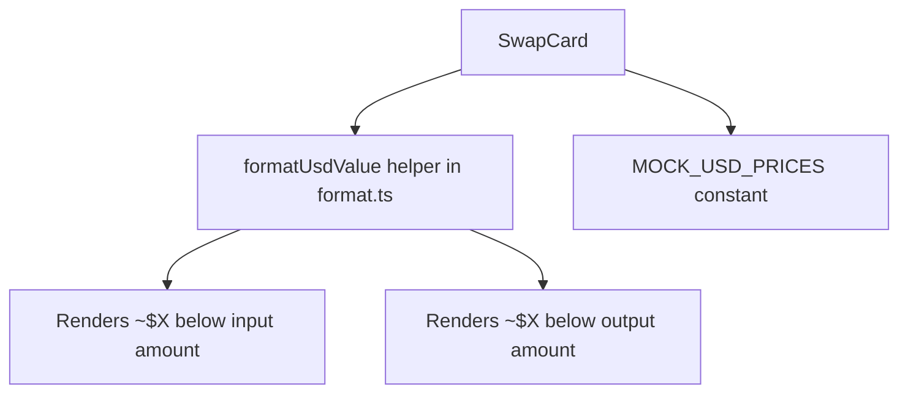

## Problem Statement

During a deep-dive review of the swap interface compared to Uniswap, the most obvious missing feature is **USD fiat value equivalents** shown alongside the token amounts. When a user enters "100 ETH" in the input, Uniswap shows "~$300,000" directly below the amount. When the output is "9.97M G$", Uniswap would show the dollar equivalent below it. GoodSwap shows no fiat equivalents anywhere in the swap card.

This is the single most impactful UX gap. Without dollar values, users cannot intuitively understand the magnitude of their trade, which erodes trust and makes the app feel incomplete.

## User Story

As a DeFi user swapping tokens on GoodSwap, I want to see the approximate USD value of my input and output amounts, so that I can quickly understand the real-world value of my trade without mentally calculating exchange rates.

## How It Was Found

Observed during browser-based deep-dive testing of the swap feature. Compared GoodSwap's swap card against Uniswap's swap interface. Uniswap prominently displays fiat equivalents under every amount field — GoodSwap does not.

## Proposed UX

- Below the input amount (e.g. "100"), show "~$300,000" in small gray text
- Below the output amount (e.g. "9.97M G$"), show "~$99,700" in small gray text
- Use the existing `MOCK_RATES` to calculate USD values (ETH = $3000, G$ = $0.01, USDC = $1.00)
- Format with compact notation for large values (e.g. "$300K", "$1.2M")
- Gray/muted text color (text-gray-500) so it doesn't compete with the primary amount

## Acceptance Criteria

- [ ] Input field shows approximate USD value below the token amount
- [ ] Output field shows approximate USD value below the token amount
- [ ] USD values update in real-time as the user types
- [ ] Large values use compact notation ($1.2K, $3.5M, $1.2B)
- [ ] USD values disappear when the input is empty or zero
- [ ] All existing tests continue to pass
- [ ] New tests cover USD value display and formatting

## Verification

- Run full test suite and verify all pass
- Verify in browser with agent-browser that USD values appear and update correctly
- Test with various token pairs and amounts

## Out of Scope

- Real-time price feeds from external APIs (use mock rates)
- Historical price charts
- Portfolio value tracking

---

## Planning

### Overview

Add approximate USD fiat value display below both the input and output amount fields in the SwapCard. Uses existing mock rates to derive USD prices (ETH=$3000, G$=$0.01, USDC=$1.00). Small, focused change touching only `format.ts` and `SwapCard.tsx`.

### Research Notes

- Uniswap displays fiat values as muted gray text directly below the token amount
- Values use `~` prefix to indicate approximation (e.g. "~$300,000")
- For very small values, Uniswap shows "< $0.01"
- Compact notation for large values: "$1.2K", "$3.5M"

### Assumptions

- USD prices are hardcoded mock values (same pattern as mock rates)
- No external API calls needed

### Architecture Diagram

### Size Estimation

- **New pages/routes:** 0
- **New UI components:** 0 (inline spans in existing components)
- **API integrations:** 0
- **Complex interactions:** 0
- **Estimated LOC:** ~50-80 lines

### One-Week Decision: YES

This is a small focused change:
- One new formatting function in `format.ts` (~20 lines)
- A `MOCK_USD_PRICES` constant (~5 lines)
- Two `useMemo` hooks + JSX spans in `SwapCard.tsx` (~25 lines)
- Tests for the new formatting function (~30 lines)

Total ~80 lines of new code — well under the one-week threshold. This is a 1-day task.

### Implementation Plan

1. Add `MOCK_USD_PRICES` map and `formatUsdValue` helper to `format.ts`
2. Add `useMemo` for input/output USD values in `SwapCard.tsx`
3. Render USD values below each amount field
4. Add tests for `formatUsdValue` formatting
5. Verify visually in browser
