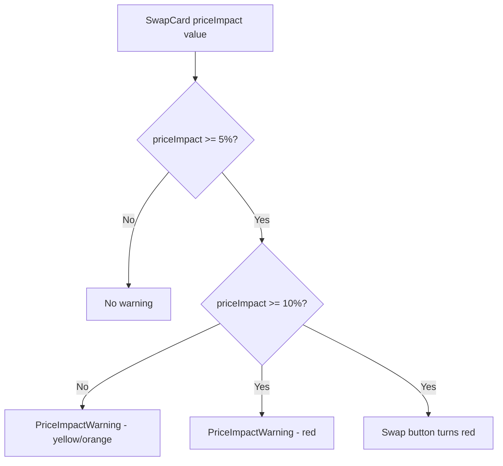

## Problem Statement

During deep-dive testing of the swap feature with extreme amounts (e.g. 999,999,999,999 G$), the price impact reached 15% — shown only as a red number in the "Swap Details" section. Uniswap shows a prominent, impossible-to-miss warning banner when price impact exceeds ~5%, something like: "Price Impact Warning: This trade will result in a significantly unfavorable price. You will lose a large portion of your funds."

GoodSwap's current price impact display is buried in the collapsible "Swap Details" section and is easy to overlook, which could lead to users executing trades with devastating slippage.

## User Story

As a DeFi user executing a large swap, I want to see a prominent, unmissable warning when my trade has high price impact, so that I am not surprised by receiving significantly less than expected.

## How It Was Found

Observed during browser testing by entering 999,999,999,999 G$ in the input. Price impact showed 15.00% in red text, but only in the collapsed details section. No standalone warning or confirmation barrier was shown. Compared to Uniswap which blocks the swap button and requires explicit acknowledgment for high-impact trades.

## Proposed UX

- **Warning threshold at 5% price impact**: Show a yellow/orange warning banner above the swap button
- **Danger threshold at 10% price impact**: Show a red warning banner, change the swap button to red with warning text like "Swap Anyway" 
- Banner text: "Price impact is high ({X}%). You may receive significantly less than expected."
- The banner should appear between the swap details and the swap button — impossible to miss
- At 10%+, the swap button should change from green to red/orange with text "Swap Anyway — High Price Impact"

## Acceptance Criteria

- [ ] Warning banner appears when price impact >= 5%
- [ ] Banner uses yellow/orange styling for 5-10% impact
- [ ] Banner uses red styling for >= 10% impact
- [ ] Banner displays the exact price impact percentage
- [ ] Swap button changes to warning style (red/orange) when price impact >= 10%
- [ ] Warning disappears when price impact drops below threshold
- [ ] All existing tests continue to pass
- [ ] New tests cover warning visibility at different price impact thresholds

## Verification

- Run full test suite and verify all pass
- Test in browser with various amounts to trigger different thresholds
- Verify warning appears and disappears correctly

## Out of Scope

- Confirmation modal (separate initiative)
- Preventing swap execution (just warn, don't block)
- Custom price impact thresholds in settings

---

## Planning

### Overview

Add a prominent warning banner in the swap card when price impact exceeds 5% (warning) or 10% (danger). Also modify the swap button styling at the danger threshold to change from green to red. The `priceImpact` value already exists in `SwapCard.tsx` — this initiative adds visual UI for the warning.

### Research Notes

- Uniswap uses a red warning banner below the swap details for high-impact trades
- Uniswap changes the swap button to red/orange at extreme impact levels
- Standard thresholds in DeFi: <1% green, 1-5% yellow, 5-10% orange/warning, >10% red/danger

### Assumptions

- Price impact calculation already exists and works correctly
- No new state management needed — just conditional rendering based on existing `priceImpact` value

### Architecture Diagram

### Size Estimation

- **New pages/routes:** 0
- **New UI components:** 1 (PriceImpactWarning — small inline banner)
- **API integrations:** 0
- **Complex interactions:** 0
- **Estimated LOC:** ~60-80 lines

### One-Week Decision: YES

Very small focused change:
- One new `PriceImpactWarning` component (~30 lines)
- Conditional styling for swap button in `SwapWalletActions.tsx` (~10 lines)
- Integration in `SwapCard.tsx` (~5 lines)
- Tests (~30 lines)

Total ~75 lines — this is a half-day task.

### Implementation Plan

1. Create `PriceImpactWarning.tsx` component with threshold-based styling
2. Add `PriceImpactWarning` to `SwapCard.tsx` between details and button
3. Pass `priceImpact` prop to `SwapWalletActions` to modify button styling
4. Add tests for warning visibility at different thresholds
5. Verify visually in browser
