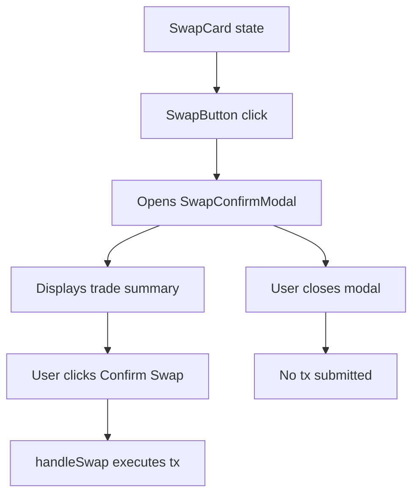

## Problem Statement

During deep-dive testing of the swap feature, clicking the "Swap" button (when wallet is connected) immediately triggers the on-chain transaction with no intermediate review step. Uniswap shows a "Review Swap" modal that displays a full summary of the trade (amounts, rates, fees, minimum received, price impact) and requires the user to click "Confirm Swap" before any transaction is sent. This review step is a critical safety mechanism that prevents accidental or misunderstood swaps.

GoodSwap currently goes straight from button click → transaction, which is a significant safety gap for a DeFi application handling real funds.

## User Story

As a DeFi user about to execute a swap, I want to see a clear review of my trade details in a confirmation modal before any transaction is submitted, so that I can verify the amounts, rates, and fees are correct and avoid costly mistakes.

## How It Was Found

Observed during browser testing of the swap flow. After entering an amount and clicking the swap button (with wallet connected), the `handleSwap` function immediately calls `approve` with no confirmation UI. Compared to Uniswap which always shows a review modal first.

## Proposed UX

- Clicking "Swap ETH for G$" opens a modal/dialog overlay
- Modal header: "Review Swap"
- Modal content shows:
  - Input: amount + token + USD equivalent
  - Output: amount + token + USD equivalent  
  - Exchange rate
  - Price impact (with color coding)
  - Minimum received
  - Network fee
  - UBI contribution
- Modal footer: "Confirm Swap" button (green) and close/cancel button
- Only after clicking "Confirm Swap" does the transaction execute
- Modal uses dark theme consistent with the rest of the app
- Accessible: traps focus, closeable with Escape, proper ARIA attributes

## Acceptance Criteria

- [ ] Clicking the swap button opens a review modal instead of immediately executing
- [ ] Modal displays input amount, output amount, exchange rate, price impact, minimum received, network fee, and UBI contribution
- [ ] Modal has a "Confirm Swap" button that triggers the actual transaction
- [ ] Modal can be closed with the X button, clicking outside, or pressing Escape
- [ ] Modal traps focus for accessibility
- [ ] After confirming, the transaction flow proceeds as before
- [ ] All existing tests continue to pass
- [ ] New tests cover modal open/close and confirmation flow

## Verification

- Run full test suite and verify all pass
- Test in browser that modal opens on swap button click
- Test modal dismissal (close button, outside click, Escape key)
- Verify transaction only fires after Confirm click

## Out of Scope

- Transaction progress tracking within the modal
- Price update/refresh while modal is open
- Multi-step approval + swap flow UI

---

## Planning

### Overview

Add a review/confirmation modal that opens when the user clicks the swap button. The modal displays a full summary of the trade (input, output, rate, fees, price impact, UBI contribution) and requires explicit "Confirm Swap" click before the transaction is submitted. Uses the existing swap data already computed in `SwapCard.tsx`.

### Research Notes

- Uniswap uses a bottom-sheet style modal on mobile and centered dialog on desktop
- The modal shows all key swap details in a clean, readable format
- Focus trapping is standard for accessibility compliance
- React portals are commonly used for modals to escape parent overflow

### Assumptions

- All swap data (amounts, rates, fees, UBI) is already computed in SwapCard
- The modal will receive all needed data as props
- Using React portal for proper stacking context

### Architecture Diagram

### Size Estimation

- **New pages/routes:** 0
- **New UI components:** 1 (SwapConfirmModal — medium complexity)
- **API integrations:** 0
- **Complex interactions:** 1 (modal focus trap, keyboard handling, portal)
- **Estimated LOC:** ~150-200 lines

### One-Week Decision: YES

One focused modal component:
- `SwapConfirmModal.tsx` — modal with trade summary display (~120 lines)
- Integration in `SwapWalletActions.tsx` to open modal instead of direct tx (~20 lines)
- Focus trap + Escape handling (~20 lines)
- Tests for open/close/confirm flow (~50 lines)

Total ~210 lines — fits within a 2-3 day estimate. One component, one interaction pattern.

### Implementation Plan

1. Create `SwapConfirmModal.tsx` with trade summary layout
2. Modify `SwapWalletActions.tsx` swap button to open modal
3. Pass `onConfirm` callback that triggers actual tx
4. Add focus trap and keyboard accessibility
5. Add tests for modal flow
6. Verify visually in browser
