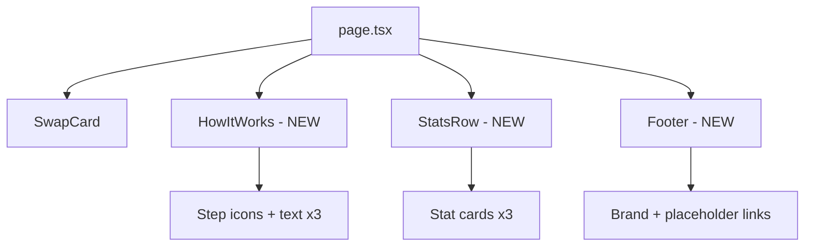

## Problem Statement

When a first-time user lands on GoodSwap, the page shows a tagline ("Swap. Fund UBI."), a swap card, and a footer reading "Powered by GoodDollar L2 — Chain ID 42069". There is nothing below the swap card — no explanation of what UBI is, how GoodSwap works, or why this swap is different from Uniswap. The footer uses developer jargon ("Chain ID 42069") that means nothing to regular users.

A new user cannot figure out what makes this app special within 10 seconds. They see a generic-looking swap interface with a fee and have no reason to stay.

Compare with Uniswap: their landing page includes feature explanations, usage stats, ecosystem links, and clear value propositions below the fold.

## User Story

As a first-time visitor who has never heard of GoodDollar, I want to quickly understand what GoodSwap is and why my trades fund universal basic income, so that I feel motivated to connect my wallet and make my first swap.

## How It Was Found

Visual review of the live app at localhost:3100. Scrolled below the swap card and found only empty space and a developer-facing footer. No educational content, no stats, no trust indicators. Compared mentally with Uniswap and other DEX landing pages that all have below-the-fold value propositions.

## Proposed UX

Add a below-the-fold section after the swap card with:

1. **"How It Works" — 3 steps** (icon + short text each):
   - Step 1: "Swap tokens" — Use GoodSwap like any DEX
   - Step 2: "Fees fund UBI" — 33% of every swap fee goes to the UBI pool
   - Step 3: "People receive income" — Verified humans worldwide get daily payouts

2. **Key stats row** (mock data for now):
   - Total UBI distributed
   - Daily claimers
   - Total swaps

3. **Replace footer** — Remove "Chain ID 42069". Replace with a clean footer: "GoodSwap is powered by GoodDollar L2" with links to docs/social (can be placeholder hrefs).

Design: Dark theme consistent with existing UI. Subtle section divider. Icons should use the existing goodgreen color accent. Stats can use animated count-up on scroll for polish.

## Acceptance Criteria

- [ ] Below the swap card, a "How It Works" section displays 3 steps with icons and descriptions
- [ ] A stats row shows at least 3 metrics (mocked data is fine)
- [ ] Footer no longer shows "Chain ID 42069"
- [ ] Footer shows "Powered by GoodDollar L2" with clean styling
- [ ] Section is responsive (stacks vertically on mobile)
- [ ] Dark theme matches existing design language
- [ ] All existing tests still pass

## Verification

- Run full test suite
- Visual check in browser at desktop and mobile widths

## Out of Scope

- Real-time data from blockchain (mock data is fine)
- Links to external docs (placeholder hrefs are fine)
- Animated scroll effects (nice-to-have, not required)

---

## Planning

### Overview

Add below-the-fold educational content to the home page so first-time users understand GoodSwap's value proposition. Replace the developer-facing footer with a proper footer. This is a UI-only change with no API integrations.

### Research Notes

- The current home page (`frontend/src/app/page.tsx`) is 17 lines — just a heading, tagline, and `<SwapCard />`
- The footer "Powered by GoodDollar L2 — Chain ID 42069" lives inside `SwapCard.tsx` (line 258-262)
- The project uses Tailwind CSS with a dark theme and `goodgreen` accent color
- No external data sources needed — mock stats are acceptable per scope

### Assumptions

- Mock data for stats is acceptable (no blockchain queries)
- Footer links can be placeholder `#` hrefs
- No scroll animations required

### Architecture Diagram

### Size Estimation

- **New pages/routes:** 0 (modifying existing `/`)
- **New UI components:** 3 (HowItWorks, StatsRow, Footer)
- **API integrations:** 0
- **Complex interactions:** 0 (all static content)
- **Estimated LOC:** ~150-200

### One-Week Decision: YES

Rationale: 0 new pages, 3 simple static components, 0 API integrations, 0 complex interactions, ~150-200 LOC. This is straightforward UI work that fits comfortably within a week.

### Implementation Plan

**Day 1:**
1. Create `HowItWorks` component with 3-step layout (icon, title, description)
2. Create `StatsRow` component with 3 metric cards (mock data)
3. Create `Footer` component with brand text and placeholder links
4. Update `page.tsx` to render all sections below SwapCard
5. Remove "Chain ID 42069" footer from SwapCard.tsx
6. Verify responsive layout at mobile and desktop widths
7. Write component tests
