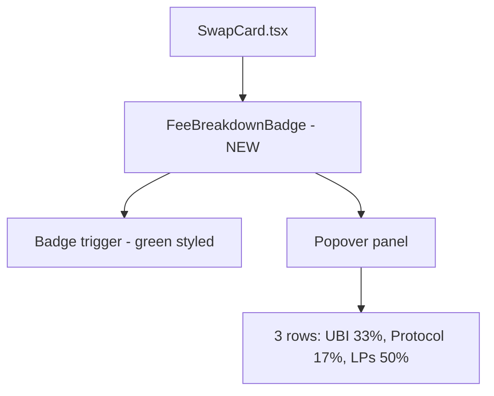

## Problem Statement

The swap card displays "0.3% fee" as a plain badge next to the title. For a first-time user, this communicates cost — "I'm paying 0.3% extra." GoodSwap's entire value proposition is that fees fund UBI, but this isn't communicated until the user enters an amount and the UBI breakdown appears below the swap fields.

The first impression of the fee is negative when it should be positive. A user comparing with Uniswap (0.3% fee) sees no difference and no reason to switch.

## User Story

As a first-time user looking at the swap card, I want to immediately understand that the 0.3% fee funds universal basic income, so that I see the fee as a positive social impact feature rather than a cost.

## How It Was Found

Visual inspection of the swap card at localhost:3100. The "0.3% fee" badge in the header area has no context. Only after entering an amount does the green UBI breakdown appear below, explaining "33.33% of the swap fee goes directly to the GoodDollar UBI pool." First-time users who haven't entered an amount never see this.

## Proposed UX

1. **Replace "0.3% fee" badge** with a more descriptive badge like "0.1% funds UBI" (using the green accent color) with a subtle heart or globe icon. This communicates value immediately.

2. **Add a tooltip/popover on the badge** that shows the full fee breakdown:
   - 33% → UBI Pool (funding daily income for verified humans)
   - 17% → Protocol (maintaining GoodSwap)
   - 50% → Liquidity providers

3. The badge should use the `goodgreen` color scheme to visually connect it with the UBI breakdown that appears when amounts are entered.

## Acceptance Criteria

- [ ] Fee badge text communicates UBI funding (not just "0.3% fee")
- [ ] Badge uses goodgreen color scheme (bg-goodgreen/10, text-goodgreen or similar)
- [ ] Clicking or hovering the badge shows a fee breakdown popover/tooltip
- [ ] Popover explains where the 0.3% goes (UBI pool, protocol, LPs)
- [ ] Popover dismisses on click outside or Escape key
- [ ] Mobile-friendly (tap to show, tap outside to dismiss)
- [ ] Existing tests still pass; new component test for the popover

## Verification

- Run full test suite
- Visual check in browser at desktop and mobile widths

## Out of Scope

- Changing the actual fee percentages or logic
- Modifying the UBI breakdown component below the swap fields

---

## Planning

### Overview

Replace the generic "0.3% fee" badge in the swap card header with a UBI-framed badge, and add a popover/tooltip that shows the full fee breakdown. Small, focused UI change in a single component.

### Research Notes

- The fee badge is in `SwapCard.tsx` line 123: `0.3% fee`
- The token economics from scope: 33% → UBI pool, 17% → protocol, 50% → dApp/LPs
- Need a popover that works on both hover (desktop) and tap (mobile)
- Escape key and click-outside dismiss patterns already exist in the codebase (Header.tsx mobile menu)

### Assumptions

- Fee split percentages are fixed (33/17/50) and hardcoded is fine
- Popover can be a simple absolute-positioned div (no library needed)

### Architecture Diagram

### Size Estimation

- **New pages/routes:** 0
- **New UI components:** 1 (FeeBreakdownBadge with inline popover)
- **API integrations:** 0
- **Complex interactions:** 0 (simple popover toggle)
- **Estimated LOC:** ~80-120

### One-Week Decision: YES

Rationale: 0 new pages, 1 simple component with a popover, 0 API integrations, ~100 LOC. This is a small, focused change.

### Implementation Plan

**Day 1:**
1. Create `FeeBreakdownBadge` component with badge trigger and popover
2. Style badge with goodgreen color scheme
3. Add click toggle for popover (works for both mobile tap and desktop click)
4. Add Escape key and click-outside dismiss
5. Integrate into SwapCard.tsx replacing the current "0.3% fee" span
6. Write component test for render, toggle, and dismiss
7. Visual verification at desktop and mobile
