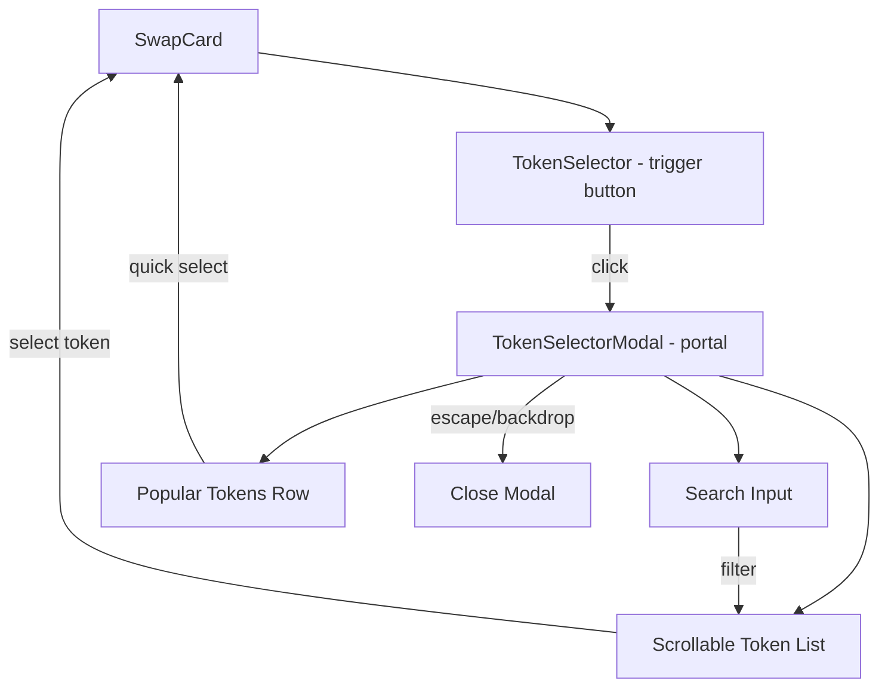

## Problem Statement

GoodSwap's token selector is a tiny dropdown with only 3 hardcoded tokens (ETH, G$, USDC). Uniswap's token selector is a full modal with a search bar, popular tokens row, categorized token list with icons/names/balances, and support for hundreds of tokens. A DeFi user switching from Uniswap would immediately find GoodSwap unusable — they can't find WBTC, DAI, LINK, UNI, or any other standard token.

## User Story

As a DeFi user, I want to search and browse a rich token list when selecting a token to swap, so that I can trade the tokens I care about without being limited to 3 hardcoded options.

## How It Was Found

Competitor comparison: Uniswap's token selector modal includes:
- Search bar (search by name, symbol, or address)
- Popular tokens row (ETH, USDC, WBTC, DAI, etc.) as quick-pick pills
- Scrollable list with token icon, symbol, name, and balance
- Recent selections remembered
- Keyboard navigation support

GoodSwap's token selector is a 3-item dropdown with no search, no popular tokens, and no way to discover new tokens.

## Proposed UX

Replace the current dropdown with a modal dialog similar to Uniswap's token selector:

1. **Trigger**: Clicking the token selector button opens a centered modal with backdrop overlay
2. **Search bar**: At the top, auto-focused. Search by name or symbol. Placeholder: "Search by name or symbol"
3. **Popular tokens row**: Below search, horizontal row of pill buttons for the most common tokens (ETH, USDC, G$, WBTC, DAI, LINK, UNI, AAVE)
4. **Token list**: Scrollable list of 15-20 tokens, each showing icon + symbol + name. When connected, show balance.
5. **Highlight**: Current selection has a checkmark. Excluded token (the other side of the swap) is dimmed.
6. **Keyboard nav**: Arrow keys to navigate, Enter to select, Escape to close. Search filters in real-time.
7. **Animation**: Modal slides in from bottom on mobile, fades in on desktop.

## Acceptance Criteria

- [ ] Token selector opens a modal dialog instead of a dropdown
- [ ] Modal has a search input that filters tokens by name and symbol (case-insensitive)
- [ ] Popular tokens row shows 6-8 common tokens as clickable pills
- [ ] Token list includes at least 15 tokens with proper SVG icons, symbol, and name
- [ ] Excluded token (other side of swap) is visually dimmed and unselectable
- [ ] Currently selected token has a checkmark indicator
- [ ] Arrow keys navigate the list, Enter selects, Escape closes
- [ ] Search input is auto-focused when modal opens
- [ ] Modal has a close button and closes on backdrop click
- [ ] Mobile: modal takes full width with bottom slide-in animation
- [ ] Desktop: modal is centered with max-width ~420px
- [ ] Existing swap logic continues to work after token selection

## Verification

- Run all existing tests
- Verify in browser with agent-browser
- Test keyboard navigation (arrow keys, enter, escape)
- Test search filtering
- Test mobile layout

## Out of Scope

- Custom token import by address (future initiative)
- Token balance fetching from chain (future initiative)
- Token price display in the selector list (future initiative)

---

## Planning

### Overview

Replace the existing `TokenSelector` dropdown component with a full modal dialog that matches the Uniswap-style token selection experience. Expand the token list from 3 to 15+ tokens with search, popular tokens, and keyboard navigation.

### Research Notes

- Uniswap's token modal uses a fixed overlay with centered content on desktop, bottom-sheet on mobile
- The modal pattern requires portal rendering to escape parent overflow/z-index
- React's `createPortal` or a simple fixed-position approach works for this
- Existing `TokenSelector` component is used in `SwapCard.tsx` with `onSelect`, `selected`, and `exclude` props — the interface must remain compatible
- Current tokens are exported as `TOKENS` array from `TokenSelector.tsx` — need to expand this
- SVG icons exist in `TokenIcon.tsx` for ETH, G$, USDC — need to add icons for new tokens

### Assumptions

- Mock data is acceptable (no real balances or prices)
- 15-20 tokens is sufficient for this iteration
- Icons can be simple colored circles with text for tokens without SVG assets

### Architecture

### Size Estimation

- **New pages/routes**: 0
- **New UI components**: 1 major (TokenSelectorModal), expand existing TokenSelector
- **API integrations**: 0
- **Complex interactions**: 1 (search + keyboard nav + modal animation)
- **Estimated LOC**: ~400

### One-Week Decision: YES

Single component replacement with no new pages. One complex interaction (search + keyboard nav). Well under the 2000 LOC threshold. Fits comfortably in 2-3 days.

### Implementation Plan

**Day 1:**
- Expand TOKENS array to 15+ tokens with proper metadata
- Add SVG icons for new tokens in TokenIcon.tsx
- Write tests for new TokenSelectorModal component

**Day 2:**
- Build TokenSelectorModal: modal overlay, search bar, popular tokens row, scrollable token list
- Wire up search filtering (case-insensitive by name and symbol)
- Add keyboard navigation (arrow keys, enter, escape)

**Day 3:**
- Replace TokenSelector dropdown trigger to open modal instead
- Add animations (mobile slide-up, desktop fade-in)
- Mobile responsive layout
- Verify all acceptance criteria
