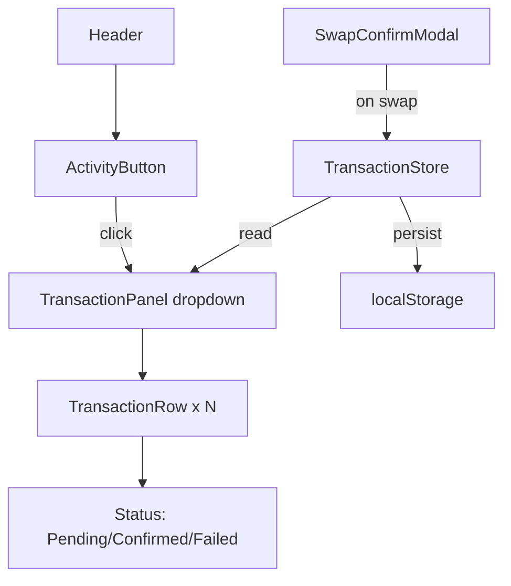

## Problem Statement

After completing a swap on Uniswap, users see their recent transaction history with status indicators (pending spinner, confirmed checkmark, failed X). GoodSwap has no transaction history or activity tracking at all. A user completing a swap has no record of what they did, no way to check if their transaction confirmed, and no link to the block explorer. This is a major UX gap.

## User Story

As a DeFi user, I want to see my recent swap transactions with their status, so that I can track whether my trades confirmed and review my activity.

## How It Was Found

Competitor comparison: Uniswap shows a Recent Transactions panel accessible from the header that lists:
- Each transaction with type (Swap X for Y), amounts, and tokens
- Status: pending (spinner), confirmed (green checkmark), failed (red X)
- Timestamp
- Link to block explorer
- Clear all button

GoodSwap has no transaction tracking. After a swap, the user has zero feedback about their history.

## Proposed UX

Add a transaction history panel accessible from the header:

1. **Activity icon button** in the header (next to Connect Wallet) — shows a clock/activity icon with a badge count for pending transactions
2. **Dropdown panel** on click — shows recent transactions in reverse chronological order
3. **Each transaction row** shows: token pair icons, "Swap X ETH for Y G$", status icon, relative timestamp, link to explorer
4. **States**: Pending (animated spinner), Confirmed (green check), Failed (red X)
5. **Empty state**: "No recent transactions" message
6. **Storage**: Use localStorage to persist across sessions (last 20 transactions)
7. For now, use mock transactions since swaps aren't real yet. When the user clicks "Swap", add a mock transaction that transitions from pending → confirmed after 3 seconds.

## Acceptance Criteria

- [ ] Header shows an activity/history icon button
- [ ] Clicking the button opens a dropdown panel with recent transactions
- [ ] Each transaction shows: token pair, amounts, status icon, timestamp
- [ ] Mock transactions are added when the user triggers a swap
- [ ] Pending → Confirmed transition animates after ~3 seconds
- [ ] Transactions persist in localStorage (up to 20)
- [ ] Empty state shows "No recent transactions" with appropriate styling
- [ ] Panel closes when clicking outside or pressing Escape
- [ ] Each transaction has a "View on explorer" link (placeholder URL)
- [ ] Mobile: panel is full-width below header
- [ ] "Clear all" button removes all transactions

## Verification

- Run all tests
- Verify in browser: trigger a mock swap, see it appear as pending, then confirmed
- Test empty state
- Test localStorage persistence across page reloads

## Out of Scope

- Real blockchain transaction tracking (requires contract integration)
- Push notifications for transaction status
- Transaction cancellation/speed-up

---

## Planning

### Overview

Add a transaction history/activity feature to GoodSwap. This includes an activity button in the header, a dropdown panel showing recent transactions, mock transaction creation on swap, and localStorage persistence.

### Research Notes

- Uniswap shows recent transactions in a dropdown from the header, with status icons and timestamps
- localStorage is the standard approach for persisting transaction history in DeFi frontends
- The mock swap flow already exists in SwapWalletActions/SwapConfirmModal — we can hook into the swap confirmation to add mock transactions
- Need a React context or simple store for transaction state management

### Assumptions

- Transactions are mock (not real on-chain) since swaps aren't connected to real contracts
- localStorage is sufficient for persistence (no backend needed)
- 20 transactions max is reasonable for the dropdown
- Relative timestamps ("2 min ago", "1 hr ago") using simple logic, no external dependency

### Architecture

### Size Estimation

- **New pages/routes**: 0
- **New UI components**: 3 (ActivityButton, TransactionPanel, TransactionRow)
- **API integrations**: 0
- **Complex interactions**: 1 (pending→confirmed transition with timer, localStorage sync)
- **Estimated LOC**: ~350

### One-Week Decision: YES

No new pages. Three small components and a localStorage store. Single complex interaction (status transition timer). Well under 1000 LOC. Fits in 2 days.

### Implementation Plan

**Day 1:**
- Create transaction types and localStorage store (useTransactions hook)
- Write tests for ActivityButton and TransactionPanel
- Build ActivityButton component with badge count
- Build TransactionPanel dropdown with TransactionRow

**Day 2:**
- Wire mock transaction creation into swap flow
- Implement pending→confirmed transition (3s timer)
- Add Clear All functionality
- Mobile responsive layout
- Verify all acceptance criteria
