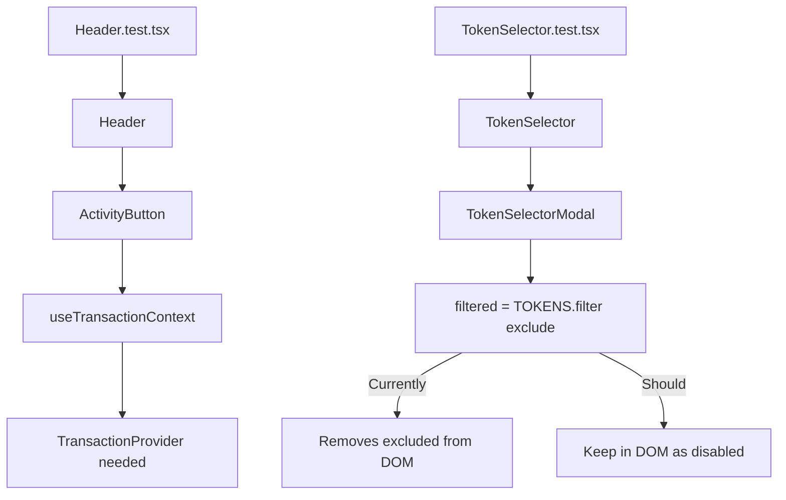

## Problem Statement

The test suite has 8 failing tests out of 100 total (92 passing). Two test files are affected:

### Header.test.tsx — 7 failures
All 7 Header tests fail with: `useTransactionContext must be used inside TransactionProvider`. The `Header` component renders `ActivityButton`, which calls `useTransactionContext()`. The test file renders `<Header />` without wrapping it in a `TransactionProvider`, causing every test to throw.

### TokenSelector.test.tsx — 1 failure
The "dims and disables excluded token" test fails because `TokenSelectorModal` filters excluded tokens out of the list entirely (`if (t.symbol === exclude) return false` on line 22) rather than keeping them in the DOM as disabled options. The test expects `screen.getByRole('option', { name: /USDC/i })` to exist and be disabled, but USDC is removed from the DOM.

## User Story

As a developer, I want all tests to pass so that the CI pipeline is green and I can confidently make changes without worrying about pre-existing failures masking new regressions.

## How It Was Found

Running `npx vitest run` — 8 tests fail, 92 pass. Output shows the exact errors described above.

## Proposed Fix

### Header tests
Add a mock or wrapper for `TransactionProvider` in `Header.test.tsx`. Either:
- Wrap renders in `<TransactionProvider>` 
- Or mock `ActivityButton` to avoid the context dependency in Header unit tests

### TokenSelector excluded token behavior
Change `TokenSelectorModal.tsx` line 22 to not filter out excluded tokens. Instead, keep them in the filtered list and rely on the existing `isExcluded` logic (lines 139, 146, 149-153, 155) to show them as disabled/dimmed. This makes the actual UI behavior match the test expectation: excluded tokens should appear but be unclickable.

## Acceptance Criteria

- [ ] All 7 Header tests pass
- [ ] The TokenSelector "dims and disables excluded token" test passes
- [ ] Full test suite: 100/100 tests pass
- [ ] No new test failures introduced
- [ ] `npm run build` still succeeds

## Verification

Run `npx vitest run` and confirm 0 failures. Run `npm run build` and confirm clean build.

## Overview

Fix 8 failing tests across 2 test files: Header.test.tsx (7 failures from missing TransactionProvider context) and TokenSelector.test.tsx (1 failure from excluded tokens being removed from DOM instead of disabled).

## Research Notes

- `ActivityButton` component uses `useTransactionContext()` which requires `TransactionProvider` ancestor
- Header test mocks `WalletButton` and `next/link` but not `ActivityButton` or `TransactionProvider`
- `TokenSelectorModal` filters excluded tokens at line 22 with `if (t.symbol === exclude) return false` — this prevents them from ever rendering
- The existing code at lines 139-155 already has logic to dim/disable excluded tokens, but it's dead code since they're pre-filtered

## Architecture Diagram

## Size Estimation

- New pages/routes: 0
- New UI components: 0
- API integrations: 0
- Complex interactions: 0
- Estimated LOC: ~30 lines changed

## One-Week Decision

**YES** — Trivial fix touching 3 files (Header.test.tsx, TokenSelectorModal.tsx, possibly TokenSelector.test.tsx). No new features, just correcting test setup and one filtering bug. Fits easily in a single session.

## Implementation Plan

**Day 1 (only day needed):**
1. Add mock for `ActivityButton` in Header.test.tsx (or wrap renders in TransactionProvider)
2. Fix TokenSelectorModal.tsx to keep excluded tokens in DOM but disabled
3. Run full test suite to confirm 100/100 pass
4. Run build to confirm no breakage

## Out of Scope

- Adding new test coverage beyond fixing existing failures
- Refactoring test infrastructure
- Fixing the MetaMask SDK build warning (third-party issue)
