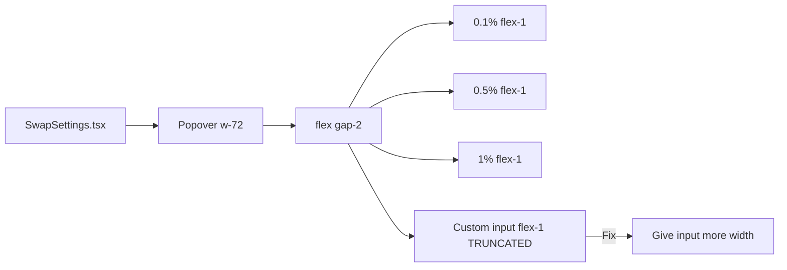

## Problem Statement

In the Transaction Settings popover (gear icon on swap card), the custom slippage input placeholder "Custom" is truncated to "Custo" because the input field is too narrow. The settings popover width is `w-72` (288px) and four `flex-1` elements (three preset buttons + custom input) share the horizontal space equally with `gap-2`. Each element gets approximately 58px, which is insufficient to display the full "Custom" placeholder text plus the "%" suffix.

## User Story

As a user adjusting slippage tolerance, I want to clearly see the "Custom" option so I know I can enter a custom value.

## How It Was Found

Visual inspection via Playwright screenshot of the settings popover. The screenshot shows "0.1%", "0.5%", "1%", and "Custo" as the four options.

## Proposed UX

The custom slippage input should display "Custom" without truncation. Options:
1. Give the custom input a wider minimum width (e.g. `min-w-[80px]`) so it gets more space than the preset buttons
2. Or increase the popover width from `w-72` to `w-80`
3. Or shorten the placeholder to just a visual indicator and remove text

Reference: Uniswap's settings popover gives the custom input proportionally more space than preset buttons.

## Acceptance Criteria

- [ ] The "Custom" placeholder is fully visible without truncation
- [ ] Preset buttons (0.1%, 0.5%, 1%) remain clearly visible and clickable
- [ ] The "%" suffix is visible next to the custom input
- [ ] Settings popover still looks balanced and polished
- [ ] All existing SwapSettings tests pass

## Verification

Take a screenshot of the settings popover and confirm "Custom" is fully visible. Run `npx vitest run` to verify tests pass.

## Overview

The custom slippage input in SwapSettings.tsx has a truncated "Custom" placeholder due to insufficient width when sharing space equally with 3 preset buttons.

## Research Notes

- SwapSettings popover is `w-72` (288px), `p-4` (32px padding) = 256px inner width
- 4 `flex-1` items with `gap-2` (24px gaps) = 232px / 4 = 58px per item
- "Custom" text needs ~50px but the input also has `px-2` padding and a "%" suffix overlay
- Fix: increase popover width to `w-80` (320px) giving each item ~66px, OR give custom input `flex-[1.3]` or `min-w-[80px]`

## Architecture Diagram

## Size Estimation

- New pages/routes: 0
- New UI components: 0
- API integrations: 0
- Complex interactions: 0
- Estimated LOC: ~5 lines changed

## One-Week Decision

**YES** — Single CSS change in one file. Trivially small.

## Implementation Plan

1. Change the popover width from `w-72` to `w-80` in SwapSettings.tsx
2. Verify the "Custom" placeholder is fully visible
3. Run SwapSettings tests to confirm they still pass

## Out of Scope

- Redesigning the entire settings popover
- Adding new slippage features
- Changing settings functionality
