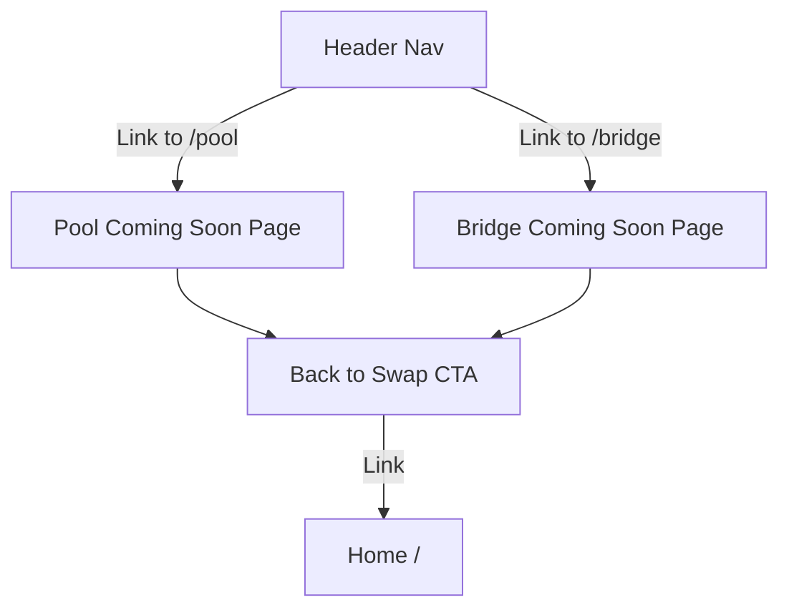

## Problem Statement

Navigating directly to `/pool` or `/bridge` shows the generic 404 "Page Not Found" error page. The header already shows "Pool" and "Bridge" as planned features with "Coming Soon" tooltips, but users who land on these URLs from external links or bookmarks see a confusing 404 message that says "The page you're looking for doesn't exist or has been moved." This misleads users into thinking the app is broken rather than that the feature is upcoming.

## User Story

As a user who clicks a link to /pool or /bridge (e.g., from a shared URL or bookmark), I want to see a branded "Coming Soon" page that explains the feature is planned, so that I understand the feature is not yet available rather than thinking the site is broken.

## How It Was Found

During error handling testing using Playwright, direct navigation to `http://localhost:3100/pool` and `http://localhost:3100/bridge` both rendered the generic 404 page. The header nav items show these features as "Coming Soon" but direct URL access gives no such context.

## Proposed UX

- Create `/pool/page.tsx` and `/bridge/page.tsx` routes
- Each shows a branded "Coming Soon" card with:
  - A relevant icon (e.g., pool icon for Pool, bridge icon for Bridge)
  - Feature name as heading
  - Brief description of what the feature will do
  - "Coming Soon" badge/label
  - "Back to Swap" button linking to `/`
- Style should match the existing 404 page aesthetic (centered, dark background, rounded card)
- Header nav should highlight the correct active page when on these routes

## Research Notes

- Next.js App Router: creating `app/pool/page.tsx` and `app/bridge/page.tsx` automatically registers the routes.
- The existing 404 page (`app/not-found.tsx`) provides a style reference: centered layout, icon, heading, description, CTA button.
- Header already detects `pathname` for active styling — need to add `/pool` and `/bridge` checks.
- Pool and Bridge nav items are currently `` elements (not links). Should convert them to `<Link>` components so navigation to the Coming Soon pages works.

## Architecture Diagram

## Size Estimation

- **New pages/routes:** 2 (pool, bridge)
- **New UI components:** 0 (reuse existing page layout patterns from not-found.tsx)
- **API integrations:** 0
- **Complex interactions:** 0
- **Estimated LOC:** ~120 (2 page files ~40 lines each + Header updates ~40 lines)

## One-Week Decision

**YES** — Only 2 simple static pages with no API calls, no state, no complex interactions. Well under the 2-3 day estimate for simple pages.

## Implementation Plan

1. Create `frontend/src/app/pool/page.tsx` with Coming Soon layout
2. Create `frontend/src/app/bridge/page.tsx` with Coming Soon layout
3. Update Header to convert Pool/Bridge spans to Links and add active state detection
4. Add tests for the new pages
5. Verify in browser

## Acceptance Criteria

- [ ] GET /pool renders a Coming Soon page (not a 404)
- [ ] GET /bridge renders a Coming Soon page (not a 404)
- [ ] Each page has a descriptive heading, brief explanation, and "Coming Soon" badge
- [ ] Each page has a "Back to Swap" link/button to `/`
- [ ] Header nav highlights "Pool" or "Bridge" when on the respective page
- [ ] Pages are visually consistent with the app's dark theme

## Verification

- Navigate to /pool and /bridge in the browser and verify Coming Soon pages render
- Run full test suite to ensure no regressions

## Out of Scope

- Actual Pool or Bridge functionality
- Adding new navigation links (Pool and Bridge are already in the header)
