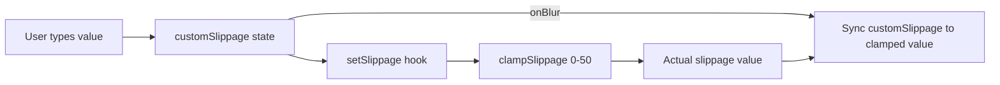

## Problem Statement

The custom slippage input in the Transaction Settings popover shows the raw value the user typed, not the actual clamped value. Slippage is internally clamped to 0-50% by `useSwapSettings`, but the input field displays whatever was typed (e.g., "100"). The user has no visual feedback that their setting was silently adjusted. This creates a deceptive UX where users believe they have 100% slippage tolerance when the actual value is 50%.

## User Story

As a user setting custom slippage tolerance, I want the input to reflect the actual value being used (clamped to the allowed range), so that I know exactly what slippage my transaction will use.

## How It Was Found

During error handling testing with Playwright: opened the settings popover and entered "100" into the custom slippage input. The input displayed "100" with the high-slippage warning, but `useSwapSettings` clamps to 50% internally. There is no visual feedback about the clamping.

## Research Notes

- `useSwapSettings` has `clampSlippage` that limits to 0-50%.
- `SwapSettings.tsx` uses local `customSlippage` state for the input value, separate from the clamped `slippage` from the hook.
- The fix is to sync the display value on blur: when the input loses focus, update `customSlippage` to match the actual clamped value.
- Show a brief "Max 50%" message when the user exceeds the limit.

## Architecture Diagram

## Size Estimation

- **New pages/routes:** 0
- **New UI components:** 0
- **API integrations:** 0
- **Complex interactions:** 0
- **Estimated LOC:** ~30 (onBlur handler + conditional warning message)

## One-Week Decision

**YES** — A single component tweak with ~30 lines of changes. Trivially small.

## Implementation Plan

1. In `SwapSettings.tsx`, add an `onBlur` handler to the custom slippage input that syncs `customSlippage` to the clamped value from the hook.
2. Add a warning message below the slippage row when user exceeds max (e.g., "Maximum 50%").
3. Update existing tests for SwapSettings to cover the clamping behavior.

## Proposed UX

- When the user finishes editing (on blur) the custom slippage input, snap the displayed value to the clamped value (0-50%).
- If the user types a value above 50%, show the clamped "50" in the input on blur, plus a brief message like "Maximum 50%".
- Keep the existing "High slippage increases risk of front-running" warning for values >5%.

## Acceptance Criteria

- [ ] Custom slippage input shows the clamped value (not raw input) after blur
- [ ] Typing a value >50 and blurring shows "50" in the input
- [ ] A brief "Maximum 50%" indicator appears when user types >50%
- [ ] Typing a value <=50 works as before
- [ ] Existing preset buttons still work correctly
- [ ] Settings persist correctly in localStorage

## Verification

- Open settings, type "100" in custom slippage, blur → input shows "50" and displays max indicator
- Open settings, type "25" → input shows "25", no max indicator
- Run full test suite

## Out of Scope

- Changing the actual slippage clamping range (0-50% stays)
- Deadline input validation (already clamps correctly and reflects clamped value)
