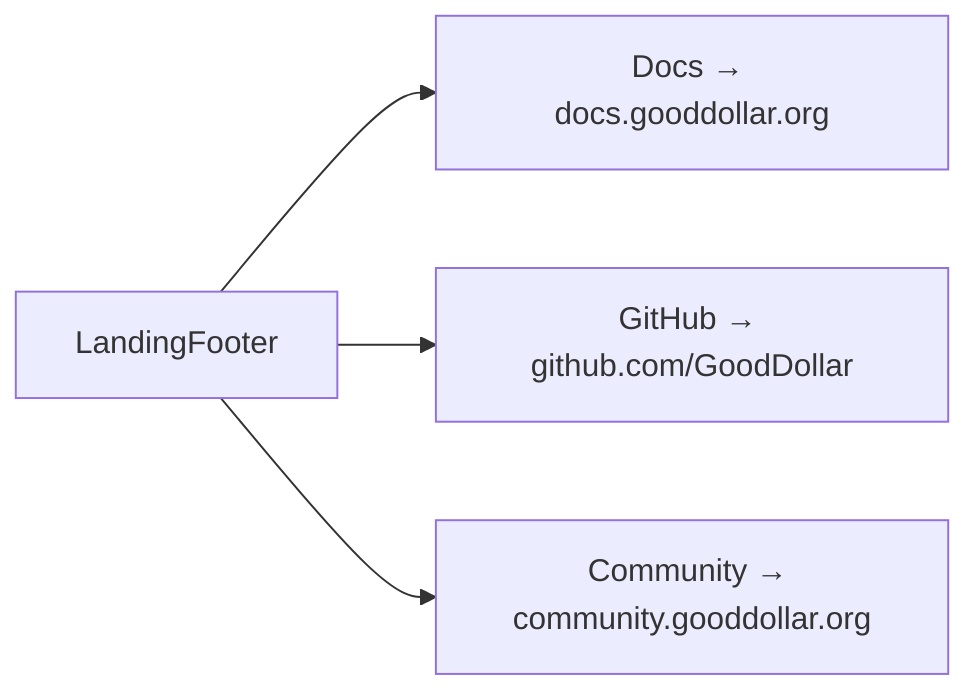

## Problem Statement

The landing page footer has three links — Docs, GitHub, and Community — that all point to `href="#"`. Clicking any of them scrolls the page to the top instead of navigating anywhere. These dead links mislead users who expect to find documentation, source code, or community resources. On any DEX (Uniswap, Jupiter), footer links point to real destinations.

## User Story

As a user who wants to learn more about GoodSwap, I want the footer links to either take me to the correct resource or clearly indicate they're not available yet, so that I'm not misled by dead links.

## How It Was Found

During error handling testing with Playwright, all three footer link hrefs were inspected and found to be `"#"`. Clicking them only scrolls to top — no navigation occurs, no feedback is shown.

## Research Notes

- GoodDollar has existing resources:
  - Docs: `https://docs.gooddollar.org`
  - GitHub: `https://github.com/GoodDollar`
  - Community: `https://community.gooddollar.org`
- `LandingFooter.tsx` has the links hardcoded with `href: '#'`.
- All external links should use `target="_blank"` and `rel="noopener noreferrer"`.
- The existing `LandingFooter.test.tsx` tests will need updating.

## Architecture Diagram

## Size Estimation

- **New pages/routes:** 0
- **New UI components:** 0
- **API integrations:** 0
- **Complex interactions:** 0
- **Estimated LOC:** ~15 (update link hrefs, add target/rel attributes)

## One-Week Decision

**YES** — Trivially small change: update 3 link objects in one file. ~15 LOC.

## Implementation Plan

1. Update `LandingFooter.tsx` link hrefs to real URLs
2. Add `target="_blank"` and `rel="noopener noreferrer"` to all external links
3. Update `LandingFooter.test.tsx` to verify correct hrefs

## Proposed UX

- **Docs** → `https://docs.gooddollar.org` (opens new tab)
- **GitHub** → `https://github.com/GoodDollar` (opens new tab)
- **Community** → `https://community.gooddollar.org` (opens new tab)
- All links open in new tabs with proper security attributes.

## Acceptance Criteria

- [ ] Docs link navigates to a real URL (not `#`)
- [ ] GitHub link navigates to a real URL (not `#`)
- [ ] Community link navigates to a real URL (not `#`)
- [ ] All external links open in new tabs
- [ ] Links have proper `rel="noopener noreferrer"` attributes
- [ ] No footer link uses `href="#"`
- [ ] Existing tests updated and passing

## Verification

- Click each footer link and verify it opens the correct external page in a new tab
- Inspect link hrefs to confirm they are not `#`
- Run full test suite

## Out of Scope

- Creating the actual docs/community sites
- Adding more footer links or navigation
