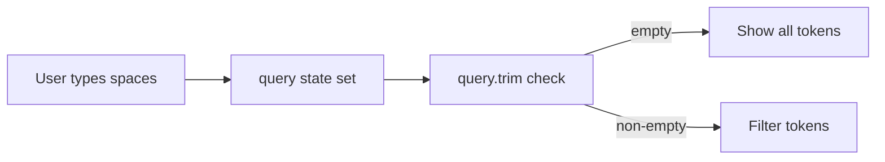

## Problem Statement

When entering whitespace-only text (spaces, tabs) into search fields on both the Explore Tokens page and the Token Selector modal, all results are filtered out and the user sees "No tokens match your search" / "No tokens found". The expected behavior is to treat whitespace-only input as an empty search and show all results.

## User Story

As a user searching for tokens, I want whitespace-only input to be treated as no search so that I don't accidentally filter out all results by pressing the space bar.

## How It Was Found

During edge-case testing with unusual inputs:
- Entered `"   "` (three spaces) into the Explore page search input → showed "No tokens match your search" with empty table
- Same behavior in Token Selector modal search

## Proposed UX

- Trim whitespace from search queries before filtering
- If the trimmed query is empty, show all results (same as no search)
- Apply to both Explore page (`/explore`) and Token Selector modal

## Acceptance Criteria

- [ ] Typing spaces only into Explore search shows all tokens
- [ ] Typing spaces only into Token Selector search shows all tokens
- [ ] Typing "  ETH  " with leading/trailing spaces matches ETH token
- [ ] Normal search behavior is unchanged
- [ ] Existing tests pass; add tests for whitespace edge case

## Verification

- Run full test suite
- Verify in browser: type spaces in Explore search, confirm all tokens appear

## Out of Scope

- Search debouncing or performance optimization
- Adding new search features (fuzzy search, etc.)

## Planning

### Overview

Trim whitespace from search queries before filtering in both the Explore page and Token Selector modal to prevent whitespace-only input from filtering out all results.

### Research Notes

- Explore page: `src/app/explore/page.tsx` line 55: `if (query)` treats whitespace as truthy
- Token Selector: `src/components/TokenSelectorModal.tsx` line 22: `if (!query)` treats whitespace as having a query
- Fix: `.trim()` the query before the check and before lowercasing

### Architecture Diagram

### Size Estimation

- New pages/routes: 0
- New UI components: 0
- API integrations: 0
- Complex interactions: 0
- Estimated LOC: ~10

### One-Week Decision: YES

Trivial two-line fix in two files. Well under a day.

### Implementation Plan

1. In `src/app/explore/page.tsx`: change `if (query)` to `if (query.trim())` and `query.toLowerCase()` to `query.trim().toLowerCase()`
2. In `src/components/TokenSelectorModal.tsx`: change `if (!query)` to `if (!query.trim())` and `query.toLowerCase()` to `query.trim().toLowerCase()`
3. Add test cases for whitespace-only queries in existing test files
4. Verify all tests pass
