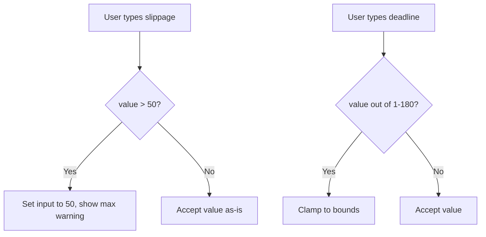

## Problem Statement

The custom slippage input in Transaction Settings has two edge-case issues:

1. **Slippage display is inconsistent while typing**: Entering "100" in the custom slippage input shows "100" in the field, but the hook clamps the actual value to 50. The user sees "100" with a "High slippage" warning, but the real value is 50. The display only corrects to "50" on blur. This inconsistency is confusing.

2. **Transaction deadline has no bounds feedback**: The deadline input accepts any number, but the hook clamps it to 1–180 minutes. There's no visual indication of the allowed range (no placeholder, no hint text, no warning on out-of-range values).

## User Story

As a user adjusting swap settings, I want the custom slippage input to immediately reflect the clamped value so I know the actual tolerance being used, and I want the deadline input to show me the allowed range.

## How It Was Found

During edge-case testing of the Settings popover:
- Typed "100" in custom slippage → input showed "100" with yellow warning, but actual slippage was clamped to 50
- After clicking away (blur), input corrected to "50" and showed orange max warning
- Typed "0" in deadline → accepted by UI but hook clamped to 1
- Typed "99999" in deadline → accepted by UI but hook clamped to 180

## Proposed UX

- Clamp slippage input value in real-time during onChange (not just onBlur)
- If user types a value > 50, immediately show "50" and the max warning
- Add placeholder or helper text to deadline input showing "1–180" range
- If deadline is out of range, clamp immediately and show a brief hint

## Acceptance Criteria

- [ ] Typing "100" in custom slippage immediately shows "50" and max warning
- [ ] Typing "0" in custom slippage shows no change (stays at previous valid value)
- [ ] Deadline input has placeholder or hint showing valid range (1–180)
- [ ] Typing "0" in deadline clamps to "1"
- [ ] Typing "999" in deadline clamps to "180"
- [ ] Existing settings tests pass; add tests for clamping behavior

## Verification

- Run full test suite
- Verify in browser: type edge values in settings, confirm real-time clamping

## Out of Scope

- Redesigning the settings popover layout
- Adding new settings options

## Planning

### Overview

Improve the SwapSettings component to clamp slippage values in real-time (not just on blur) and add boundary feedback to the transaction deadline input.

### Research Notes

- `src/components/SwapSettings.tsx`: onChange calls `setSlippage(num)` without clamping display; onBlur clamps to 50
- `src/lib/useSwapSettings.ts`: `clampSlippage` already limits 0-50, `setDeadline` clamps 1-180
- The hook does the right thing; the UI input text just doesn't reflect it

### Architecture Diagram

### Size Estimation

- New pages/routes: 0
- New UI components: 0
- API integrations: 0
- Complex interactions: 0
- Estimated LOC: ~30

### One-Week Decision: YES

Small change to one component file. Under a day.

### Implementation Plan

1. In `SwapSettings.tsx` onChange for custom slippage: clamp the display value immediately when > 50, show warning inline
2. Add placeholder text "1–180" or helper text to deadline input
3. Clamp deadline input value in real-time (min 1, max 180)
4. Add tests for edge values
5. Verify all tests pass
