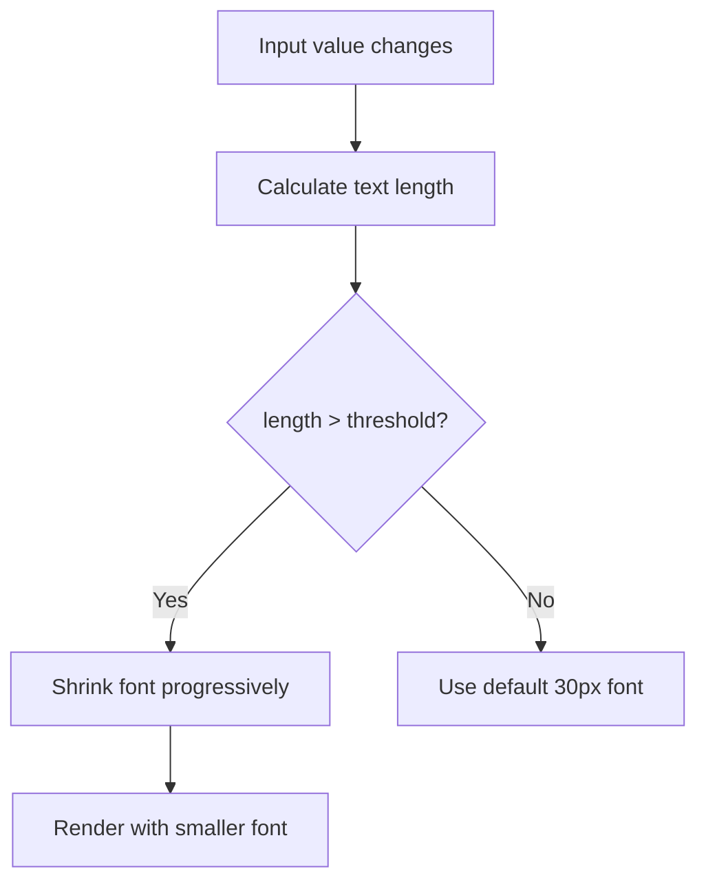

## Problem Statement

When entering very long numbers into the swap "You pay" input, the text overflows the input field container:

1. **Very large numbers (20+ digits)**: Input like "99999999999999999999" fills the field and the digits are visually clipped/cropped at the edges.
2. **Very long decimals (18+ decimal places)**: Input like "0.000000000000000001" overflows the field, with the leftmost characters pushed out of the visible area.

The `sanitizeNumericInput` function already limits to 20 characters, which helps, but the font size is large enough that 20 characters still overflow the input width.

## User Story

As a user entering a swap amount, I want the input to handle large numbers gracefully so that I can see the full value I'm entering without text being clipped.

## How It Was Found

During edge-case testing with unusual inputs:
- Entered "999999999999999999999999" → 20 chars after sanitize, but still overflows the input visually
- Entered "0.000000000000000001" → text scrolls/clips within the input field

## Proposed UX

- Auto-shrink the font size of the input when the text exceeds the container width
- Start at the current large font size and progressively reduce as more characters are entered
- Never shrink below a minimum readable size (e.g., 14px)
- When text is deleted, scale back up

## Acceptance Criteria

- [ ] Entering 20-character numbers fits within the input without clipping
- [ ] Font auto-shrinks progressively as more digits are typed
- [ ] Font scales back to normal when text is shortened
- [ ] Normal-length inputs (1–8 chars) use the current large font size
- [ ] Existing tests pass

## Verification

- Run full test suite
- Verify in browser: type long numbers, confirm no overflow

## Out of Scope

- Changing the max character limit
- Adding thousand separators to the input field
- Changing the input field width

## Planning

### Overview

Add auto-shrinking font behavior to the swap "You pay" input when the text exceeds the container width, similar to how Uniswap handles long inputs.

### Research Notes

- `src/components/SwapCard.tsx` line 160-167: input uses `text-3xl` (30px) fixed font size
- The output span (line 206) already has responsive font sizing via `clamp()` when text > 10 chars
- `sanitizeNumericInput` caps at 20 chars, but 20 chars at 30px still overflows ~460px container
- Approach: use a ref to measure input scrollWidth vs clientWidth, or simply base it on string length

### Architecture Diagram

### Size Estimation

- New pages/routes: 0
- New UI components: 0
- API integrations: 0
- Complex interactions: 1 (auto-sizing font calculation)
- Estimated LOC: ~30

### One-Week Decision: YES

Small enhancement to one component. Under a day.

### Implementation Plan

1. Add dynamic font size calculation based on inputAmount length in SwapCard
2. Use inline style to progressively shrink from 30px to 16px as input grows
3. Threshold: start shrinking at 8 chars, minimum at 18+ chars
4. Test with various input lengths to verify no overflow
5. Verify all tests pass
