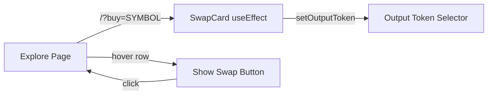

## Problem Statement

When a user clicks a token row on the Explore page, the app navigates to `/?token=SYMBOL` which sets that token as the **input** (sell) token. This is counterintuitive — users researching a token on the Explore page almost always want to **buy** it, not sell it.

Additionally, the Explore token rows have no visible "Swap" or "Trade" call-to-action. The rows are clickable (cursor: pointer on hover) but there's no explicit visual affordance telling users what clicking will do. On Uniswap's explore page, a "Swap" button appears on hover for each row.

## User Story

As a user browsing tokens on the Explore page, I want to click a token and be set up to **buy** it on the Swap page, so that the transition from research to trading is intuitive and seamless.

## How It Was Found

During UX flow testing with Playwright on the live app:
1. Navigated to `/explore`, clicked the first token row (ETH)
2. App navigated to `/?token=ETH` — the SwapCard `useEffect` sets the token as the **input** token (sell direction)
3. The `handleRowClick` in `explore/page.tsx` pushes `/?token=${symbol}` and the SwapCard `useEffect` calls `setInputToken(found)` — confirming the token is set as the "You pay" token
4. No visible indication on the Explore rows about what clicking will do — only cursor: pointer on hover

## Proposed UX

1. **Fix token direction**: When navigating from Explore, set the clicked token as the **output** (receive/buy) token instead of the input (pay/sell) token
2. **Add hover action button**: Show a small "Swap →" button on the right side of each row on hover (desktop only), providing clear affordance
3. **URL param change**: Use `?buy=SYMBOL` instead of `?token=SYMBOL` to make the intent explicit

## Acceptance Criteria

- [ ] Clicking a token row on Explore navigates to swap page with that token as the **output** token ("You receive")
- [ ] URL uses `?buy=SYMBOL` parameter
- [ ] Each Explore row shows a "Swap" button on hover (desktop)
- [ ] Mobile rows remain full-row clickable (no hover button needed)
- [ ] Existing `?token=` param continues to work (backward compatibility) by setting the input token
- [ ] All existing tests pass

## Verification

- Run full test suite: `cd frontend && npx vitest run`
- Verify in browser: click token on Explore → lands on swap page with token as output
- Check hover button appears on desktop Explore rows

## Out of Scope

- Token detail page / token info page (separate initiative)
- Price chart or historical data on Explore
- Deep-linking for swap pairs (from/to/amount params)

---

## Research Notes

- `SwapCard.tsx` reads URL params in a `useEffect` and calls `setInputToken(found)` for `?token=` param
- `explore/page.tsx` pushes `/?token=${symbol}` in `handleRowClick`
- Adding a `?buy=` param handler in SwapCard alongside the existing `?token=` handler is straightforward
- Explore row hover effect is pure CSS (Tailwind `group-hover`) — no complex interactions needed

## Architecture

## Size Estimation

- New pages/routes: 0
- New UI components: 0 (hover button is inline in existing row)
- API integrations: 0
- Complex interactions: 0
- Estimated lines of new code: ~60-80

## One-Week Decision: YES

Extremely focused change: modify one URL param in Explore, add one `useEffect` branch in SwapCard, and add Tailwind hover classes to Explore rows. Well under one day of work.

## Implementation Plan

1. **SwapCard.tsx**: Add `?buy=` param handler in the existing `useEffect` that calls `setOutputToken` instead of `setInputToken`
2. **explore/page.tsx**: Change `handleRowClick` to push `/?buy=${symbol}` instead of `/?token=${symbol}`
3. **explore/page.tsx**: Add `group` class to `<tr>` and render a hover-visible "Swap" button in the last cell
4. **Tests**: Add/update tests for the new URL param behavior
