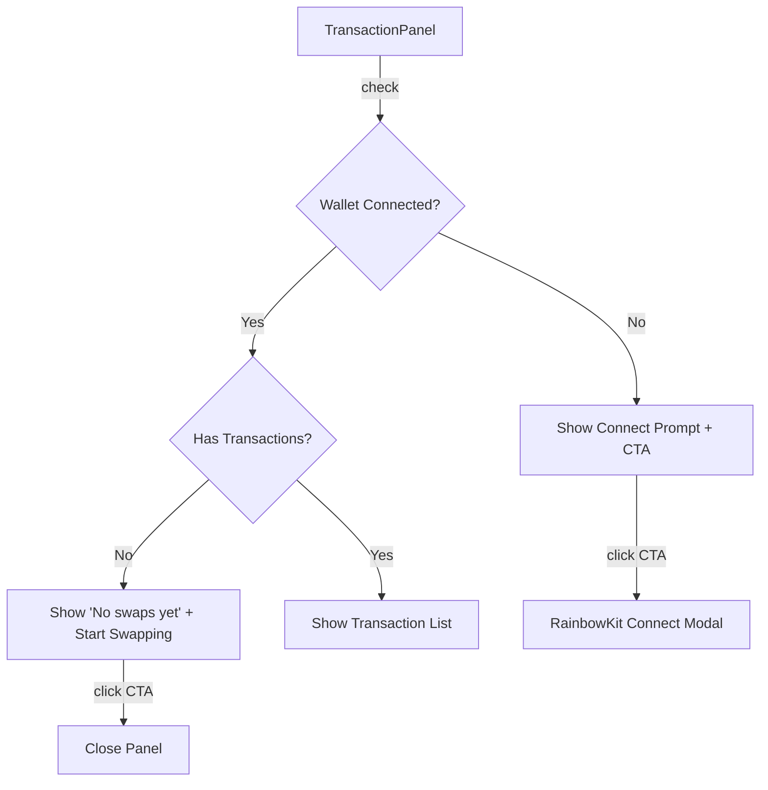

## Problem Statement

The Activity panel (triggered by the clock icon in the header) shows only "No recent transactions" with a clock icon when the user has no transaction history. This is a dead end — there's no guidance on what would appear here, no invitation to connect a wallet, and no actionable next step. For new users exploring the app for the first time, this empty state provides zero value and makes the feature feel broken.

## User Story

As a new user exploring GoodSwap, I want the Activity panel to explain what it tracks and guide me toward my first swap, so that I understand the feature's purpose and feel motivated to take action.

## How It Was Found

During UX flow testing with Playwright:
1. Opened the app at `http://localhost:3100`
2. Clicked the clock icon (aria-label="Recent activity") in the header
3. Panel opened showing only a clock icon and "No recent transactions" text
4. No wallet connection prompt, no explanation of what transactions appear here, no CTA
5. Screenshot saved at `.autobuilder/screenshots/flow-activity.png`

## Proposed UX

Replace the bare "No recent transactions" empty state with a helpful, contextual message:

**When wallet is NOT connected:**
- Icon: swap arrows or rocket illustration
- Text: "Connect your wallet to track swaps"
- Subtext: "Your swap history and pending transactions will appear here"
- CTA: "Connect Wallet" button (triggers wallet connection)

**When wallet IS connected but no transactions:**
- Icon: sparkle or swap arrows
- Text: "No swaps yet"
- Subtext: "Complete your first swap and it'll show up here"
- CTA: "Start Swapping" link that closes the panel

## Acceptance Criteria

- [ ] Activity panel shows wallet-aware empty state:
  - Disconnected: "Connect your wallet to track swaps" + Connect Wallet button
  - Connected, no txns: "No swaps yet" + "Start Swapping" CTA
- [ ] "Connect Wallet" button in panel triggers RainbowKit wallet connection modal
- [ ] "Start Swapping" CTA closes the panel (user is already on swap page)
- [ ] Existing transaction list rendering is unchanged when transactions exist
- [ ] All existing tests pass

## Verification

- Run full test suite: `cd frontend && npx vitest run`
- Verify in browser: open activity panel without wallet → see connect prompt
- Verify: the panel has clear guidance text in both states

## Out of Scope

- Full transaction history page
- Network-level activity feed (showing other users' swaps)
- Transaction notification toasts

---

## Research Notes

- `TransactionPanel.tsx` renders the empty state at line 85-93 — a simple div with clock icon and text
- `useWalletReady` hook from `WalletReadyContext.tsx` provides wallet connection status
- RainbowKit's `useConnectModal` hook can trigger the wallet connect dialog
- The panel receives `onClose` prop which can be called when "Start Swapping" CTA is clicked

## Architecture

## Size Estimation

- New pages/routes: 0
- New UI components: 0 (modifying existing TransactionPanel)
- API integrations: 0
- Complex interactions: 0
- Estimated lines of new code: ~40-60

## One-Week Decision: YES

Single component modification with two conditional branches. Uses existing hooks for wallet state. Well under one day of work.

## Implementation Plan

1. **TransactionPanel.tsx**: Import `useWalletReady` and `useConnectModal` hooks
2. **TransactionPanel.tsx**: Replace the empty state block with wallet-aware conditional:
   - Not connected: swap icon + "Connect your wallet" text + Connect Wallet button
   - Connected, no txns: sparkle icon + "No swaps yet" text + close button
3. **Tests**: Add tests for both empty state variants
