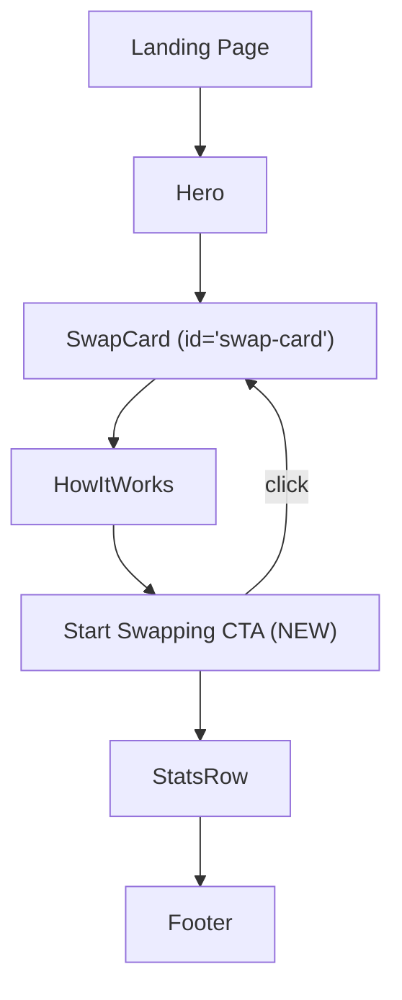

## Problem Statement

After the "How It Works" section on the landing page, the user flow dead-ends into a passive stats row and footer. There's no call-to-action prompting the user to take the next step. A user who scrolled past the swap card, read the three "How It Works" cards, and understood the UBI value proposition has no clear path to start trading from that position on the page.

The swap card is above the fold, but users who scroll down to learn about GoodSwap first need a way to be guided back to action.

## User Story

As a new user who just learned how GoodSwap works by reading the How It Works section, I want a clear call-to-action that invites me to start swapping, so I don't have to scroll back up to find the swap card.

## How It Was Found

During UX flow testing of the "new user explores the app" scenario:
1. Loaded `http://localhost:3100`
2. Scrolled past the swap card to the "How It Works" section
3. Read the three cards: "Swap Tokens", "Fees Fund UBI", "People Earn Income"
4. Below these cards, only the stats row ($2.4M UBI Distributed, 640K+ Daily Claimers, 1.2M Total Swaps) and footer are present
5. No button or link to scroll back to the swap card or begin trading
6. Full-page screenshot confirms the flow: hero → swap card → How It Works → stats → footer — no CTA between How It Works and stats

## Proposed UX

Add a centered "Start Swapping" button between the How It Works section and the Stats row:

- Style: goodgreen background, rounded pill shape, matches the existing button aesthetic
- Text: "Start Swapping" with a subtle arrow icon
- Behavior: smooth-scrolls up to the swap card and focuses the amount input field
- Spacing: generous padding above and below to create visual breathing room

## Acceptance Criteria

- [ ] A "Start Swapping" CTA button appears between HowItWorks and StatsRow on the landing page
- [ ] Clicking the button smooth-scrolls to the swap card area
- [ ] After scrolling, the amount input field is focused (keyboard ready)
- [ ] Button is styled consistently with the app's design language (goodgreen, rounded)
- [ ] Responsive: looks good on both desktop and mobile viewports
- [ ] All existing tests pass

## Verification

- Run full test suite: `cd frontend && npx vitest run`
- Verify in browser: scroll to How It Works → click "Start Swapping" → page scrolls up, input focused
- Verify on mobile viewport (375px): button renders correctly

## Out of Scope

- Animated scroll-triggered elements
- A/B testing of CTA copy
- Analytics tracking on button click

---

## Research Notes

- `page.tsx` renders components in order: hero → SwapCard → HowItWorks → StatsRow → LandingFooter
- SwapCard uses a standard `<input>` with `inputMode="decimal"` — can be targeted with `document.querySelector` or a ref
- Adding an `id` attribute to the SwapCard wrapper enables `scrollIntoView` targeting
- `scroll-behavior: smooth` is built into Tailwind via the `scroll-smooth` class on `<html>`

## Architecture

## Size Estimation

- New pages/routes: 0
- New UI components: 0 (inline button in page.tsx or a tiny wrapper)
- API integrations: 0
- Complex interactions: 0 (smooth scroll is a one-liner)
- Estimated lines of new code: ~20-30

## One-Week Decision: YES

Trivially small change: add one button element with an onClick handler. Under half a day of work.

## Implementation Plan

1. **SwapCard.tsx**: Add `id="swap-card"` to the outermost wrapper div
2. **page.tsx**: Add a "Start Swapping" button between `<HowItWorks />` and `<StatsRow />`
3. **Button onClick**: `document.getElementById('swap-card')?.scrollIntoView({ behavior: 'smooth' })` then focus the input
4. **Style**: `bg-goodgreen text-dark font-semibold rounded-full px-8 py-3` to match existing CTAs
5. **Tests**: Verify button renders and is clickable
