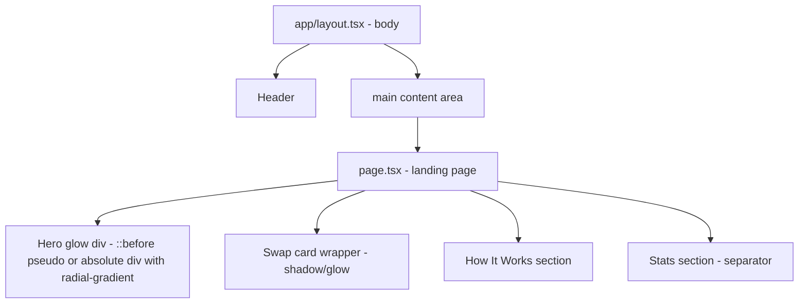

## Problem Statement

The GoodSwap landing page (swap page at `/`) has a completely flat dark background with no visual depth. Professional DeFi apps like Uniswap, Jupiter, and PancakeSwap use subtle radial gradients, mesh backgrounds, glow effects behind primary elements, and gradient borders to create visual sophistication and guide the user's eye toward the swap card. Our page looks plain in comparison.

Observed on: `http://localhost:3100` — the entire background is a uniform dark color. The swap card, hero text, and How It Works section all sit on the same featureless background. There's no visual hierarchy created by lighting or color gradients.

## User Story

As a DeFi user visiting GoodSwap for the first time, I want the landing page to feel premium and polished, so that I trust the app with my transactions and feel that it's a professional product.

## How It Was Found

Visual review of the landing page screenshot at `.autobuilder/screenshots/home.png`. Compared against professional DEX apps (Uniswap, Jupiter) that use radial glows, gradient effects, and subtle background patterns to create depth.

## Proposed UX

1. **Hero section glow**: Add a subtle radial gradient behind the "Swap. Fund UBI." heading — a large, soft, semi-transparent `goodgreen` glow that creates a focal point.
2. **Swap card glow**: Add a subtle `goodgreen` radial glow behind the swap card to draw the eye.
3. **Background gradient**: Add a very subtle top-to-bottom gradient from a slightly lighter dark color to the base dark color, creating the impression of overhead ambient lighting.
4. **Stats section**: Add a subtle separator line or gradient transition above the stats section.

All effects should be CSS-only (no images), subtle enough to not distract from content, and performant (use opacity, radial-gradient, backdrop-filter).

## Acceptance Criteria

- [ ] Landing page has a visible but subtle radial glow effect behind the hero heading area
- [ ] Swap card has a soft glow/shadow effect that makes it pop from the background
- [ ] Overall page background has a slight gradient, not a uniform flat color
- [ ] Effects are CSS-only and don't impact page load performance
- [ ] Effects don't interfere with text readability or element interactivity
- [ ] Responsive: effects scale appropriately on mobile and desktop
- [ ] All existing tests continue to pass

## Verification

- Run all tests and verify they pass
- Visual check in browser with agent-browser screenshots

## Out of Scope

- Animated effects or particle systems
- Background images or SVG patterns
- Changes to the explore, pool, or bridge pages

---

## Planning

### Research Notes

- Professional DEX apps (Uniswap, Jupiter, PancakeSwap) use CSS radial-gradient and box-shadow for background glow effects
- Tailwind CSS supports arbitrary gradient values and radial gradients via custom classes
- The existing project uses Tailwind with dark theme colors (`dark`, `dark-50`, `dark-100`, `goodgreen`)
- CSS-only approach: use `::before`/`::after` pseudo-elements or wrapper divs with absolute positioning and radial gradients
- No external libraries needed

### Assumptions

- The existing layout in `app/page.tsx` and `app/layout.tsx` can accommodate wrapper elements for gradient effects
- The `goodgreen` color (#00B0A0) works well as a glow color

### Architecture Diagram

### Size Estimation

- **New pages/routes**: 0
- **New UI components**: 0 (CSS changes to existing components only)
- **API integrations**: 0
- **Complex interactions**: 0
- **Estimated lines of new code**: ~30-50 lines of CSS/Tailwind changes

### One-Week Decision: YES

This is a pure CSS polish task. No new components, no API calls, no complex interactions. Just adding gradient backgrounds and glow effects to existing elements. Estimated effort: 2-4 hours.

### Implementation Plan

**Day 1 (only day needed):**
1. Add a subtle radial glow div behind the hero heading in `page.tsx` using absolute positioning and `bg-[radial-gradient(...)]`
2. Add a soft glow/shadow effect to the swap card wrapper in `SwapCard.tsx` or `page.tsx`
3. Add a subtle gradient to the body/main background via `layout.tsx` or `page.tsx`
4. Add a subtle separator/gradient transition above the stats row
5. Test responsiveness and verify no text readability issues
6. Run all existing tests to ensure nothing breaks
