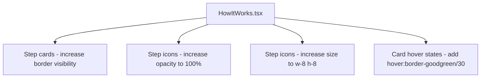

## Problem Statement

The "How It Works" section on the landing page has step icons rendered at 60% opacity (`text-goodgreen/60`) which makes them nearly invisible against the dark background. The cards themselves are very minimal — thin, low-opacity borders with barely distinguishable backgrounds. For such an important explainer section, the visual treatment doesn't create enough hierarchy to draw users' attention.

Observed on: `http://localhost:3100` in the screenshot at `.autobuilder/screenshots/home.png`. The swap arrows, dollar sign, and people icons in each card are hard to see at a glance.

## User Story

As a first-time visitor, I want the "How It Works" section to clearly communicate the three-step process with visually prominent icons and cards, so that I quickly understand how GoodSwap works.

## How It Was Found

Visual review of the home page screenshot. The icons in the How It Works cards are rendered with `text-goodgreen/60` class (60% opacity) making them hard to see. The step number circles are more visible than the actual icons, creating a confusing visual hierarchy.

## Proposed UX

1. **Increase icon contrast**: Change icon color from `text-goodgreen/60` to `text-goodgreen` (full opacity) or at minimum `text-goodgreen/80`.
2. **Larger icons**: Increase icon size from `w-6 h-6` to `w-7 h-7` or `w-8 h-8` for better visibility.
3. **Card hover states**: Add a subtle hover effect to the step cards (slight border brightening or background shift) to make them feel interactive and alive.
4. **Connecting visual flow**: Add subtle visual connectors (dotted line or arrows) between the three steps on desktop to show the flow, or at minimum ensure the numbered circles provide clear visual progression.

## Acceptance Criteria

- [ ] Step icons are visible at full or near-full opacity (no more 60% opacity)
- [ ] Icons are sized at least w-7 h-7 for better visibility
- [ ] Step cards have a subtle hover state (border brightening or background shift)
- [ ] Visual hierarchy is clear: number → icon → title → description
- [ ] All existing tests continue to pass
- [ ] Responsive: looks good on both mobile (stacked) and desktop (3-column)

## Verification

- Run all tests and verify they pass
- Visual check in browser comparing before/after screenshots

## Out of Scope

- Changing the content or order of the steps
- Adding animations or transitions beyond hover states
- Restructuring the section layout

---

## Planning

### Research Notes

- The current `HowItWorks.tsx` component uses `text-goodgreen/60` for icons — 60% opacity of the green accent color
- Icons are SVGs at `w-6 h-6` — standard but on the smaller side for hero content
- Cards use `bg-dark-100/60 border border-gray-700/20` — very subtle treatment
- Tailwind supports hover transitions with `hover:` prefix and `transition-*` utilities
- No external libraries needed

### Assumptions

- Only `HowItWorks.tsx` needs changes
- The `goodgreen` color works at full opacity for icons

### Architecture Diagram

### Size Estimation

- **New pages/routes**: 0
- **New UI components**: 0 (modifications to `HowItWorks.tsx` only)
- **API integrations**: 0
- **Complex interactions**: 0
- **Estimated lines of new code**: ~15-25 lines of Tailwind class changes

### One-Week Decision: YES

This is a trivial CSS polish task — changing a few Tailwind classes in a single component. Estimated effort: 1-2 hours.

### Implementation Plan

**Day 1 (only day needed):**
1. Update icon container from `text-goodgreen/60` to `text-goodgreen` (full opacity)
2. Increase icon SVG size from `w-6 h-6` to `w-8 h-8`
3. Add hover effect to step cards: `hover:border-goodgreen/30 hover:bg-dark-100/80 transition-all duration-200`
4. Slightly increase card border opacity for better visibility
5. Run all existing tests
6. Visual verification with screenshots
