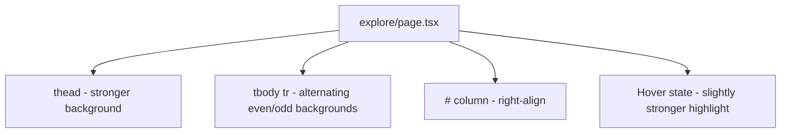

## Problem Statement

The Explore page token table has minimal visual distinction between rows — all rows have the same background with only very subtle `border-gray-700/10` dividers. On wider viewports, it's hard to track across columns (price → change → volume → market cap) because there's no alternating row color to guide the eye. The table header also blends into the rows, lacking sufficient visual separation. These are common table scannability issues that professional apps (CoinGecko, CoinMarketCap) solve with alternating row backgrounds and stronger header styling.

Observed on: `http://localhost:3100/explore` in screenshot at `.autobuilder/screenshots/explore.png`.

## User Story

As a user browsing the token list on the Explore page, I want the table to be easy to scan across columns, so that I can quickly compare prices, changes, and market caps without losing my place.

## How It Was Found

Visual review of the Explore page screenshot. Compared against CoinGecko and CoinMarketCap token tables that use alternating row backgrounds, stronger header styling, and more visual hierarchy.

## Proposed UX

1. **Alternating row backgrounds**: Every other row gets a very subtle background tint (`bg-dark-50/20` or similar) for better scannability.
2. **Stronger header row**: The table header should have a more distinct background (`bg-dark-50/30`) and slightly larger/bolder text to separate it from data rows.
3. **Hover row highlight**: The existing `hover:bg-dark-50/40` is good but could be slightly stronger.
4. **Row padding refinement**: Ensure consistent vertical padding across all cells for clean alignment.
5. **Number column alignment**: The row number (#) column should be right-aligned for cleaner appearance with multi-digit numbers.

## Acceptance Criteria

- [ ] Even-numbered rows have a subtle alternating background color
- [ ] Table header row has a visually distinct background from data rows
- [ ] Row hover highlight is clearly visible
- [ ] All columns have consistent vertical padding
- [ ] Row numbers are right-aligned for clean multi-digit alignment
- [ ] All existing tests continue to pass
- [ ] Responsive behavior unchanged — volume/market cap hide on smaller viewports
- [ ] Loading skeleton rows still look correct

## Verification

- Run all tests and verify they pass
- Visual check in browser at both desktop and tablet widths

## Out of Scope

- Adding new columns (sparkline charts, etc.)
- Changing the sort logic
- Adding pagination
- Changing token data or formatting

---

## Planning

### Research Notes

- The current `explore/page.tsx` uses a standard HTML table with Tailwind styling
- Rows have `border-b border-gray-700/10` dividers and `hover:bg-dark-50/40` hover state
- Tailwind supports `even:` and `odd:` pseudo-class variants for alternating rows
- Header row uses `text-gray-400` and same background as data rows
- Row numbers (#) are left-aligned with `text-left` header
- The skeleton loading rows work well already

### Assumptions

- Only `app/explore/page.tsx` needs modifications
- The existing dark theme palette has enough shades to create subtle alternating colors

### Architecture Diagram

### Size Estimation

- **New pages/routes**: 0
- **New UI components**: 0 (modifications to `explore/page.tsx` only)
- **API integrations**: 0
- **Complex interactions**: 0
- **Estimated lines of new code**: ~15-25 lines of Tailwind class changes

### One-Week Decision: YES

This is a trivial CSS polish task — changing Tailwind classes on table rows and headers in a single file. Estimated effort: 1-2 hours.

### Implementation Plan

**Day 1 (only day needed):**
1. Add alternating row backgrounds: `even:bg-dark-50/15` on data rows
2. Strengthen header row: add `bg-dark-50/25` background, slightly bolder text
3. Right-align the # column header and cells
4. Ensure hover state is still clearly visible over alternating backgrounds
5. Verify skeleton loading rows still look correct
6. Run all existing tests
7. Visual verification with screenshots
