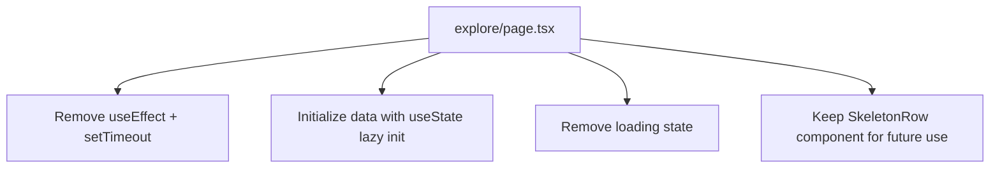

## Problem Statement

The Explore page has a hardcoded `setTimeout(() => { ... }, 400)` that delays rendering of synchronous mock data by 400ms. Users see skeleton loading rows for 400ms before the token table appears, even though the data (`getTokenMarketData()`) is a pure synchronous function that returns immediately. This adds perceptible latency to every visit to the Explore page for no reason.

Observed at: `frontend/src/app/explore/page.tsx` lines 36-42.

## User Story

As a user navigating to the Explore page, I want to see the token table immediately, so that I don't wait for a fake loading spinner on data that's already available.

## How It Was Found

Code review during performance-focused product review. The `useEffect` with `setTimeout(() => { setData(getTokenMarketData()); setLoading(false) }, 400)` was identified as an artificial delay on synchronous data. Browser testing confirmed the 400ms skeleton flash on every page load.

## Proposed UX

1. Remove the `setTimeout` wrapper and initialize data synchronously using `useState(() => getTokenMarketData())`.
2. Remove the `loading` state and the `useEffect` since data is available immediately.
3. Keep the `SkeletonRow` component in the file for future use when real API integration is added, but don't show it for now.
4. The table should render with data on the very first paint — no flash of skeleton rows.

## Acceptance Criteria

- [ ] Explore page renders token data immediately without any artificial delay
- [ ] No skeleton/loading flash on initial page load
- [ ] `SkeletonRow` component preserved in the codebase for future real API loading states
- [ ] Search filtering and sort functionality unchanged
- [ ] All existing tests continue to pass
- [ ] Visual appearance of the table unchanged once data is shown

## Verification

- Run all tests and verify they pass
- Navigate to `/explore` in the browser and confirm instant data rendering
- Confirm no flash of skeleton rows on page load

## Out of Scope

- Adding real API data fetching
- Changing table layout or styling
- Modifying sort or filter behavior

---

## Planning

### Research Notes

- The `getTokenMarketData()` function in `lib/marketData.ts` is a pure synchronous function that maps `TOKENS` to `MOCK_MARKET_DATA` and sorts by market cap. Zero async work.
- The current pattern uses `useState(true)` for loading + `useEffect` with `setTimeout(400)` to simulate async fetch — but data is local.
- React's `useState(() => initialValue)` lazy initializer pattern allows computing initial state synchronously without useEffect.
- Removing the useEffect eliminates a render cycle: currently it renders skeleton first, then re-renders with data after 400ms.

### Assumptions

- Only `frontend/src/app/explore/page.tsx` needs modification
- The `SkeletonRow` component should be preserved (commented or kept in file) for when real APIs are added

### Architecture Diagram

### Size Estimation

- **New pages/routes**: 0
- **New UI components**: 0
- **API integrations**: 0
- **Complex interactions**: 0
- **Estimated lines of new code**: ~5 lines changed (net reduction)

### One-Week Decision: YES

Trivial change — remove a setTimeout wrapper and initialize state synchronously. Estimated effort: 30 minutes.

### Implementation Plan

**Day 1 (only step needed):**
1. Replace `useState(true)` for `loading` and `useState<TokenMarketData[]>([])` for `data` with `useState(() => getTokenMarketData())` for data only.
2. Remove the `useEffect` that calls `setTimeout`.
3. Remove the `loading` state variable.
4. Update the JSX to remove the `loading` conditional (the skeleton branch). Keep `SkeletonRow` component defined but unused.
5. Run existing tests and verify all pass.
6. Visual verification in browser.
