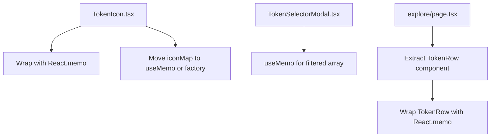

## Problem Statement

Several components have unnecessary render overhead:

1. **TokenIcon** creates a new `iconMap` Record object inside the component function body on every render. The Explore page renders 18 TokenIcon instances, so each search keystroke or sort click creates 18 fresh iconMap objects and re-renders all icons, even when their `symbol` and `size` props haven't changed.

2. **TokenSelectorModal** computes `filtered = TOKENS.filter(...)` on every render without `useMemo`. This means the filter runs on unrelated state changes like `highlightedIndex` updates (triggered by mouse hover on each list item).

3. **Explore page table rows** all re-render when the search query changes, even rows whose filtered data hasn't changed. Wrapping row rendering in `React.memo` would skip re-renders for rows with unchanged props.

Found in: `frontend/src/components/TokenIcon.tsx`, `frontend/src/components/TokenSelectorModal.tsx`, `frontend/src/app/explore/page.tsx`.

## User Story

As a user interacting with the Explore page or the token selector dropdown, I want smooth, responsive interactions when typing search queries or hovering over tokens, so that the UI never stutters or lags.

## How It Was Found

Code review during performance-focused product review. The `iconMap` object allocation in `TokenIcon` (lines 128-138), the un-memoized `filtered` in `TokenSelectorModal` (lines 23-27), and the inline row rendering in Explore page were all identified as sources of wasted renders.

## Proposed UX

No visual changes. Internal optimization only — the same UI, but with fewer unnecessary re-renders:

1. **TokenIcon**: Move the `iconMap` creation to module scope (outside the component) with a factory function that takes `size`. Wrap `TokenIcon` with `React.memo` so it only re-renders when `symbol`, `size`, or `className` change.

2. **TokenSelectorModal**: Wrap the `filtered` computation with `useMemo` keyed on `[query]` (since `TOKENS` is a constant).

3. **Explore page**: Extract the table row into a named component wrapped with `React.memo` so rows don't re-render when only the parent's `query` or `sortField` state changes.

## Acceptance Criteria

- [ ] `TokenIcon` wrapped with `React.memo` — only re-renders on prop changes
- [ ] `iconMap` no longer allocated inside the `TokenIcon` component body on every render
- [ ] `TokenSelectorModal` `filtered` array is memoized with `useMemo`
- [ ] Explore page table rows extracted into a `React.memo` component
- [ ] All existing tests continue to pass
- [ ] No visual changes — pixel-perfect same output
- [ ] Search, sort, and token selection all still work correctly

## Verification

- Run all tests and verify they pass
- Visually verify Explore page renders correctly
- Visually verify token selector modal works correctly with search and selection

## Out of Scope

- Changing TokenIcon visual design
- Adding virtualization for long token lists
- Modifying the token data or sort logic
- Performance benchmarking with React DevTools

---

## Planning

### Research Notes

- `React.memo` shallow-compares props and skips re-render if unchanged — perfect for `TokenIcon` which receives `symbol`, `size`, and `className`.
- The `iconMap` in `TokenIcon` is a Record created on every render. Since the icon components are deterministic based on `size`, the map can be computed with `useMemo([size])` or moved to a factory function.
- `useMemo` in `TokenSelectorModal` for `filtered` should key on `[query]` since `TOKENS` is module-level constant.
- Explore page table rows can be extracted to a named `TokenRow` component wrapped with `React.memo` keyed on token data props.

### Assumptions

- Files to modify: `TokenIcon.tsx`, `TokenSelectorModal.tsx`, `explore/page.tsx`
- No visual changes — strictly internal optimization
- All existing tests should pass without modification

### Architecture Diagram

### Size Estimation

- **New pages/routes**: 0
- **New UI components**: 1 (TokenRow extracted from explore page, trivial)
- **API integrations**: 0
- **Complex interactions**: 0
- **Estimated lines of new code**: ~30 lines of refactoring (net neutral — restructuring, not adding)

### One-Week Decision: YES

Small refactoring across 3 files — wrapping components with `React.memo` and adding `useMemo`. Estimated effort: 1-2 hours.

### Implementation Plan

**Day 1 (only day needed):**
1. **TokenIcon.tsx**: Wrap the exported component with `React.memo`. Move `iconMap` creation into `useMemo` keyed on `size`.
2. **TokenSelectorModal.tsx**: Wrap the `filtered` computation with `useMemo` keyed on `[query]`.
3. **explore/page.tsx**: Extract the `<tr>` row rendering into a `TokenRow` component. Wrap it with `React.memo`.
4. Run all existing tests and verify they pass.
5. Visual verification in browser — ensure no visual changes.
