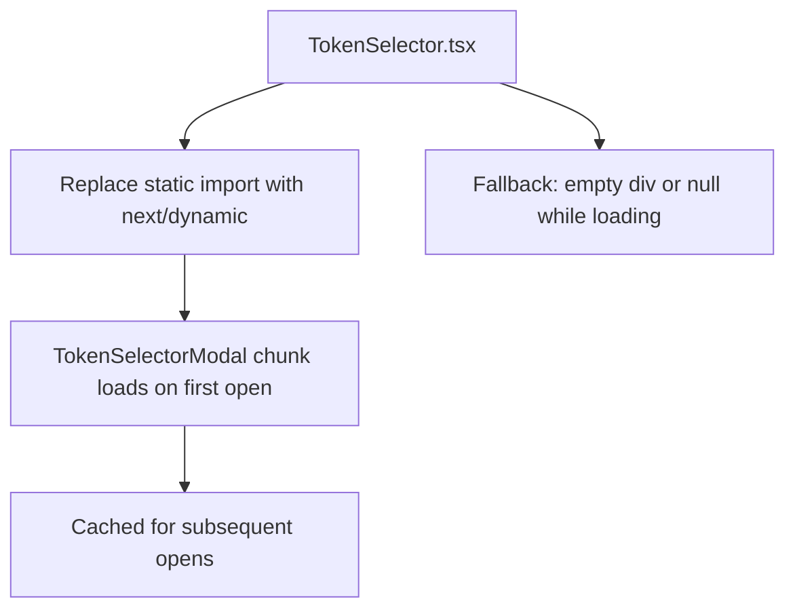

## Problem Statement

The `TokenSelectorModal` component (~177 lines including search, keyboard navigation, filtering, and 18-item list rendering) is eagerly imported by `TokenSelector.tsx`, which is used on the home page's `SwapCard`. The modal is only shown when a user clicks a token dropdown button — the vast majority of page loads never open it. Despite this, its code is included in the initial JS bundle that must be downloaded and parsed before the page can render.

The production build shows the home page at 167 KB first load JS (76.6 KB above the 90.4 KB shared baseline). Lazy-loading the modal would remove it from the critical rendering path and shave several KB off the initial load.

Found at: `frontend/src/components/TokenSelector.tsx` which imports `TokenSelectorModal` at the top level.

## User Story

As a user visiting GoodSwap for the first time, I want the swap page to load as fast as possible, so that I can see the swap interface quickly without waiting for code I haven't requested yet.

## How It Was Found

Performance review of the production build output and browser resource analysis. The home page's first load JS (167 KB) includes the TokenSelectorModal code even though users only need it on interaction.

## Proposed UX

No visual changes. The modal appears exactly the same way when a user clicks the token dropdown:

1. Replace the static `import { TokenSelectorModal } from './TokenSelectorModal'` in `TokenSelector.tsx` with `next/dynamic` (or `React.lazy` + `Suspense`).
2. The modal loads only when `open` state becomes `true`.
3. Add a tiny loading fallback (e.g., a simple div with the same dimensions) for the brief moment the modal chunk downloads on first open.

## Acceptance Criteria

- [ ] `TokenSelectorModal` is no longer in the initial JS bundle for any page
- [ ] Token dropdown click still opens the modal (may have a sub-second load on first click)
- [ ] Subsequent opens of the modal are instant (chunk is cached)
- [ ] All existing tests continue to pass
- [ ] Search, keyboard navigation, and token selection all work correctly
- [ ] No visual flicker or layout shift when modal loads

## Verification

- Run `next build` and confirm the home page's First Load JS decreased
- Run all tests and verify they pass
- Visually verify token selector modal works correctly after lazy loading

## Out of Scope

- Lazy-loading other components (SwapSettings, SwapDetails, etc.)
- Changing modal design or functionality
- Adding loading skeletons beyond a simple fallback

---

## Planning

### Research Notes

- `next/dynamic` is Next.js's wrapper around `React.lazy` + `Suspense`. It supports `ssr: false` to avoid SSR hydration mismatches for browser-only components.
- Alternative: plain `React.lazy(() => import('./TokenSelectorModal'))` works since the file already has a named export, but `next/dynamic` is more idiomatic in Next.js.
- The `TokenSelectorModal` is only rendered when `open` is true in `TokenSelector.tsx`. The dynamic import can be gated behind the `open` check.
- Production build currently shows `/` at 167 KB first load. The modal code + its filter/keyboard logic should reduce this by a few KB.
- `next/dynamic` with `loading` prop provides a clean fallback mechanism.

### Assumptions

- Only `frontend/src/components/TokenSelector.tsx` needs modification (the import site)
- `TokenSelectorModal.tsx` needs a default export for `next/dynamic` compatibility (currently uses named export — will need to add or switch)
- The modal only matters on first open; subsequent opens hit the browser cache

### Architecture Diagram

### Size Estimation

- **New pages/routes**: 0
- **New UI components**: 0
- **API integrations**: 0
- **Complex interactions**: 0
- **Estimated lines of new code**: ~10 lines changed

### One-Week Decision: YES

Trivial change — replace one static import with a dynamic import. Estimated effort: 30 minutes.

### Implementation Plan

**Day 1 (only step needed):**
1. In `TokenSelectorModal.tsx`: Add a `default` export (or switch the named export to default) so `next/dynamic` can resolve it.
2. In `TokenSelector.tsx`: Replace `import { TokenSelectorModal } from './TokenSelectorModal'` with `const TokenSelectorModal = dynamic(() => import('./TokenSelectorModal'), { ssr: false })`.
3. Add `import dynamic from 'next/dynamic'` to `TokenSelector.tsx`.
4. Run `next build` and compare the home page First Load JS with the previous 167 KB.
5. Run all existing tests and verify they pass.
6. Visual verification — ensure modal still opens correctly on token dropdown click.
