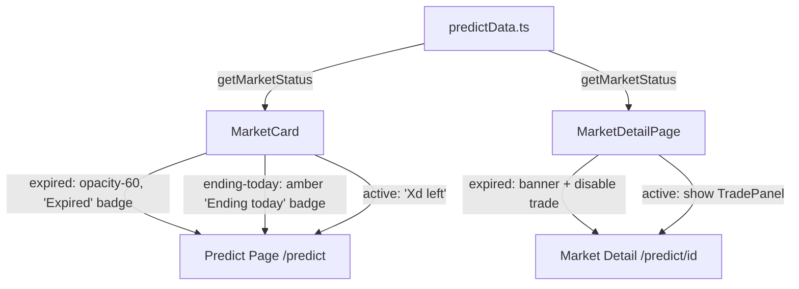

## Problem Statement

On the Prediction Markets page (`/predict`), markets whose end date has passed display "0d left" in the card header instead of an "Expired" label. Since all mock market dates are in 2025 and the current date is April 2026, nearly every market card shows "0d left", which is confusing and misleading. Users cannot tell whether a market is still tradeable, ending today, or already closed.

The `MarketCard` component calculates days remaining with `Math.max(0, ...)`, which clamps negative values to 0 but never distinguishes between "ending today" and "ended months ago."

## User Story

As a prediction market user, I want to clearly see which markets are expired vs active, so that I don't waste time trying to trade on closed markets.

## How It Was Found

During edge-case testing with agent-browser on the live `/predict` page, most market cards displayed "0d left" in the top-right corner. The mock data contains end dates in 2025 and the current date is April 2026, so these markets are all past their expiry. No visual distinction is made between an active market ending today and a market that expired months ago.

## Proposed UX

1. **Expired markets**: Show "Expired" label with a muted red/gray badge instead of "0d left". Apply 60% opacity to the entire card to visually communicate they're inactive.
2. **Markets ending today**: Show "Ending today" with an amber/yellow indicator to communicate urgency.
3. **Active markets**: Continue showing "Xd left" as before.
4. **Market detail page**: If a market is expired, show an "Expired" banner at the top and disable the trade form with a message like "This market has ended."

## Acceptance Criteria

- [ ] Markets with endDate before now show "Expired" label (not "0d left")
- [ ] Expired market cards have reduced opacity (visual distinction from active)
- [ ] Markets ending within 24h show "Ending today" with amber styling
- [ ] Market detail page shows "Expired" state and disables trading for expired markets
- [ ] Sort by "Ending Soon" still works correctly, placing expired markets last
- [ ] All existing tests continue to pass

## Verification

- Run test suite (`npm test`)
- Browse `/predict` with agent-browser and verify expired markets show "Expired"
- Navigate to an expired market detail page and verify trade form is disabled

## Out of Scope

- Updating mock data dates to be in the future
- Adding a separate "Expired" tab/filter (nice-to-have, not required)
- Resolution/outcome display (separate feature)

---

## Planning

### Overview

Add expired-market awareness to the prediction markets UI. The `MarketCard` component and market detail page both use `Math.max(0, ...)` to compute days remaining, which clamps expired markets to "0d left" instead of showing a proper "Expired" label. This initiative adds a utility function to compute market status (active/ending-today/expired) and updates the UI components to visually distinguish expired markets.

### Research Notes

- The mock data has hardcoded 2025 dates; the current date is April 2026, making most markets expired.
- The `MarketCard` component (in `src/app/predict/page.tsx`) renders the time label at line 36.
- The market detail page (`src/app/predict/[marketId]/page.tsx`) shows "Ends In: X days" at line 158 and always renders the TradePanel.
- No utility function exists for market status; we'll add one to `src/lib/predictData.ts`.

### Assumptions

- Expired markets should remain visible (not hidden) but visually subdued.
- The trade form on expired market detail pages should be replaced with an "Expired" message.

### Architecture Diagram

### Size Estimation

- **New pages/routes**: 0
- **New UI components**: 0 (modifying existing MarketCard + MarketDetailPage)
- **API integrations**: 0
- **Complex interactions**: 0
- **Estimated LOC**: ~60 lines of changes across 3 files

### One-Week Decision

**YES** — This is a small UI enhancement touching 3 files with ~60 lines of changes. No new pages, components, or integrations needed. Well within one week.

### Implementation Plan

**Day 1:**
1. Add `getMarketStatus(endDate: string): 'active' | 'ending-today' | 'expired'` utility to `predictData.ts`
2. Update `MarketCard` in `predict/page.tsx` to use the utility and render appropriate labels/styling
3. Update market detail page to show expired banner and conditionally render TradePanel
4. Write tests for `getMarketStatus` utility and component behavior
5. Verify visually with agent-browser
