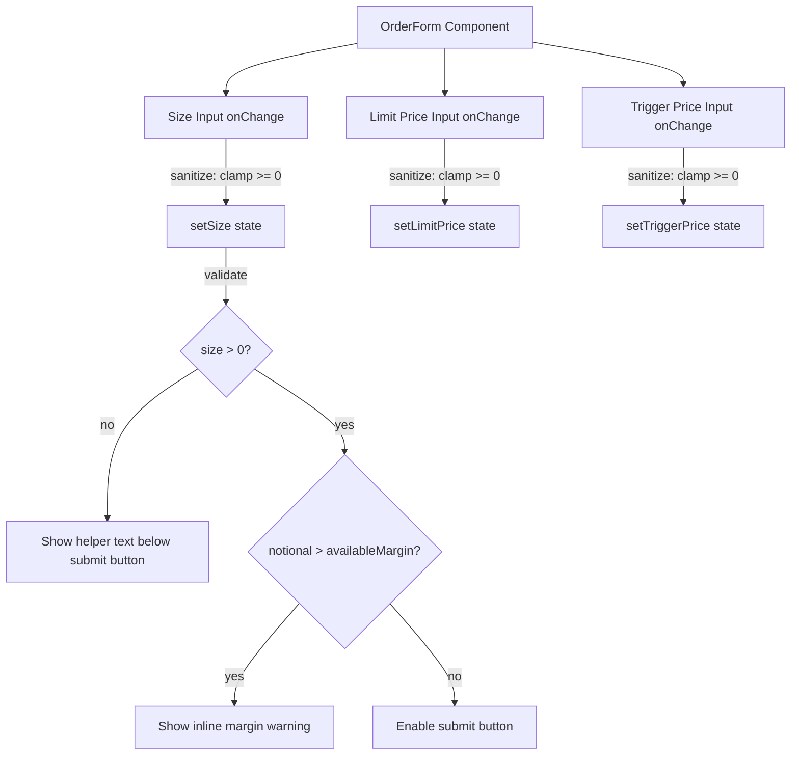

## Problem Statement

The GoodPerps order form (`/perps`) accepts invalid inputs without providing visual feedback to the user:

1. **Negative size values**: Typing "-5" in the Size field is accepted by the input. The "Long BTC" button becomes disabled, but there is no error message explaining why. The HTML `min="0"` attribute only affects spinbutton arrows, not direct keyboard input.
2. **No max size validation**: Typing "999999999999999999" is accepted without warning.
3. **Silent submit button**: When the button is disabled due to invalid input, there's no tooltip or inline error explaining what the user needs to fix.

The same pattern affects the limit price and trigger price fields (they can accept negative values).

## User Story

As a perps trader, I want to see clear error messages when I enter invalid values (negative sizes, unreasonable amounts), so that I understand what I need to fix before placing an order.

## How It Was Found

During edge-case testing with agent-browser on the live `/perps` page:
- Entered "-5" in the Size field → accepted without error, button silently disabled
- Entered "999999999999999999" → accepted without any size limit warning
- No visible validation feedback in either case

## Proposed UX

1. **Negative values**: Clamp the size input to prevent negative values on change. If a negative value is pasted/entered, immediately clear it to empty or "0" and show a brief inline error: "Size must be positive."
2. **Unreasonable values**: When size exceeds available margin, show an inline warning: "Exceeds available margin" below the size input.
3. **Disabled button explanation**: Add a brief text below the disabled submit button explaining what's needed: "Enter a valid size to place order."
4. **Same treatment for limit/trigger price fields**: Prevent negative prices.

## Acceptance Criteria

- [ ] Size input rejects negative values (clamps to 0 or empty on change)
- [ ] Inline error shown when user attempts to enter a negative value
- [ ] Inline warning when notional value exceeds account's available margin
- [ ] Disabled submit button shows helper text explaining what's needed
- [ ] Limit price and trigger price inputs also reject negative values
- [ ] All existing tests continue to pass
- [ ] Order placement still works correctly with valid inputs

## Verification

- Run test suite (`npm test`)
- Browse `/perps` with agent-browser, try entering negative values and verify error messages
- Verify valid order flow still works

## Out of Scope

- Real-time margin calculation with live balances
- Server-side order validation
- Risk management features (max position limits)

---

## Planning

### Overview

Add inline input validation feedback to the GoodPerps order form. Currently, the size, limit price, and trigger price inputs accept negative values via keyboard without visual error messages. The submit button silently disables without explaining what the user needs to fix. This initiative adds input sanitization (clamping negatives), inline validation messages, and a helper text below the disabled submit button.

### Research Notes

- The `OrderForm` component lives in `src/app/perps/page.tsx` (lines 85-192).
- The size input at line 166 has `type="number" step="any" min="0"` but browsers don't enforce `min` on typed input.
- The submit check at line 108 uses `if (sizeNum <= 0) return` and the button disabled check at line 180 uses `disabled={sizeNum <= 0}`.
- Limit price (line 159) and trigger price (line 151) have the same `min="0"` pattern.
- The account mock data shows `availableMargin: 7285.32` which could be used for margin validation.

### Assumptions

- Input sanitization should happen on change (prevent negative values from being stored in state).
- Error messages should follow the existing design system (text-red-400, text-xs).
- The available margin value from mock data is sufficient for the margin check.

### Architecture Diagram

### Size Estimation

- **New pages/routes**: 0
- **New UI components**: 0 (modifying existing OrderForm)
- **API integrations**: 0
- **Complex interactions**: 0
- **Estimated LOC**: ~50 lines of changes in 1 file

### One-Week Decision

**YES** — This is a small enhancement to a single component (~50 lines). No new pages, components, or integrations. Well within one week.

### Implementation Plan

**Day 1:**
1. Add input sanitization functions for size, limit price, and trigger price (prevent negatives)
2. Add inline error message component for invalid inputs
3. Add helper text below disabled submit button ("Enter a valid size to place order")
4. Add margin exceeded warning when notional > available margin
5. Write tests for validation logic
6. Verify visually with agent-browser
