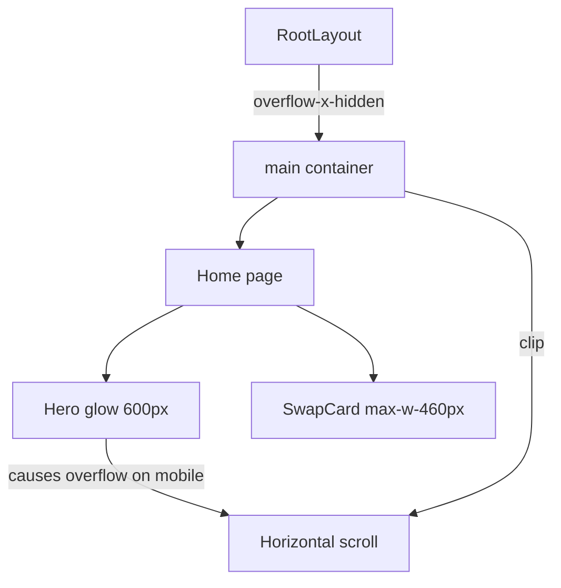

## Problem Statement

On a 375px mobile viewport, the swap card on the landing page (`/`) has its left edge clipped. The "Swap" label appears as "ap", "You pay" appears as "u pay", and "You receive" appears as "u receive". The card container overflows the viewport boundary on the left, making the core swap interface partially unusable on mobile.

## User Story

As a mobile user visiting GoodSwap, I want the swap card to be fully visible and usable on my phone screen, so that I can read all labels and interact with the swap form without content being cut off.

## How It Was Found

During visual polish review at 375x812 viewport (iPhone SE/standard mobile), took a screenshot of the landing page. The swap card's left content is clearly clipped — the first 1-2 characters of left-aligned labels are cut off by the viewport edge.

## Proposed UX

The swap card should be fully contained within the mobile viewport with appropriate horizontal padding. All labels ("Swap", "You pay", "You receive") should be fully visible. The card should have at least 16px (1rem) padding from the viewport edges on mobile.

## Acceptance Criteria

- [ ] Swap card is fully visible on 375px viewport — no content clipping
- [ ] "Swap", "You pay", "You receive" labels are fully readable on mobile
- [ ] Card has proper horizontal margins/padding from viewport edges
- [ ] Desktop layout remains unchanged
- [ ] All tests pass

## Verification

- Open `/` at 375px viewport width and verify all swap card content is visible
- Check at 320px viewport width (smallest common mobile) as well
- Verify desktop layout at 1920px is unaffected
- Run all tests

## Out of Scope

- Redesigning the swap card layout
- Changing the swap functionality
- Other mobile responsiveness issues

## Research Notes

- Root layout (`frontend/src/app/layout.tsx`) has `<main className="... px-4 ...">` which gives 16px horizontal padding — should be sufficient
- Landing page (`frontend/src/app/page.tsx`) has a hero glow effect: `
` that is 600px wide absolute-positioned
- On 375px viewport, the 600px glow div extends 300px from center (112.5px beyond viewport on each side)
- While the glow is `pointer-events-none`, it likely causes horizontal overflow which shifts the page content
- The `SwapCard` component has `max-w-[460px]` and uses `mx-4` for internal spacing
- Fix: Add `overflow-x: hidden` to the parent container to prevent the glow div from causing horizontal scroll

## Architecture

## One-Week Decision

**YES** — Single CSS property fix. ~15 minutes.

## Implementation Plan

1. Add `overflow-x-hidden` to the `<main>` element in `frontend/src/app/layout.tsx` or to the home page wrapper in `page.tsx`
2. Verify the swap card is fully visible at 375px and 320px viewports
3. Ensure no content is unintentionally clipped on other pages
