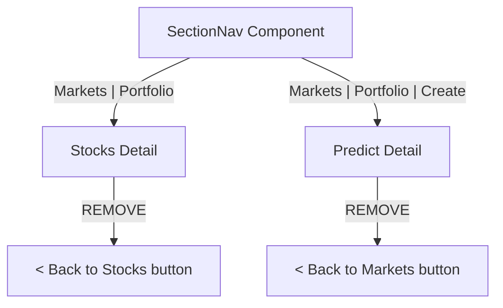

## Problem Statement

The stock detail page (`/stocks/[ticker]`) and predict market detail page (`/predict/[marketId]`) both display "< Back to Stocks" / "< Back to Markets" breadcrumb buttons. Since initiative 0060 added SectionNav sub-navigation tabs (Markets | Portfolio) to all section pages, these back links are now redundant. The user already has the "Markets" tab in the sub-nav to navigate back. The dual navigation creates visual clutter, wastes vertical space (especially on mobile), and is inconsistent with the app's new navigation pattern.

## User Story

As a user viewing a stock or market detail page, I want a clean visual hierarchy with a single consistent navigation pattern, so that the page feels polished and professional without confusing duplicate navigation elements.

## How It Was Found

During visual polish review, observed that both `/stocks/AAPL` and `/predict/btc-100k-2025` display a "< Back to ..." button below the SectionNav tabs. The SectionNav already provides a "Markets" tab that serves the same purpose, making the back button redundant.

## Proposed UX

Remove the "< Back to Stocks" button from `/stocks/[ticker]` and the "< Back to Markets" button from `/predict/[marketId]`. The SectionNav tabs already provide this navigation. The detail page content should start immediately after the sub-nav tabs.

## Acceptance Criteria

- [ ] Stock detail page no longer shows "< Back to Stocks" button
- [ ] Predict market detail page no longer shows "< Back to Markets" button
- [ ] SectionNav tabs remain visible and functional on detail pages
- [ ] "Markets" tab in SectionNav correctly navigates back to the list view
- [ ] Page layout adjusts properly without the back button (no excessive top spacing)
- [ ] All tests pass

## Verification

- Navigate to `/stocks/AAPL` and verify no back button is shown
- Navigate to `/predict/btc-100k-2025` and verify no back button is shown
- Click "Markets" tab to verify it navigates back correctly
- Run all tests

## Out of Scope

- Changing the SectionNav component itself
- Adding breadcrumb navigation
- Modifying any other pages

## Research Notes

- Stock detail page (`frontend/src/app/stocks/[ticker]/page.tsx` line 131-134): `<button onClick={() => router.push('/stocks')} className="...">Back to Stocks</button>`
- Predict market detail page (`frontend/src/app/predict/[marketId]/page.tsx` line 120-123): `<button onClick={() => router.push('/predict')} className="...">Back to Markets</button>`
- SectionNav component (`frontend/src/components/SectionNav.tsx`) is included in section layouts and shows "Markets | Portfolio" tabs
- Stocks layout: `frontend/src/app/stocks/layout.tsx`
- Predict layout: `frontend/src/app/predict/layout.tsx`
- Removing the back buttons means removing the `<button>` element and adjusting the top margin of the content that follows

## Architecture

## One-Week Decision

**YES** — Remove two elements from two files. ~20 minutes.

## Implementation Plan

1. In `frontend/src/app/stocks/[ticker]/page.tsx`: Remove the "< Back to Stocks" button (lines 131-134)
2. In `frontend/src/app/predict/[marketId]/page.tsx`: Remove the "< Back to Markets" button (lines 120-123)
3. Adjust spacing on remaining content if needed (remove excessive top margin)
