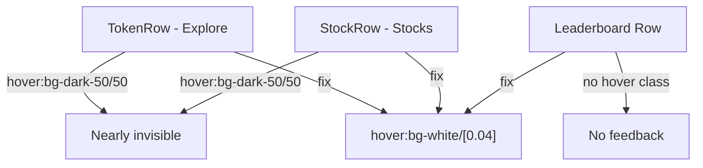

## Problem Statement

The data tables on the Explore (`/explore`), Stocks (`/stocks`), and Perps Leaderboard (`/perps/leaderboard`) pages use `hover:bg-dark-50/50` for row hover effects. The color `dark-50` is `#1a2540` and the table background `dark-100` is `#151e35` — applying `#1a2540` at 50% opacity over `#151e35` produces almost no visible contrast. Users hovering over table rows get no meaningful visual feedback, making the tables feel static and unresponsive compared to professional trading platforms like CoinGecko, Uniswap, or Binance which all have clearly visible row hover highlights.

## User Story

As a user browsing token, stock, or leaderboard data, I want clear visual feedback when I hover over a table row, so that I can track which row I'm looking at and feel confident the row is clickable.

## How It Was Found

During visual polish review, hovered over rows in the Explore table and could not perceive any background change. Inspected the code and confirmed `hover:bg-dark-50/50` produces ~2% luminance difference on the `dark-100` background — imperceptible to human eyes.

## Proposed UX

Increase the hover background to a clearly visible level. Use `hover:bg-goodgreen/5` or `hover:bg-white/5` to provide a subtle but visible highlight on hover. The effect should be consistent across all three table components (Explore, Stocks, Leaderboard). CoinGecko uses a light gray overlay (~5% opacity white) as reference.

## Acceptance Criteria

- [ ] Explore table rows show a clearly visible background change on hover
- [ ] Stocks table rows show a clearly visible background change on hover
- [ ] Perps Leaderboard table rows show a clearly visible background change on hover
- [ ] Hover effect is subtle (not jarring) but clearly perceptible
- [ ] Hover transition is smooth
- [ ] Alternating row striping still works with hover
- [ ] All tests pass

## Verification

- Open `/explore` and hover over rows — verify visible feedback
- Open `/stocks` and hover over rows — verify visible feedback
- Open `/perps/leaderboard` and hover over rows — verify visible feedback
- Run all tests

## Out of Scope

- Changing table layout or column structure
- Adding click animations
- Changing the table data content

## Research Notes

- Explore page (`frontend/src/app/explore/page.tsx` line 26): `TokenRow` uses `hover:bg-dark-50/50` — `dark-50` is `#1a2540`, at 50% opacity over `dark-100` (`#151e35`) = ~2% luminance change
- Stocks page (`frontend/src/app/stocks/page.tsx` line 33): `StockRow` uses identical `hover:bg-dark-50/50`
- Leaderboard page (`frontend/src/app/perps/leaderboard/page.tsx` line 48): Table rows have NO hover class at all — just `border-b` and optional `bg-dark-50/15`
- Fix: Replace `hover:bg-dark-50/50` with `hover:bg-white/[0.04]` or `hover:bg-goodgreen/[0.04]` which provides visible contrast (~4% white overlay)
- Also add hover + transition to leaderboard rows which currently have none

## Architecture

## One-Week Decision

**YES** — CSS class changes in three files. ~20 minutes.

## Implementation Plan

1. In `frontend/src/app/explore/page.tsx`: Replace `hover:bg-dark-50/50` with `hover:bg-white/[0.04]` in `TokenRow`
2. In `frontend/src/app/stocks/page.tsx`: Replace `hover:bg-dark-50/50` with `hover:bg-white/[0.04]` in `StockRow`
3. In `frontend/src/app/perps/leaderboard/page.tsx`: Add `hover:bg-white/[0.04] cursor-pointer transition-colors` to table rows
