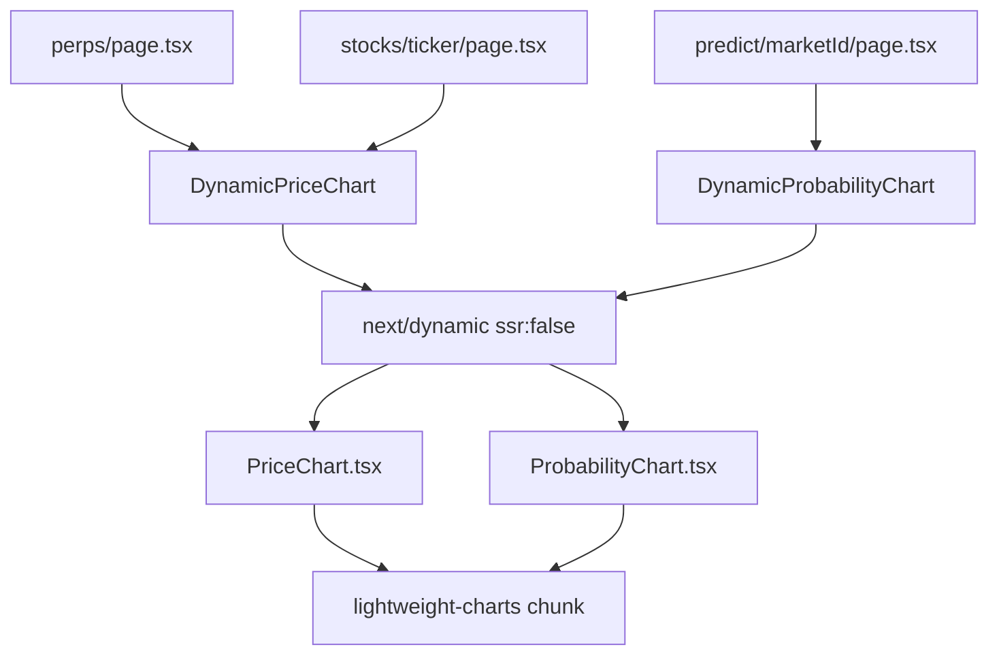

## Problem Statement

`PriceChart` and `ProbabilityChart` statically import `lightweight-charts` (~416KB decoded) at the module top level. This means every route that renders a chart (perps, stocks/[ticker], predict/[marketId]) eagerly downloads and parses the entire charting library before the page becomes interactive. The chart library is one of the largest JS chunks on the site.

**Observed in browser:** The perps page loads a 416KB decoded JS chunk (`4055.*.js`) containing `lightweight-charts` even when the user hasn't scrolled to the chart area.

## User Story

As a user navigating to the perps or stock detail pages, I want the page shell and order form to appear instantly, so that I can start reading market info while the chart loads in the background.

## How It Was Found

- Production build analysis shows `/perps` at 149KB First Load JS and `/stocks/[ticker]` at 156KB First Load JS
- Chrome DevTools resource profiling shows `4055.*.js` (416KB decoded) loaded on every chart route
- `PriceChart.tsx` line 4 and `ProbabilityChart.tsx` line 3 both statically import from `lightweight-charts`

## Proposed Fix

1. Create a dynamic wrapper for `PriceChart` using `next/dynamic` with `ssr: false` and a skeleton fallback
2. Create a dynamic wrapper for `ProbabilityChart` using `next/dynamic` with `ssr: false` and a skeleton fallback
3. Replace static imports in `perps/page.tsx`, `stocks/[ticker]/page.tsx`, and `predict/[marketId]/page.tsx`

## Acceptance Criteria

- [ ] `PriceChart` is loaded via `next/dynamic` with `ssr: false`
- [ ] `ProbabilityChart` is loaded via `next/dynamic` with `ssr: false`
- [ ] Both show a properly sized skeleton/placeholder while loading
- [ ] Chart routes no longer include `lightweight-charts` in the initial JS bundle
- [ ] Charts render correctly once loaded
- [ ] All existing tests pass

## Verification

- Run `npm run build` and verify chart route First Load JS decreases
- Run all tests: `npx vitest run`
- Browse perps, stock detail, and predict detail pages with agent-browser

## Overview

Wrap `PriceChart` and `ProbabilityChart` in `next/dynamic` with `ssr: false` so `lightweight-charts` is code-split into a separate chunk loaded only when needed. Add skeleton placeholders that match chart dimensions.

## Research Notes

- `next/dynamic` with `ssr: false` is the standard Next.js pattern for client-only heavy libraries
- `lightweight-charts` requires DOM access and cannot SSR — `ssr: false` is correct
- Skeleton should match the chart height prop (default 400px for PriceChart, variable for ProbabilityChart)

## Architecture

## One-Week Decision

**YES** — This is a 2-3 file change per chart component. Total ~30 minutes of work.

## Implementation Plan

1. In each page that imports `PriceChart`, replace the static import with `next/dynamic(() => import(...).then(m => m.PriceChart), { ssr: false, loading: () => <ChartSkeleton /> })`
2. Same for `ProbabilityChart`
3. Create inline skeleton components matching chart dimensions
4. Verify build output shows reduced First Load JS

## Out of Scope

- Changing chart library itself
- Adding intersection-observer-based loading (viewport trigger)
- Modifying chart configuration or appearance
