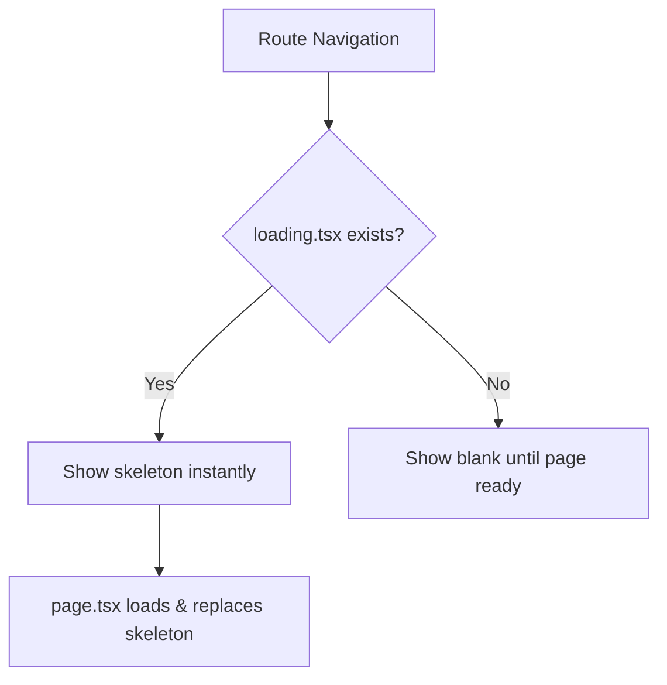

## Problem Statement

The app has zero `loading.tsx` files across all routes. When navigating between sections (e.g., Swap → Perps → Predict), there is no visual loading indicator — the page content simply appears once ready. This makes route transitions feel sluggish, especially for heavier pages like perps (149KB) and predict detail (157KB).

## User Story

As a user clicking between nav sections, I want to see an instant skeleton placeholder so that I know the app is responding and content is loading.

## How It Was Found

- Glob search for `loading.tsx` in `src/app/` returned 0 results
- Navigating between pages in agent-browser shows a blank content area until the new page's JS is fully loaded and rendered
- Next.js App Router supports `loading.tsx` for instant streaming UI on navigation

## Proposed Fix

Add `loading.tsx` files for the heaviest route segments:
1. `src/app/perps/loading.tsx` — skeleton with chart area + order form placeholder
2. `src/app/predict/loading.tsx` — skeleton with market cards grid
3. `src/app/stocks/loading.tsx` — skeleton with table rows
4. `src/app/explore/loading.tsx` — skeleton with table rows

Each skeleton should match the approximate layout of the target page using animated pulse placeholders in the app's dark theme.

## Acceptance Criteria

- [ ] `loading.tsx` exists for `/perps`, `/predict`, `/stocks`, `/explore`
- [ ] Each skeleton approximates the page layout (header area, content area, table/grid)
- [ ] Skeletons use the existing dark theme colors (bg-dark-100, border-gray-700, etc.)
- [ ] Skeletons include subtle pulse animation
- [ ] Build passes with no errors
- [ ] All existing tests pass

## Verification

- Run `npm run build` successfully
- Run all tests: `npx vitest run`
- Navigate between sections in agent-browser and verify skeletons appear

## Overview

Add `loading.tsx` files to the four heaviest route segments so Next.js App Router shows an instant skeleton during navigation.

## Research Notes

- Next.js App Router automatically wraps `page.tsx` in a `Suspense` boundary using `loading.tsx` as the fallback
- Skeletons should use the same dark theme (bg-dark-100, bg-dark-50, border-gray-700) with `animate-pulse`
- Each skeleton just needs to approximate the page layout — not pixel-perfect

## Architecture

## One-Week Decision

**YES** — 4 small files, each ~20-30 lines of JSX. Total ~1 hour of work.

## Implementation Plan

1. Create `src/app/perps/loading.tsx` — chart area placeholder + sidebar placeholder
2. Create `src/app/predict/loading.tsx` — card grid placeholder
3. Create `src/app/stocks/loading.tsx` — table rows placeholder
4. Create `src/app/explore/loading.tsx` — table rows placeholder

## Out of Scope

- Adding loading.tsx for individual dynamic routes ([ticker], [marketId])
- Suspense boundaries inside pages
- Custom loading animations or spinners
