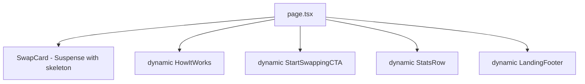

## Problem Statement

The landing page (`/`) statically imports `HowItWorks`, `StartSwappingCTA`, `StatsRow`, and `LandingFooter` — all below-the-fold content that users don't see on initial load. Combined with `SwapCard` (which pulls in token UI, settings, modals), the landing page has a 166KB First Load JS bundle — the largest of any route. The `Suspense` wrapper around `SwapCard` also has no fallback, causing a blank area during load.

## User Story

As a first-time visitor landing on GoodSwap, I want the swap card and hero text to appear as fast as possible, without waiting for below-fold content I haven't scrolled to yet.

## How It Was Found

- Build output shows `/` at 166KB First Load JS — heaviest route
- `src/app/page.tsx` lines 2-6: all 5 components are static imports
- `Suspense` on line 34 has no `fallback` prop — shows nothing while SwapCard loads

## Proposed Fix

1. Use `next/dynamic` to lazy-load `HowItWorks`, `StartSwappingCTA`, `StatsRow`, and `LandingFooter`
2. Add a skeleton fallback to the `Suspense` wrapping `SwapCard`

## Acceptance Criteria

- [ ] `HowItWorks`, `StartSwappingCTA`, `StatsRow`, `LandingFooter` are loaded via `next/dynamic`
- [ ] `Suspense` around `SwapCard` has a skeleton fallback matching the card dimensions
- [ ] Landing page First Load JS decreases in build output
- [ ] All sections still render correctly when scrolled into view
- [ ] Build passes, all tests pass

## Verification

- Run `npm run build` and compare landing page First Load JS
- Run all tests: `npx vitest run`
- Browse landing page with agent-browser, verify all sections render

## Overview

Convert the 4 below-fold landing page imports to `next/dynamic` and add a skeleton fallback to the existing `Suspense` around `SwapCard`.

## Research Notes

- `next/dynamic` is the standard pattern for lazy-loading named exports in Next.js
- These are client components, so `ssr: false` is not required but acceptable
- The `Suspense` wrapper around `SwapCard` (line 34) has empty fallback — adding a skeleton matching card dimensions (~460px wide, ~350px tall) improves perceived load

## Architecture

## One-Week Decision

**YES** — Single file change in `page.tsx` plus a small skeleton component. Total ~30 minutes.

## Implementation Plan

1. Replace static imports with `next/dynamic` for `HowItWorks`, `StartSwappingCTA`, `StatsRow`, `LandingFooter`
2. Add a `SwapCardSkeleton` inline component matching card dimensions
3. Pass skeleton as `fallback` to `Suspense`
4. Verify build output

## Out of Scope

- Changing the visual design of any section
- Adding intersection observer (dynamic import alone suffices for initial load)
- Modifying SwapCard internals
